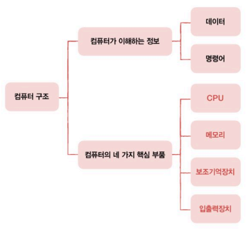
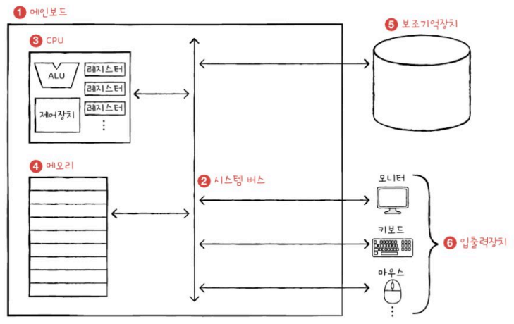

컴퓨터 구조 시작하기 (30p ~ 51p)

### Q1. 컴퓨터 구조를 이해해야 하는 이유는 무엇인가요?

A1.

컴퓨터 구조를 이해하면 다음과 같은 이점이 있습니다:

1. 문제 해결: 문제 상황을 빠르게 진단하고 다양한 해결 방법을 도출할 수 있습니다.
2. 성능, 용량, 비용 최적화: 개발한 프로그램이 실행될 환경을 정확히 이해함으로써 최적의 컴퓨터 환경을 설계할 수 있습니다.
이를 통해 문법만으로는 해결할 수 없는 성능, 용량, 비용 관련 문제를 효율적으로 처리할 수 있습니다​.

### Q2. 컴퓨터의 4가지 핵심 부품에 대해 설명해주세요.

A2.

컴퓨터는 다음의 4가지 핵심 부품으로 구성됩니다:

1. 중앙처리장치(CPU): 메모리에 저장된 명령어를 읽고, 해석하고, 실행하는 역할을 합니다.
2. 산술논리연산장치(ALU): 산술 및 논리 연산을 수행하는 계산기 역할을 합니다.
3. 레지스터: CPU 내부의 작은 임시 저장 장치로 데이터를 빠르게 저장하고 처리합니다.
4. 제어장치: 명령어를 해석하고 제어 신호를 내보내 CPU와 다른 부품들을 조율합니다​.

 

# 1. 컴퓨터 구조를 알아야 하는 이유

## 1) 문제 해결

- 컴퓨터 구조를 이해하고 있다면 문제 상황을 빠르게 진단할 수 있고, 문제 해결의 실마리를 다양하게 찾을 수 있다.

## 2) 성능, 용량, 비용

- 개발한 프로그램이 어떤 환경에서 어떻게 작동하는지 잘 이해하고 있어야 하고, 프로그램을 위한 최적의 컴퓨터 환경을 스스로 판단할 수 있어야 한다.
- 컴퓨터 구조를 이해하면 문법만으로는 알기 어려운 성능, 용량, 비용을 고려하여 개발할 수 있다.

 

# 2. 컴퓨터 구조의 큰 그림

## 1) 컴퓨터가 이해하는 정보

- 데이터 : 컴퓨터가 이해하는 숫자, 문자, 이미지, 동영상과 같은 정적인 정보
- 명령어 : 데이터를 움직이고 컴퓨터를 작동시키는 정보

## 2) 컴퓨터의 4가지 핵심 부품

- **중앙처리장치**(CPU) : 메모리에 저장된 명령어를 읽어 들이고, 해석, 실행
    - 산술논리연산장치(ALU) : 계산기
    - 레지스터 : CPU 내부의 작은 임시 저장 장치
    - 제어장치 : 제어 신호를 내보내고, 명령어를 해석
- **주기억장치**(메모리) : 현재 실행되는 프로그램의 **명령어**와 **데이터**를 저장
    - RAM (메모리는 보통 RAM을 지칭)
    - ROM
- **보조기억장치** : 전원이 꺼져도 보관될 프로그램을 저장 (ex : 하드디스크, SSD, USB 메모리 등)
- **입출력장치** : 컴퓨터 외부에 연결되어 컴퓨터 내부와 정보를 교환할 수 있는 부품

---

- 시스템 버스 : 컴퓨터의 네 가지 핵심 부품들이 서로 정보를 주고받는 통로
    - 주소 버스 : 주소를 주고받는 통로
    - 데이터 버스 : 명령어와 데이터를 주고받는 통로
    - 제어 버스 : 제어 신호를 주고받는 통로