네트워크의 큰 그림 (348p ~ 365p)

# 1. 네트워크의 기본 구조

- **네트워크** : 노드+간선. 그래프의 형태

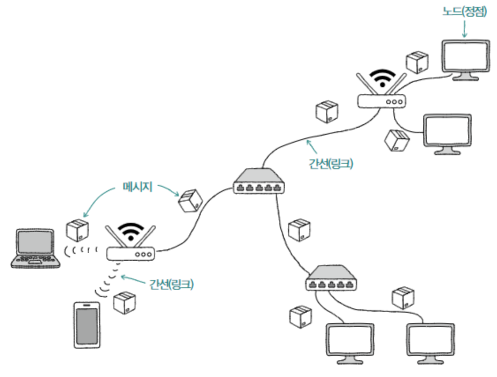

- **네트워크 토폴로지** : 노드와 노드 사이의 연결 구조

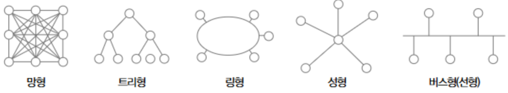

- **호스트** : 네트워크의 가장자리에 위치하면서 네트워크를 통해 주고받는 정보를 최초로 송신하고 최종 수신하는 노드. 대부분의 네트워크 기기.
    - **클라이언트** : 요청을 보내는 호스트
    - **서버** : 응답을 보내는 호스트

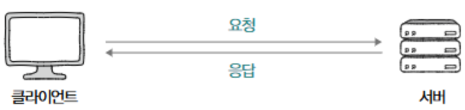

### LAN과 WAN

- **LAN** : 근거리 네트워크
- **WAN** : 원거리 네트워크(LAN ↔ LAN). ISP (인터넷 서비스 업체)가 구축하고 관리. (ex> KT, LG U+, SK)

### 패킷 교환 네트워크

- **패킷** : 네트워크를 통해 송수신되는 데이터의 단위
    - **페이로드** : 패킷에서 송수신하고자 하는 데이터
    - **헤더, 트레일러** : 부가 정보

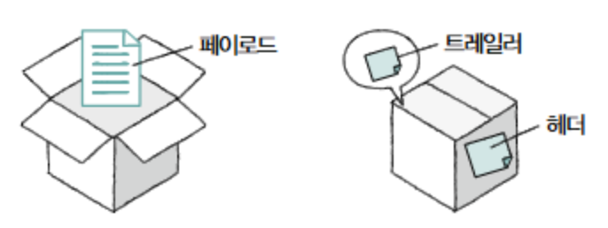

### 주소의 개념과 전송 방식

- **주소** : 패킷의 헤더에 명시되는 정보. IP주소, MAC 주소가 있음. 주소를 바탕으로 다양한 수신지 유형을 지정해 패킷을 보낼 수 있음.
    - **유니캐스트** : 송신지와 수신지가 일대일로 메시지를 주고받는 전송 방식
    - **브로드캐스트** : 네트워크상의 모든 호스트에게 메세지를 전송하는 방식
        - **브로드캐스트 도메인** : 브로드캐스트가 전송되는 범위
    - **멀티캐스트** : 네트워크 내의 동일 그룹에속한 호스트에게만 전송
    - **애니캐스트** :  네트워크 내의 동일 그룹에 속한 호스트 중 가장 가까운 호스트에게 전송

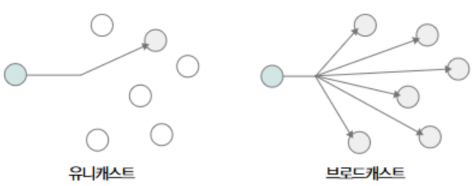

# 2. 두 호스트가 패킷을 주고받는 과정

### 프로토콜

네트워크에서 통신을 주고받는 노드 간의 합의된 규칙이나 방법. aka 네트워크의 언어 !

```
패킷을 주고받는 호스트와 네트워크 장비들이 서로 주고받는 정보를 이해하려면 같은 프로토콜을 이해해야 하고, 같은 프로토콜로 통신해야 함.
```

프로토콜마다 **목적**과 **특징**이 다르다 !

- IP : 네트워크 간의 **주소를 지정**
- ARP : **IP 주소와 MAC 주소를 대응**
- HTTPS : 보안상 HTTP에 비해 **안전**
- TCP : UDP에 비해 **신뢰성**이 높음

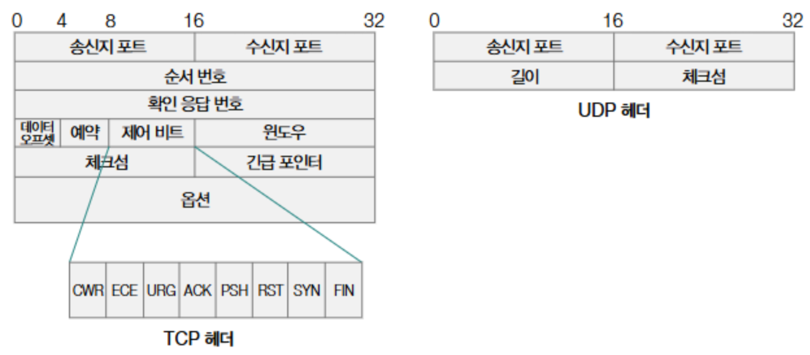

### 네트워크 참조 모델

통신이 이루어지는 단계를 계층적으로 표현한 것

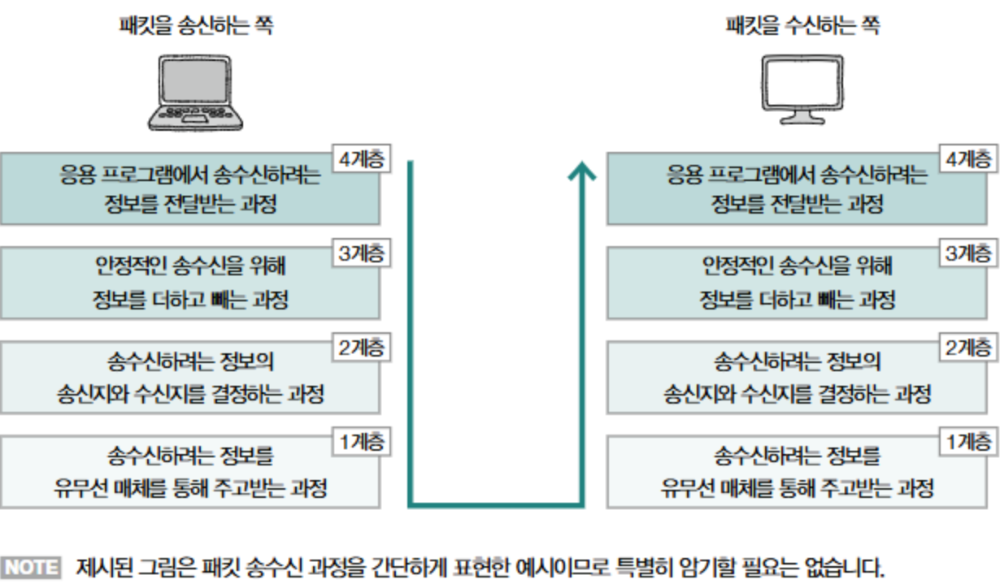

## OSI 모델

**OSI 모델** : 국제 표준화 기구에서 만든 네트워크 참조 모델. OSI 7계층.

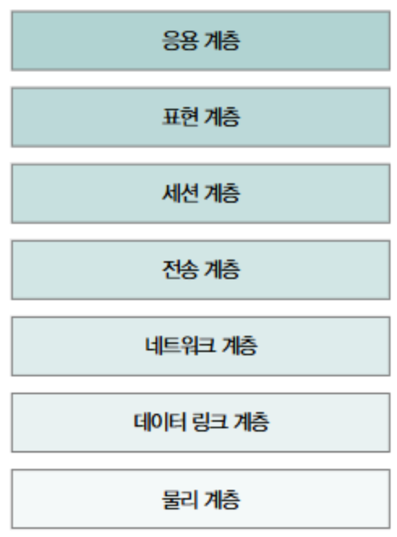

### 1. 물리 계층

가장 최하위 계층. **비트 신호**를 주고받는 계층. 0과 1로 이루어진 신호

### 2. 데이터 링크 계층

**같은 LAN**에 속한 호스트끼리 올바르게 정보를 주고받기 위한 계층.

같은 네트워크에 속한 호스트를 식별할 수 있는 주소 사용(**MAC 주소**)

물리계층을 통해 주고받는 정보에 오류가 없는지 확인

### 3. 네트워크 계층

네트워크 간 통신을 가능하게 하는 계층.

LAN을 넘어 다른 네트워크와 통신을 주고받기 위해 필요한 계층

네트워크 간 통신 과정에서 호스트를 식별할 수 있는 주소(**IP 주소**) 필요 

대표적인 프로토콜 : **IP**

### 4. 전송 계층

**신뢰성 있는 전송**을 가능하게 하는 계층

- 네트워크를 통해 송수신되는 패킷은 전송 도중에 유실될 때도 있고, 순서가 뒤바뀔 때도 있음

**포트(port)**라는 정보를 통해 특정 응용 프로그램과의 연결 다리 역할을 수행

대표적인 프로토콜 : **TCP**, **UDP**

### 5. 세션 계층

응용 프로그램 간의 연결 상태를 의미하는 **세션**을 관리하기 위한 계층

응용 프로그램 간의 연결 상태를 유지하거나 새롭게 생성하고, 필요하다면 연결을 끊는 역할

### 6. 표현 계층

인코딩과 압축, 암호화와 같은 작업을 수행

### 7. 응용 계층

사용자와 가장 밀접하게 맞닿아 있어 여러 네트워크 서비스를 제공하는 계층

대표적인 프로토콜 : **HTTP**, **HTTPS**, **DNS**

## TCP/IP 모델

**구현**과 **프로토콜**에 중점을 둔 네트워크 참조 모델

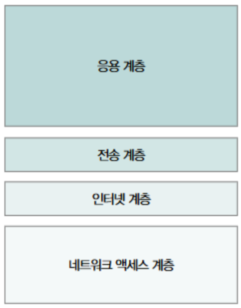

### 1. 네트워크 엑세스 계층

링크 계층, 네트워크 인터페이스 계층이라고도 부름

OSI 모델의 **②데이터 링크 계층**과 유사

### 2. 인터넷 계층

OSI 모델의 **③네트워크 계층**과 유사

### 3. 전송 계층

OSI 모델의 **④전송 계층**과 유사

### 4. 응용 계층

OSI 모델의 **⑤세션 계층**, **⑥표현 계층**, **⑦응용 계층**을 합친 것과 유사

## 캡슐화와 역캡슐화

- 캡슐화 : 송신 과정에서 헤더 (및 트레일러)를 추가해 나가는 과정
- 역캡슐화 : 캡슐화 과정에서 붙인 헤더 (및 트레일러)를 각 계층에서 확인한 뒤 제거하는 과정

```
OSI 모델을 기준으로 계층마다 패킷을 부르는 이름이 다름
```

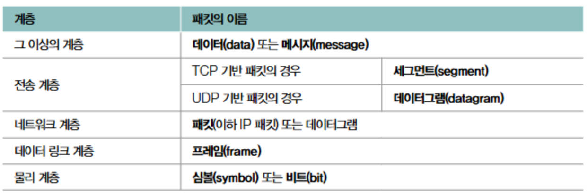

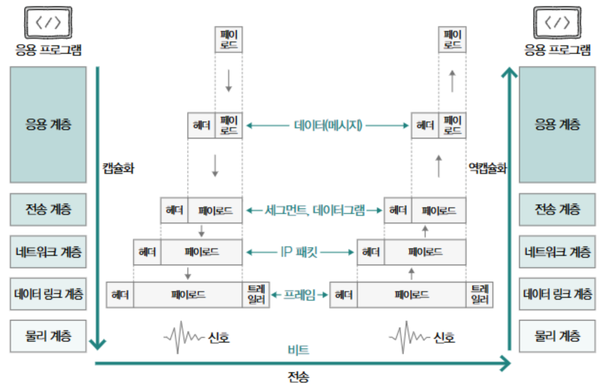

실제 캡슐화와 역캡슐화 360p ~ 361p

# 3. 네트워크 지도 그리기

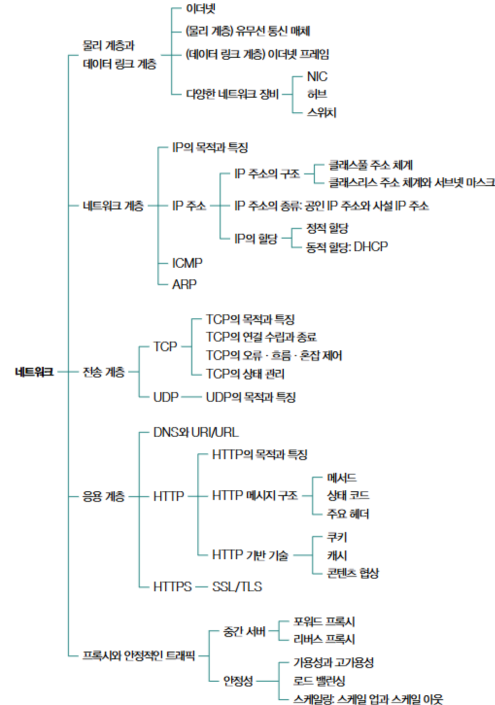