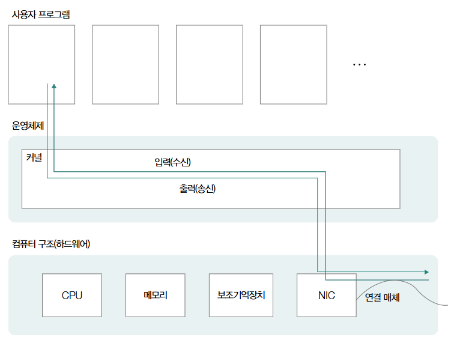

# 02 물리 계층과 데이터 링크 계층

## 이더넷(Ethernet)
### 정의
- 이더넷은 통신 매체를 통해 신호를 송수신하는 방법, 데이터 ㄹ이크 계층에서 주곱다는 데이터(프레임) 형식 등이 정의된 기술.
    - 현대 대부분의 (유선)LAN은 이더넷을 기반으로 구현
- 물리 계층과 데이터 링크 계층에 LAN 내의 호스트들이 올바르게 정보를 주고 받을 수 있게 해주는 다양한 기술 중 하나나

### 이더넷 표준
- 먼저 이더넷은 IEEE 802.3이라는 이름으로 국제 표준화된 기술.
- 아래는 지속적으로 만들어지고 있는 새로운 이더넷 표준

- 개발자 입장에서 이더넷 표준을 들여다 볼 상황은 많지 않음. 그러나, 아래 두 사항은 기억해두자.
1. 오늘날 (유선)LAN 대부분이 이더넷 표준을 따르기 때문에 대다수 LAN 장비들이 특정 이던세 표준을 따른다.
2. 이더넷 표준이 달라지면 통신 매체의 종류를 비롯한 신호 송수신 방법, 나아가 최대 자원 속도도 달라질 수 있다.

### 이더넷 프레임 (Ethernet frame)
- 이더넷 프레임은 이더넷 기반의 네트워크에서 주고받는 프레임을 말한다.
- 오늘날 주로 사용되는 이더넷 프레임은 Ethernet II 프레임이라고도 부름.
    - 오늘날 (유선)LAN은 대부분 이더넷을 기반으로 구현되기 때문에 사실상 **'프레임'**이 이더넷 프레임을 지칭한다고 보아도 무방함

- 프레임은 위와 같이 '프리앰블', '수신지 MAC 주소' 등의 정보를 포함하고 있음.
1. 프리앰블
    - 프리앰블은 네트워크 통신에서 데이터 프레임의 시작을 알리고 동기화를 유지하는 데 사용되는 부분으로 8바이트 크기를 가지는 정보로, 
        - 첫 7바이트는 10101010이라는 값을 가지고, 
        - 마지막 바이트는 10101011이라는 값을 가집니다.
    - 수신지 입장에서는 프리앰블 비트를 통해 이더넷 프레임이 수신되고 있다는 사실을 인지함

2. 송수신지 MAC 주소
    - MAC 주소는 네트워크 장치의 고유 식별자로, 6바이트 길이의 주소로 다음과 같이 콜론으로 구분된 12자리 16진수로 구성됨.
        - `ab:cd:ab:cd:00:01`
        
    - 역할
        - 송신지 MAC 주소는 데이터를 보낸 장치의 주소.
        - 수신지 MAC 주소는 데이터를 받을 대상 장치의 주소.
    - 물리적 주소라고도 불리는 MAC주소는 네트워크 인터페이스마다 하나씩 부여되는 주소임.
        - 네트워크 인터페이스 연결 매체와의 연결지점을 의미하며, 보통 NIC가 이를 담당함.

3. 타입/길이
    - MAC 주소의 타입/길이 필드에 명시된 크기에 따라 나타내는 게 다름.
        - 데이터 크기(프레임 페이로드)가 1500 이하(16진수 05DC)인 경우: 크기를 나타냄.
        - 데이터 크기가 1500 이상(16진수 0600)인 경우: 상위 프로토콜을 나타냄.
            - 예: IPv4가 캡슐화된 정보를 운반한다면, 타입에 16진수 0800, 
            - ARP 프로토콜이 캡슐화된 정보를 운반한다면 타입에는 16진수 0806 명시

4. 데이터
    - 데이터 필드에는 페이로드, 즉 상위 계층으로 전달하거나 전달받을 데이터가 명시 됨.
        - 페이로드: 데이터 필드에는 전달하고자 하는 상위 계층의 데이터가 포함
        - 크기 제한: 
            - 일반적으로 데이터 필드의 최대 크기는 1500바이트로 제한됩니다.
            - 더 큰 데이터를 보내야 하는 경우, 데이터를 여러 패킷으로 분할하여 전송.
        - %참고% 네트워크에서 이 1500바이트는 중요한 기준으로 사용되며, 이를 **MTU (Maximum Transmission Unit)**라고 부릅니다.
            - 이더넷 프레임으로 전송가능한 최대 크기
            - 네트워크 계층 패킷 (헤더 + 페이로드)의 최대 크기 지칭

5. FCD (Frame Check Sequence)
    - 프레임의 오류가 있는지 여부를 확인하기 위한 필드
    - CRC(Cyclic Redundancy Check)라는 오류 검출용 값이 명시됨
        - 송신측에서 데이터에 대해 CRC 값을 계산하여 FCS에 포함.
        - 수신측은 수신한 데이터에 대해 다시 CRC 값을 계산.
        - 두 값이 같으면 오류가 없는 것으로 간주, 다르면 데이터 오류 발생으로 판단.
    - 예시
        - 수신지 MAC 주소: f2:00:00:02:02:02.   
        - 송신지 MAC 주소: f2:00:00:01:01:01.
        - 타입: 0800 (IPv4).
        - 의미: MAC 주소 f2:00:00:02:02:02의 호스트가 f2:00:00:01:01:01에게 IPv4 데이터가 포함된 프레임을 전송.

## 유무선 통신 매체
- 유선 통신 매체는 데이터를 물리적으로 전달하는 데 사용되는 하드웨어입니다. 주로 네트워크 케이블과 같은 장비가 여기에 포함
- 통신 속도와 병목 현상
    - 케이블 성능의 한계: 네트워크 케이블은 높은 속도로 데이터를 송수신할 수 있지만, 연결된 장치(호스트)의 처리 속도가 느리다면, 높은 성능의 케이블도 효과를 발휘하지 못합니다. (따라서 개발자도 통신 매체에 대해 알아야 함)
    - 예: 1초에 1GB를 송수신할 수 있는 통신 매체를 사용하더라도, 호스트가 이를 처리하지 못하면 데이터 전송 속도가 제한됩니다.

### 유선 매체 – 트위스티드 페어 케이블

- 특징
    - 트위스티드 페어 케이블(Twisted Pair Cable)은 가장 대표적인 유선 통신 매체입니다.
- 구조:
    - 내부 전선이 두 가닥(pair)씩 꼬여 있는 케이블로 구리선을 통해 전기적으로 신호를 주고 받음.
    - 전기적 간섭(노이즈)을 줄이는 효과가 있습니다.
- 카테고리 (Category)
    - 트위스티드 페어 케이블의 성능은 **카테고리(Cat)**를 통해 구분됩니다.
    - 각 카테고리마다 지원하는 최대 속도와 대역폭이 다릅니다.
    
    - 주로 사용되는 카테고리:
        - Cat7 (또는 Cat 7): 고속 네트워크를 지원.
        - Cat8 (또는 Cat 8): Cat7보다 더 높은 성능을 제공.
    ---
    **노이즈와 차폐**
    - 트위스티드 페어 케이블은 구리선을 통해 전기적인 신호를 주고받기 때문에 전기 신호에 왜곡을 줄 수 있는 주변 잡음(노이즈)에 취약합니다.
    - 이를 방지하기 위해 케이블에 **차폐(shielding)**가 사용됩니다.
        - 브레이드 실드: 철사로 엮인 보호층.
            - 철사로 케이블을 감싸는 방식 
            - STP(Shielded Twisted Pair) 케이블 : 브레이브 실드로 감싼 케이블
        - 포일 실드: 얇은 금속층으로 보호. 
            - 포일로 케이블을 감싸는 방식
            - FTP(Foil Twisted Pair) 케이블 : 포일 실드로 노이즈를 감소시킨 케이블

    - 케이블 유형에 따른 차폐 방식
    

        - STP (Shielded Twisted Pair): 실드로 노이즈를 감소시킨 케이블.
        - FTP (Foil Twisted Pair): 포일 실드를 적용한 케이블.
        - UTP (Unshielded Twisted Pair): 아무 차폐가 없는 케이블.

### 무선 매체 - 전파와 WiFi
- 대표적인 유선 매체로 트위스티드 페어 케이블이 있다면, 대표적인 무선 매체로는 전파가 있음.
    - 전파란?
    - 정의: 전파는 약 3kHz부터 3THz 사이의 진동수를 가지는 전자기파를 의미.
    - 주파수 대역:
        - 일반적으로 2.4GHz와 5GHz 대역이 가장 널리 사용됨.
        - 이 두 대역은 WiFi 통신에 주로 활용됩니다.
    - WiFi란?
    - 무선 LAN 기술:
        - 유선 LAN에서 이더넷이 대중적으로 사용된다면, 무선 LAN에서는 WiFi가 가장 많이 사용.
    - 표준: IEEE 802.11 표준을 따르는 무선 LAN 기술.
        - 802.11ax (wifi 6), 802.11ac (wifi 5), 802.11n (wifi 4)등은 각각의 표준 규격.
        - 규격마다 최대 속도, 주파수 대역, 지원 범위 등이 다릅니다.
    - WiFi 대역:
        - 2.4GHz: 신호 범위가 넓고 벽 등 장애물을 잘 통과하지만, 속도는 비교적 느림.
    
    - 위와 같이 [프로토콜]의 Wi-fi 4 와 같이 세대와 표준 규격 확인이 가능함.
    --- 
    앞서 와이파이에서 주로 사용되는 주파수 대역은 2.4 GHz 혹은 5GHz 라고 했는데, 이 때 같은 주파수 대역을 사용하는 여러 무선 네트워크가 존재할 수 있고, 신호의 간섭이 발생할 수 있음.
    - 간섭 현상
        - 같은 주파수 대역을 사용하는 장치들 간에 간섭이 발생할 수 있습니다.
        - 이를 방지하기 위해 주파수 대역을 **채널**로 세분화하여, 각 채널에서 독립적으로 통신이 이루어지도록 설계됩니다.
    - 
        - 중첩되지 않는 채널:
            - 1, 6, 11번 채널은 서로 간섭되지 않는 대표적인 채널입니다.
            - 중첩되는 채널(예: 2, 3번)을 사용할 경우, 신호 간섭이 발생하여 네트워크 성능이 저하될 수 있습니다.
        - 5GHz 대역은 2.4GHz에 비해 더 많은 채널을 지원하며, 간섭 가능성이 낮아 고속 네트워크 환경에서 유리합니다.
        - 이렇든 무선 네트워크의 성능 저하를 방지하려면, 신호가 중첩되지 않는 채널을 사용하는 것이 중요 함.
    ---
    **AP와 SSID**
    - AP (Access Point):
        - 여러 무선 통신 기기를 연결하여 무선 네트워크를 구성하는 장치.
        - 일반적으로 무선 공유기가 AP 역할을 수행.
        - AP는 유선 네트워크를 무선 네트워크로 변환하여 다양한 장치가 네트워크에 연결할 수 있도록 지원.
    - SSID (Service Set Identifier):
        - AP에서 제공하는 무선 네트워크의 이름(식별자).
        - 흔히 WiFi 네트워크 이름으로 나타남.

### 네트워크 인터페이스: NIC
- 정의:**NIC (Network Interface Controller)**는 네트워크 상에서 노드와 통신매체가 연결되는 지점(인터페이스).
    - 노드가 네트워크를 통해 송수신하는 정보가 네트워크 인터페이스를 거치는 셈
    - 네트워크 인터페이스마다 MAC 주소가 부여되고, NIC라는 하드웨어가 네트워크 인터페이스 역할을 담당하는 것이 일반적임.
- 역할: 통신매체의 신호를 호스트가 이해하는 프레임으로 변환하거나 호스트가 이해하는 프레임을 통신 매체의 신호로 변환하는 역할을 수행.
    - 때로는 MAC 주소를 토대로 잘못 전송된 패킷이 없는지 확인.

- **NIC (Network Interface Controller)의 동작 원리**
1. 입력 장치와 출력 장치의 역할
    
    - 출력(송신): 네트워크 패킷을 송신하는 동작.
    - 입력(수신): 네트워크 패킷을 수신하는 동작.
    - NIC는 입력/출력을 수행하며, 다른 입력/출력 장치와 동일한 방식으로 동작합니다.
2. NIC 작동 과정
    - NIC는 시스템 콜(커널 모드)로 호출됩니다.
    - 호출 후, 송수신 동작이 수행되고 데이터 전송이 완료되면 인터럽트를 통해 CPU에게 작업 완료를 알립니다.
    - DMA(Direct Memory Access): 대부분의 NIC는 CPU 부하를 줄이기 위해 DMA를 지원하여 메모리에 직접 접근합니다.
3. 구조적 이해
    - NIC는 운영체제와 컴퓨터 하드웨어 사이에서 작동합니다.
    - 운영체제:
        - 커널을 통해 데이터를 입력(수신) 및 출력(송신)합니다.
    - 컴퓨터 하드웨어:
        - NIC는 CPU, 메모리, 보조기억장치 등과 협력하여 네트워크 통신을 처리합니다.
    ---
    #티밍과 본딩#
    - 고가의 NIC를 구비하는 방법 외에도 NIC 단계의 성능 향상을 위해 사용하는 방식이 있음.
    - 여러 물리적인 NIC를 마치 하나의 고속 NIC 처럼 구성하는 것
    1. 티밍
        - 윈도우 운영체제에서 사용하는 용어
    2. 본딩
        - 리눅스 운영체제에서 사용하느 용어
    - 사실 티밍과 본딩의 자세한 정의는 다르지만, 여러 물리적인 NIC를 하나의 고속 NIC처럼 구성한는 방식이라는 점에서 같다.
    - 또한 저성능 여러 물리적인 입출력장치르 고성능의 논리적 입출력장치 하나로 묶어 사용한다는 점에서 2장에서 학습했던 RAID와 유사하다.
    - 티밍과 본딩을 통해 송수신 성능을 향상시킬 수 있고, 하나의 NIC에 문제가 발생하더라도 다른 NIC를 통해 송수신되도록 하여 안정적으로 송수신할 수 있다.

### 허브와 스위치
허브와 스위치는 물리 계층과 데이터 링크 계층의 중간 노드.
- 허브는 오늘날의 네트워크에서 잘 사용하지 않음. -> 스위치를 사용하는 경우가 많음.

**1. 물리 계층의 허브**
- 허브는 물리 계층의 대표적인 네트워크 장비로, 여러 대의 호스트를 연결하는 장치

    - 포트(port) : 케이블의 커넥터가 꽂히는 부분
-  허브의 특징.
    1. 전달받은 신호를 모든 포트로 내보낸다.
        
        - 허브는 신호를 전달받으면 어떠한 조작/판단 없이 모든 포트에 신호를 내보냄
    2. 반이중 모드로 통신한다.
        - 반이중 모드? 
            - 송신 또는 수신을 번갈아 가면서 수행해야하는 통신 방식.
            - 동시 송수신이 불가능한 상태를 말함.
            - 예 : 무전기 (한쪽이 송신할 때 다른쪾은 송신이 불가능)
        - 전이중 모드
            - 동시 송수신이 가능한 상태
            - 예 : 전화기 ( 양방향 송수신이 가능한 상태 )
                - 스위치는 전이중모드를 지원함.        
        - 
            - 콜리전 도메인 : 충돌이 발생할수 있는 영역
---

**2. 데이터 링크 계층의 스위치**
- 스위치는 허브의 한계를 보완하기 위한 네트워크 장비.
- 스위치는 허브와 달리 전달받은 신호를 목적지 호스트가 연결된 포트로만 보내고, 전이중 모드를 지원하여 허브와 비교해 콜리전 도메인(충돌이 발생할 수 있는 영역)이 좁음.

    - 스위치는 2계층(데이터 링크)에서 사용한다는 점에서 L2 스위치라고도 불림.
    - 상위 계층에서 사용되는 L3, L4 스위치도 있지만, 책에서는 스위치를 L2 스위치와 동일한 의미로 사용.

- 스위치 특징
1. **MAC 주소 학습 기능:**
    - 스위치는 프레임의 헤더에서 MAC 주소를 확인합니다.
        - 스위치는 데이터링크 계층에 속한 장비이므로 MAC주소를 이해할 수 있음.
    - 학습한 MAC 주소를 기반으로 어떤 포트가 어떤 호스트와 연결되어 있는지 파악합니다.
- **MAC 주소 테이블 (MAC Address Table)**
    - 포트, 연결된 호스트의 MAC 주소의 대응 관계를 테이블 형태로 메모리에 저장
    - 
    - 위처럼 MAC 주소 테이블을 생성하고, 참조하여 스위치가 전달받은 신호를 목적지 호스트가 연결도니 포트로만 내보냄

2. **VLAN (Virtual LAN)**
    - VLAN은 가상 LAN을 의미하며, 같은 스위치에 연결된 모든 호스트를 하나의 네트워크로 간주하고 싶지 않을 때, 여러 개의 논리적인 네트워크로 분할하는 기술
    - 목적:
        - 같은 스위치에 연결된 호스트라 해도, 서로 다른 VLAN에 속하면 별도의 네트워크로 구분되어 서로 간섭이 없습니다.
        - 보안, 트래픽 관리, 방송 도메인 축소 등에 활용됩니다.
    
    - 예:
        - 호스트 A~D는 VLAN1에, 호스트 E~I는 VLAN2에 할당.
        - 이들은 서로 다른 네트워크로 간주되며, VLAN1에 속한 호스트끼리는 서로 통신할 수 있지만, VLAN2에는 직접 브로드캐스트가 전달되지 않음.
            - 호스트 A~D와 E~I가 통신하기 위해서는 네트워크 계층 이상의 장비가 필요

    

