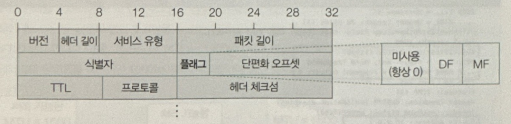
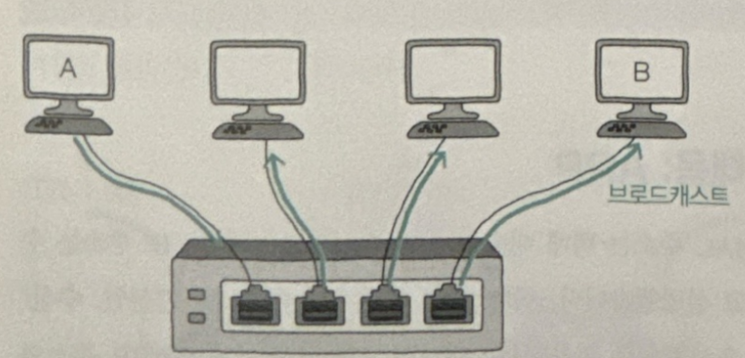

# 3. 네트워크 계층-IP

## 1. IP의 목적과 특징
1. **IP의 정의**
  - IP(Internet Protocol) : 인터넷을 포함한 네트워크에서 장치들이 서로를 식별하고 통신할 수 있도록 하는 핵심적인 프로토콜
2. **IP의 목적**
  - 주소 지정(addressing) : 네트워크 간 통신 과정에서 호스트를 특정하는 것
  - 단편화(fragmentation) : 데이터를 여러 IP 패킷으로 올바르게 쪼개어 보내는 것
3. **IP의 특징**
  - 신뢰할 수 없는 통신
  - 비연결형 통신
4. **IP의 종류**
  - 오늘날의 IP는 IPv4, IPv6 두 가지 종류가 있음. 더 빈번하게 사용되는 버전은 IPv4이며, 일반적으로 칭하는 IP는 모두 IPv4를 의미함.
  
  - **IPv4**
    - 하나의 주소는 총 4바이트(32비트)로 구성.
    - 할당 가능한 IPv4 주소는 총 약43억 개(2^32개)로 고갈될 여지가 있음.
    - 숫자당 8비트로 표현되므로 0~255 범위의 10진수 4개로 표기되며, 각각의 10진수는 점(.)으로 구분됨. 점으로 구분된 하나의 10진수를 옥텟(octet)이라고 함.
  - **IPv6**
    - IPv4의 고갈 가능성 때문에 등장한 프로토콜로, 16바이트(128비트)로 주소를 표현.
    - 이론적으로 무한에 가까운(2^128) 주소를 할당 가능함.
    - 콜론(:)으로 구분된 8개 그룹의 16진수로 표기.

### 1. 주소지정과 단편화
1. **주소지정**
  - 주소 지정은 IP 패킷 헤더에 있는 IP 주소를 통해 이루어짐.   
    
    - 송신지 IP 주소와 수신지 IP 주소 필드에는 송수신지를 식별할 수 있는 IP 주소가 명시됨(e.g. 192.168.0.1)
  - 패킷을 올바르게 전송하기 위해서는 MAC 주소와 IP 주소가 모두 필요함. 패킷 송수신 과정에서 MAC 주소보다는 IP 주소가 우선적으로 활용됨.
    > MAC 주소 (Media Access Control Address) : 랜카드나 와이파이 칩셋과 같은 하드웨어 장치에 고유하게 할당된 물리적 주소
  - 라우터(router) : IP 주소를 기반으로 패킷의 최적 경로를 결정해 목적지까지 전달하는 네트워크 장비
    - 라우팅 : 라우터가 IP 패킷을 전달할 최적 경로를 결정하고 해당 경로로 패킷을 내보내는 과정
    

2. **단편화**
  - 전송하고자 하는 IP 패킷(IP 헤더와 페이로드)의 크기가 MTU라는 단위보다 클 경우 패킷을 MTU 이하의 여러 패킷으로 쪼개서 전송하고, 쪼개서 전송된 패킷들은 수신지에서 재조합됨.
    > MTU (Maxium Transmission Unit) : 최대 전송 단위. 일반적인 MTU의 크기는 1500바이트로, 프레임을 통해 주고받을 수 있는 최대 페이로드의 크기로 봐도 무방함.
  - IP 패킷 헤더에서 단편화와 관련된 필드 : 식별자, 플래그, 단편화 오프셋 피드
    
    1. 식별자(Identifier) : 특정 패킷이 어떤 데이터에서 쪼개진 패킷인지를 식별하기 위해 사용되는 필드. 같은 정보에서 쪼개진 패킷들은 같은 식별자를 공유함.
    2. 플래그(flag) : 3비트로 구성된 필드(첫 번째 비트, DF, MF). 첫 번째 비트는 항상 0으로 설정되어 현재 사용되지 않음. DF(Don't Fragment)는 IP 단편화를 수행하지 말라, MF(More Fragment)는 단편화된 패킷이 더 있다는 표시를 남기기 위한 비트
    
    3. 단편화 오프셋(offset) : 특정 패킷이 초기 데이터에서 얼마나 떨어져있는지가 명시된 필드. 단편화되어 전송되는 패킷을 목적지에서 재조합하기 위해 패킷의 올바른 순서를 나타내는 데 사용

  > ### 경로 MTU 발견(Path MTU discovery) : IP 단편화 피하기
  > 네트워크 성능의 발전과 단편화의 단점으로 인해, 오늘날의 네트워크 환경에서는 IP 단편화가 잘 발생하지 않는다.   
  오늘날의 네트워크에서는 대부분 경로 MTU 발견을 지원하며, 처리 가능한 최대 MTU 크기도 균일하기 때문에 IP 단편화가 자주 발생하지 않는다.
        
    1. **경로 MTU 발견**   
      - 경로 MTU(Path MTU) : IP 단편화 없이 주고받을 수 있는 최대 크기 (아래 그림에서 1000byte)
        
      - 경로 MTU 발견 : 경로 MTU를 구하고 해당 크기만큼만 송수신해 IP 단편화를 회피하는 기술
        
    2. **단편화의 단점**   
      - 단편화된 패킷을 재조립하는 과정에서 발생하는 부하로 인해 성능 저하 가능.   
      - 이러한 단점을 피하기 위해 IP 패킷을 주고받는 경로에 존재하는 모든 호스트의 처리 가능한 MTU 크기를 고려해야 함.
    

### 2. 신뢰할 수 없는 통신과 비연결형 통신
1. **신뢰할 수 없는 프로토콜(unreliable protocol)**
  - 패킷이 수신지까지 제대로 전송되었다고 보장하지 않는 프로토콜
  - 동의어 : 신뢰할 수 없는 통신, 신뢰성이 낮은 통신, 최선형 전달(best effort delivery)

2. **비연결형 프로토콜(connectionless protocol)**
  - 패킷을 주고 받기 전에 사전 연결과정을 거치지 않음
  - 상대 호스트의 수신 가능 여부는 고려하지 않고, 수신지를 향해 패킷을 전송하는 역할만 함.
  > TCP : IP와 달리 송수신지 간 연결 설정을 통해 패킷을 주고받을 호스트 간 송수신 준비가 되었는지 확인하는 프로토콜

### **IP 패킷 예시 1

  - Src(Source Address) : 송신지 주소 10.0.0.1
  - Dst(Destination Address) : 수신지 주소 10.0.0.2
  - 식별자 : 0x2c2e
  - 단편화 오프셋 : 0
  - More Fragments 비트 활성화

### **IP 패킷 예시 2

  - 식별자 : 0x2c2e
  - 단편화 오프셋 : 1480
  - More Fragments 비트 활성화

## 2. IP 주소의 구조

1. 구성
  - 네트워크 주소와 호스트 주소로 구성
  - 네트워크 주소 : 네트워크 ID, 네트워크 식별자 등으로 불리며, 호스트가 속한 네트워크를 특정하기 위해 사용
  - 호스트 주소 : 호스트ID, 호스트 식별자 등으로 불리며, 네트워크에 속한 호스트를 특정하기 위해 사용.

2. 특징
  - 네트워크 주소를 표현하는 크기와 호스트를 표현하는 크기가 유동적일 수 있음.
    
    - (a) : 호스트 주소에 24비트 사용 → 네트워크 당 많은 호스트에 IP 주소 할당 가능
    - (c) : 호스트 주소에 8비트 사용

### 1. 클래스풀 주소 체계
1. 클래스풀 주소 체계(classful addressing) : 클래스를 바탕으로 IP 주소를 관리하는 주소 체계
    - 클래스(class) : 네트워크의 크기에 따라 유형별로 IP 주소를 분류하는 기준
2. 종류(총 5개)   
      1. A, B, C 클래스 : 네트워크 크기별로 IP 주소를 분류하는데 사용되는 클래스**   
      2. D, E 클래스 : 멀티캐스트라는 특수한 목적을 위해 예약된 클래스**   

      **A, B, C 클래스 상세**   
      | 클래스 | 네트워크 주소 구성  | 호스트 주소 구성 | IP 주소 표현 가능 범위 |
      |---|---|---|---|
      | A | 0 비트로 시작, 1옥텟 | 3옥텟 | 0.0.0.0 ~ 127.255.255.255 |
      | B | 10 비트로 시작, 2옥텟 | 2옥텟 | 128.0.0.0 ~ 191.255.255.255 |
      | C | 110 비트로 시작, 3옥텟 | 1옥텟 | 192.0.0.0 ~ 223.255.255.255 |

        
    

  - 첫 옥텟의 주소로 어떤 클래스에 속한 IP 주소인지 구별 가능함
  
  
> ### 네트워크/브로드캐스트 주소와 예약 주소
>1. **네트워크 및 브로드캐스트 주소**   
>    
>    1. 네트워크 주소 : 호스트 주소가 전부 `0`인 IP 주소
>     - 예시 : `172.16.0.0`   
>    2. 브로드캐스트 주소 : 호스트 주소가 전부 `1`인 IP 주소   
>     - 예시 : `172.16.255.255`
>
>     위 주소들은 특정 호스트를 지정하는 데 사용 불가.
> 
> 2. **예약 IP 주소**
> -   특수한 목적으로 예약된 IP 주소
> 
>     | 예약 IP 주소 범위     | 사용 목적                               |
>     | :-------------------- | :-------------------------------------- |
>     | `0.0.0.0` ~ `0.255.255.255`   | '이 네트워크의 이 호스트' 지칭에 사용       |
>     | `127.0.0.0` ~ `127.255.255.255` | 루프백 주소로 사용                          |
>     | `10.0.0.0` ~ `10.255.255.255`  |  사설 네트워크 주소 사용                      |
>     | `172.16.0.0` ~ `172.31.255.255` | 사설 네트워크 주소 사용                      |
>     | `192.168.0.0` ~ `192.168.255.255`| 사설 네트워크 주소 사용                      |
>
>     1. **루프백 주소 (loopback address) = 로컬 호스트 (localhost)**
>      -   자신을 가리키는 특별한 주소.
>      -   가장 일반적인 루프백 주소는 `127.0.0.1`
>      -   루프백 주소로 전송된 패킷은 자기 자신에게 되돌아옴.
>      -   자기 자신을 마치 다른 호스트인 양 간주하여 패킷을 전송 가능.
>
>     2. **'이 네트워크의 이 호스트'(This host on this network)**
>
>     -   `0.0.0.0` ~ `0.255.255.255` 범위는 '이 네트워크의 이 호스트'를 지칭하도록 예약.
>     -   가장 일반적인 의미는 호스트가 IP 주소를 할당받기 전에 임시로 사용하거나, 마땅히 지정할 IP 주소가 없을 때 사용
>     - 가장 일반적으로 사용되는 주소는 `0.0.0.0`

### 2. 클래스리스 주소 체계와 서브넷 마스크
- 클래스풀 주소 체계는 네트워크 크기 고정으로 인해, IP 주소가 낭비될 수 있다는 한계가 있음.\
    -   A 클래스: 네트워크 당 1600만 개 이상의 호스트 IP 주소 가능.
    -   B 클래스: 네트워크 당 6만 개 이상의 호스트 IP 주소 가능.
    -   C 클래스: 네트워크 당 약 200개(254개)의 호스트 IP 주소 가능.
    -   단일 조직에서 이 정도의 호스트가 필요한 경우가 많지 않음.

1. 클래스리스 주소 체계 
  - 클래스를 이용하지 않고 네트워크와 호스트를 구분하는 방식

2. 서브넷 마스크(subnet mask)
    1. 서브넷 마스크
      - 서브넷(서브네트워크) : IP 주소에서 네트워크 주소로 구분할 수 있는 네트워크의 부분집합
      - 서브넷 마스크 : 네트워크 주소와 호스트 주소를 구분하는 데 사용되는 32비트 값.
        - IP 주소 상에서 네트워크 주소를 1로, 호스트 주소를 0으로 표기한 비트열
      - 서브네팅 : 서브넷 마스크를 이용해 원하는 크기로 클래스를 잘게 쪼개 사용하는 것
      -   클래스풀 주소 체계의 기본 서브넷 마스크 표현
          -   A 클래스: `255.0.0.0` (`11111111.00000000.00000000.00000000`)
          -   B 클래스: `255.255.0.0` (`11111111.11111111.00000000.00000000`)
          -   C 클래스: `255.255.255.0` (`11111111.11111111.11111111.00000000`)

3. 서브넷 마스크와 IP 주소 간의 AND 연산
-   IP 주소와 서브넷 마스크 간의 비트 AND 연산을 통해 IP 주소 내의 네트워크 주소 추출 가능.
-   예시
    
    -   IP 주소: `192.168.200.102`
    -   서브넷 마스크: `255.255.255.0`
    -   비트 AND 연산 결과: `192.168.200.0` (네트워크 주소)

4. CIDR 표기법 (Classless Inter-Domain Routing) - 서브넷 마스크 표기법
-   서브넷 마스크를 IP 주소/서브넷 마스크 쌍의 형태로 간단하게 표현하는 방식.
-   서브넷 마스크의 1의 개수를 슬래시 (/) 뒤에 표기.
-   예시
    -   `192.168.20.3/30`
        -   `/30`: 서브넷 마스크에서 1이 총 30개 있다는 의미.
        -   서브넷 마스크: `11111111.11111111.11111111.11111100` (2진수)
        -   서브넷 마스크: `255.255.255.252` (10진수)

## 3. 공인 IP 주소와 사설 IP 주소
### 1. IP 주소 확인 방법

1.명령어를 통한 확인
-   윈도우: `ipconfig/all` 명령어를 입력하여 IP 주소 확인 가능.
    
-   맥OS, 리눅스: `ifconfig` 명령어를 입력하여 IP 주소 확인 가능.
    

2. 온라인 검색을 통한 확인
    

### 2. IP 주소의 종류
1. **공인 IP 주소 (Public IP Address)**
-   전 세계에서 유일한 IP 주소. 인터넷과 같은 네트워크 통신에 사용.
-   서버와 패킷을 주고 받으려면 호스트가 속한 네트워크 밖에서 사용할 공인 IP 주소를 사용해야 함.
-   ISP (인터넷 서비스 제공자)나 공인 IP주소 할당 기관을 통해 할당 가능.

2. **사설 IP 주소 (Private IP Address)**
-   호스트가 속한 사설 네트워크 내에서만 유효한 IP 주소.
- 일반적으로 라우터(공유기)를 통해 할당됨. 따라서 공유기를 중심으로 구성된 LAN 대부분은 사설 네트워크에 해당.
-   다음 범위에 속하는 IP 주소는 사설 IP 주소로 간주
    -   `10.0.0.0/8` (`10.0.0.0` ~ `10.255.255.255`)
    -   `172.16.0.0/12` (`172.16.0.0` ~ `172.31.255.255`)
    -   `192.168.0.0/16` (`192.168.0.0` ~ `192.168.255.255`)
-   사설 IP 주소는 해당 호스트가 속한 사설 네트워크 내에서만 유효하며, 다른 네트워크 상에서는 IP 주소가 중복될 수 있다는 점에 유의

## 4. IP 주소의 할당
### 1. 정적 할당 (Static Allocation)
-   수작업을 통해 IP 주소를 할당하는 방식.

1. **정적 IP 주소 설정 시 필요한 정보**
-   정적 IP 주소를 부여하기 위해 입력해야 할 값들 : IP 주소, 서브넷 마스크, 게이트웨이(라우터) 주소, DNS 주소

    1. 게이트웨이 (Gateway)
    -   일반적으로 서로 다른 네트워크를 연결하는 하드웨어나 소프트웨어적 수단
        -   기본 게이트웨이 (Default Gateway): 호스트가 속한 네트워크 외부로 나가기 위한 첫 번째 경로.
            -   대부분 라우터 (공유기)의 IP 주소를 의미.
            -   IP 할당의 맥락에서 게이트웨이 주소에는 기본 게이트웨이 역할을 하는 라우터 (공유기)의 주소를 적어줘야 함.

    2. 도메인 네임 시스템 (DNS)
        - 호스트가 도메인 네임을 토대로 IP 주소를 알아내기 위해 질의하는 서버의 주소
        1. 도메인 네임과 IP 주소 매핑
            -   `minchul.net` 등과 같이 사람이 읽기 쉬운 도메인 네임을 실제 통신에 사용되는 IP 주소로 변환하는 과정 필요.
            -   호스트가 도메인 네임을 토대로 대응하는 IP 주소를 알아내려면 `<도메인 네임, IP 주소>` 쌍을 저장하는 서버(네임 서버/DNS 서버)에 질의해야 함.

        2. DNS 질의 과정
            1.  클라이언트가 DNS 서버에 `hanbit.com`의 IP 주소 질의.
            2.  DNS 서버가 `hanbit.com`의 IP 주소 응답.
            3.  클라이언트가 응답받은 IP 주소로 실제 서버에 요청.
            4.  서버가 클라이언트에게 응답.

        3. 공개 DNS 서버
            -   DNS 주소를 입력할 때 무엇을 입력할지 결정하기 어렵다면, 누구나 사용할 수 있도록 공개된 DNS 서버 주소인 `8.8.8.8` 또는 `1.1.1.1`을 입력하면 됨.

### 2. 동적 할당 (Dynamic Allocation)
-   일반적으로 DHCP (Dynamic Host Configuration Protocol)라는 프로토콜을 통해 자동으로 IP 주소를 할당하는 방식

1. DHCP 작동 방식
    -   DHCP 서버가 IP 주소를 임대해 주는 방식으로 작동. 일반적으로 라우터(공유기)가 DHCP 서버 역할 수행.
    -   동적 IP 주소에는 사용 가능한 기간(임대 기간)이 정해져 있음.
    -   동적 IP 주소는 할당받을 때마다 다른 주소를 받을 수 있음
    -   사용 시간이 끝난 IP 주소는 DHCP 서버로 반납되며, 새로운 IP 주소를 할당받는 경우 다른 IP 주소를 할당받을 수 있음.
    -   DHCP를 통한 IP 주소 할당은 'IP 주소의 임대'라고 표현하기도 함.

2. 임대 갱신 (Lease Renewal)
    -   IP 주소의 임대 기간이 끝나기 전에 임대 기간을 연장할 수 있음.
    -   임대 갱신은 기본적으로 자동으로 두 차례 진행되며, 두 번의 임대 갱신이 모두 실패하면 해당 IP 주소는 DHCP 서버로 반납됨.

## 5. IP 전송 특징의 보완 : ICMP
### 1. ICMP (Internet Control Message Protocol)
    -   IP는 성능을 위해 신뢰할 수 없는 프로토콜이자 비연결형 프로토콜로, 전송 자체를 보장하지 않음.
    -   이러한 IP의 특징을 보완하는 방법 2가지
        1. 신뢰할 수 있는 연결형 통신을 지원하는 상위 계층의 프로토콜을 이용하는 방식(예. TCP)
        2. 네트워크 계층의 프로토콜로 ICMP를 이용하는 방식
    -   ICMP는 IP 전송 과정에 대한 피드백 메세지를 얻기 위해 사용하는 프로토콜
    -   ICMP 메세지를 통해 전송과정에서 발생하는 오류 및 네트워크 상태 정보를 얻어 IP 전송 결과를 알 수 있음.

### 2. ICMP 메시지의 종류

1. 전송 과정에서 발생한 오류 보고
2. 네트워크에 대한 정보 제공 (네트워크 상태 정보 제공)

| 유형 | 메시지                                | 설명                                                                                       |
| ---- | ------------------------------------- | ------------------------------------------------------------------------------------------ |
| ① 오류 보고          | 네트워크 도달 불가 (Destination network unreachable)      | 해당 네트워크로 패킷을 전송할 수 없을 때 발생                                                              |
|                       | 호스트 도달 불가 (Destination host unreachable)           | 해당 호스트로 패킷을 전송할 수 없을 때 발생                                                        |
|                       | 프로토콜 도달 불가 (Destination protocol unreachable)      | 수신지에서 특정 프로토콜을 사용할 수 없을 때 발생                                                            |
|                       | 포트 도달 불가 (Destination port unreachable)             | 해당 포트로 패킷을 전송할 수 없을 때 발생                                                        |
|                       | 단편화가 필요하지만 DF가 1로 설정되어 단편화할 수 없음 (Fragmentation required, and DF flag set) | 패킷을 단편화해야 하지만, DF(Don't Fragment) 플래그가 설정되어 단편화할 수 없을 때 발생 |
|                       | TTL 만료 (TTL expired in transit)                       | 패킷의 TTL 값이 0이 되어 폐기되었을 때 발생                                                              |
| ② 네트워크 상의 정보 제공 | Echo 요청 (Echo request)                             |  ping 명령어에서 패킷을 보내기 위해 사용                                                                     |
|                       | Echo 응답 (Echo reply)                                 | ping 명령어에서 받은 응답                                                                                |

**TTL 만료**
  1. TTL 필드
      -   IP 헤더에는 패킷의 수명을 의미하는 TTL (Time To Live) 필드 존재.
      -   무의미한 패킷이 네트워크 상에 지속적으로 남아있는 것을 방지하기 위함.
  2. TTL 만료
    
      -   패킷이 멀리 떨어진 호스트끼리 통신할 때 여러 라우터를 거치게 되는데, 패킷이 라우터를 하나 거칠 때마다 TTL 값이 1씩 감소함.
          -   홉(hop) : 패킷이 호스트 또는 라우터에 한 번 전달되는 것. TTL 값은 홉을 거칠 때마다 1씩 감소함.
      -   TTL 값이 0이 되면 해당 패킷은 폐기되고, 패킷을 송신한 호스트에게 [시간 초과(Time Exceeded)] ICMP 메시지가 전송

### 3. ICMP 메세지를 활용한 네트워크 진단 및 테스트
1. traceroute (윈도우: tracert)
-   네트워크상의 경로를 확인하기 위해 사용되는 명령어.
    -   각 홉 (라우터)별 IP 주소 및 응답 시간 출력.

2. ping
-   네트워크 상태를 점검하기 위해 패킷을 송신하는 명령어.
    -   지정한 횟수만큼 패킷을 보내고, 각 패킷에 대한 응답 시간 및 패킷 손실 여부 등을 출력.

## 6. IP 주소와 MAC 주소의 대응 : ARP(Address Resolution Protocol)

### 1. ARP 프로토콜
-   IP주소와 MAC 주소를 함께 활용하는 통신 과정에서, 동일 네트워크 내에 있는 송수신 대상의 IP 주소를 통해 MAC 주소를 알아내는 프로토콜.

### 2. ARP 동작 과정

1. ARP 요청 메시지
  
  -   ARP 요청 메시지는 브로드캐스트 메시지(네트워크 내 모든 호스트에게 보내는 메시지)
      -   알고 있는 MAC 주소에 대응되는 IP 주소를 포함하고 있음.
      -   "이 IP 주소를 가진 호스트와 통신하고 싶은데, 이 호스트의 MAC 주소가 무엇인가?" 와 같은 의미.

2. ARP 응답 메시지
  
-   ARP 요청을 받은 호스트 중, 요청한 IP 주소에 해당하는 호스트가 자신의 MAC 주소를 담아 응답.

### 3. ARP 테이블 (ARP Table)
-   ARP 테이블은 `<IP 주소, MAC 주소>` 쌍의 항목으로 구성된 테이블 형태의 정보.
-   이를 통해 나중에 같은 호스트에게 패킷을 보내야 할 때마다 ARP 요청 메시지를 보내지 않아도 됨.
-   ARP 요청/응답 메시지를 통해 IP 주소와 MAC 주소 쌍이 ARP 테이블에 추가됨.
-   ARP 테이블 항목은 일정 시간이 지나면 삭제되거나, 수동으로 삭제할 수 있음.
-   ARP 테이블은 운영체제별 명령어를 통해 확인 가능.

    1. ARP 테이블 확인 명령어
    -   윈도우 명령 프롬프트 (CMD) 또는 맥OS/리눅스 터미널에서 `arp -a` 명령어를 입력하여 ARP 테이블 확인 가능.
  
    