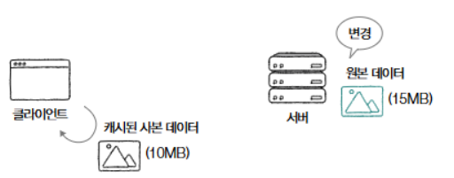
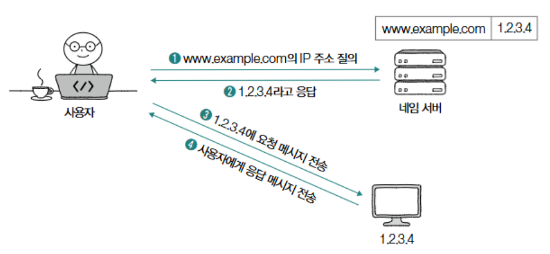
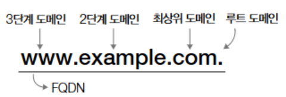
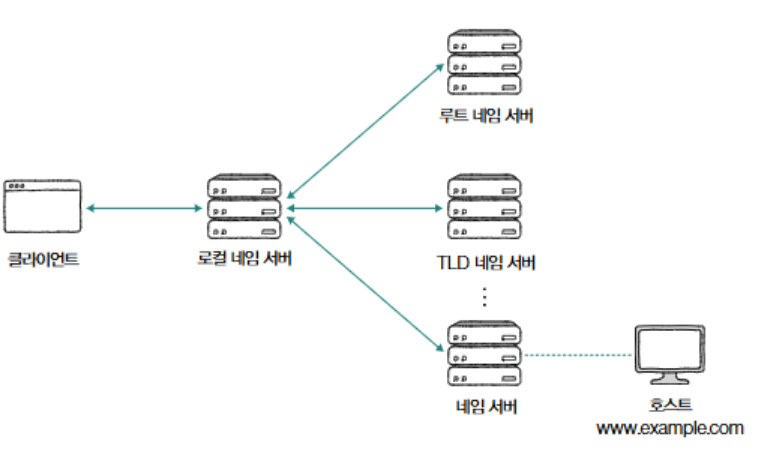
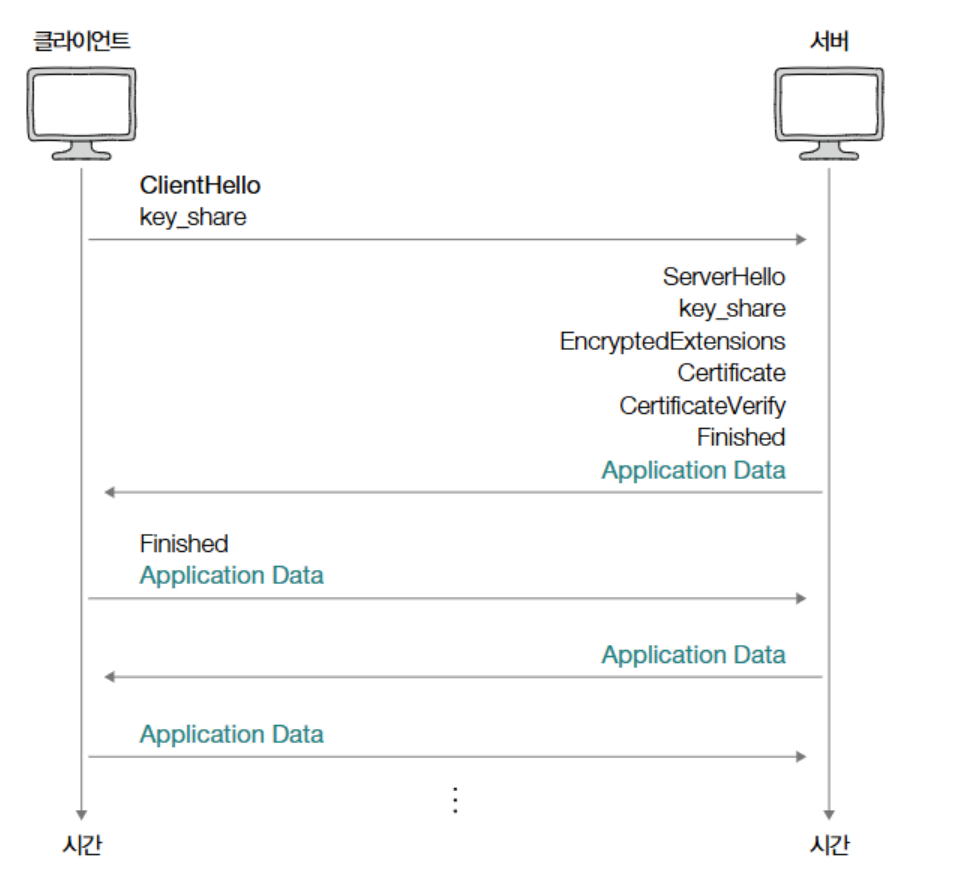

# HTTP의 응용

### 쿠키

---

- 쿠키의 정의 : HTTP의 stateless한 성질을 보완하기 위한 수단, 서버에서 생성되어 클라이언트 측에 저장되는 <이름, 값> 쌍 형태의 데이터.
    - 쿠키의 만료 기간과 같은 추가 속성 보유 가능
- 쿠키 정보 확인 : 개발자 도구→ Application → Storage → Cookies 에서  속성 확인 가능
- (여기다가 이미지 넣자)
- 서버 - 클라이언트 쿠키 전송 방식 :
    - 서버가 쿠키 생성 → 클라이언트에 전송 → 클라이언트는 쿠키를 저장 → 추후 같은 서버에 요청을 보낼 때 요청 메시지에 쿠키를 *자동으로* 포함하여 전송
- 쿠키의 대표적인 속성 :
    - domain : 쿠키를 전송할 도메인 제한
    - path : 쿠키를 전송할 경로 제한
        
        ```python
        요청 메시지
        # 아래처럼 여러 쿠키 전달 시 세미콜론으로 구분
        Cookie : 이름=값;,  이름=값;
        
        GET /next_page HTTP/1.1
        Host : example.com
        Cookie: name=minchul; phone=100-100; message=Hello
        ...헤더 후략...
        
        응답 메시지 
        Set-Cookie: name=minchul domain=minchul.net
        Set-Cookie: name=minchul path=/lectures
        
        ```
        
    - Expires, Max-Age : 쿠키 유효 기간으로 해당 시간이 지나면 쿠키는 삭제되어 전달되지 않음.
        - expires는 날짜, Max-age는 초단위 유효기간으로 표기
        
        ```python
        Set-Cookie: sessionID=abc123; Expires=Fri,  23 Aug 2024 09:00:00 GMT
        Set-Cookie: sessionID=abc123; Max-age=2592000
        ```
        
    - Secure, HTTPOnly :
        - Secure : HTTPS를 통해서만 쿠키를 송수신하라는 속성
        - HTTPOnly : 자바스크립트를 총한 쿠키의 접근 제한, 오직 HTTP 송수신을 통해서만 쿠키 접근
        
        ```python
        Set-Cookie: sessionID=abc123; Secure
        Set-Cookie: sessionID=abc123; HTTPOnly
        ```
        
    
    <aside>
    💡
    
    웹 스토리지 
    
    - 웹 스토리지의 정의 : 웹 브라우저 내 저장공간으로, 쿠키보다 더 큰 데이터 저장 가능
    - 기능 : 클라이언트의 상태를 추측 가능한 <키, 값> 쌍이 있음.
    - 쿠키와의 차이점 : 자동으로 서버에 전송되지 않음.
    - 종류 :
        - 로컬 스토리지 : 별도 삭제하지 않는 한 영구 저장
        - 세션 스토리지 : 세션 유지되는 동안 저장됨
    </aside>
    

### 캐시

---

- 정의 : 응답받은 자원의 사본을 임시 저장하여 불필요한 대역폭 낭비와 응답 지연 방지
- 캐시의 유효기간 :
    - 설정 : Expires 헤더 (만료 날짜) , Cache-Control: max-age (유효 기간)
    - 만료 시 서버 재 요청 여부 :
        - 클라이언트는 유효기간이 만료된 캐시를 사용할 때 서버에 원본 데이터의 변경 여부를 질의함 → 
        캐시의 **신선도 (cache freshness)**, 즉 최신 데이터와의 일치 정도를 유지
        - **원본 데이터가 변경되지 않은 경우:** 캐시된 데이터를 그대로 사용하며 유효기간을 연장
        - **원본 데이터가 변경된 경우:** 서버에서 새로운 데이터를 받아 캐시를 갱신
    - 변경 확인을 위한 날짜 기반 방법 :  If-Modified-Since 헤더
        
        
        
    
    ```html
    HTTP/1.1 200 OK
    Date: Mon, 05 Feb 2024 12:00:00 GMT
    Content-type: text/plain
    Content-length: 100
    Expires: Tue, 06 Feb 2024 12:00:00 GMT
    
    두 번째 예시:
    HTTP/1.1 200 OK
    Date: Mon, 05 Feb 2024 12:00:00 GMT
    Content-type: text/plain
    Content-length: 100
    Cache-Control: max-age=1200
    
    ```
    
- 서버가 자원을 처리하는 방식
    - **서버가 요청받은 자원이 변경된 경우:** 서버는 상태 코드 200(OK)과 함께 새로운 데이터를 반환
    - **서버가 요청받은 자원이 변경되지 않은 경우:**  304 (Not Modified) 반환
        - 메시지 본문 없음, 자원이 변경되지 않았다는 304 코드만 반환
        - 클라이언트는 캐시된 자원 사용 가능
        - Last-Modified 헤더로 자원의 '마지막 변경 시점'을 알릴 수 있음
    - **서버가 요청받은 자원이 삭제된 경우**: 404 (Not Found) 반환
- 클라이언트와 서버 간의 통신 흐름 (If-Modified-Since 사용 시):
    
    
    
- **ETag (Entity Tag)를 이용한 캐시 검증:**
    - **Etag 정의** :  "자원의 버전"을 식별하기 위한 정보
        - 원본 자원 변경 여부 확인 시 Etag 값 변경됨 → 해당 정보로 자원 변경(버전) 확인 가능
        - 날짜 기반 정보보다 정밀한 캐시 검증으로 더 선호되는 방식
    - **If-None-Match header :** Etag 명시됨, 명시된 Etag값과 일치하는 값이 없다면 변경된 자원으로 응답
        
        ```html
        GET /index.html HTTP/1.1
        Host: www.example.com
        If-None-Match: "abc"
        ```
        

### 콘텐츠 협상

---

- 콘텐츠 협상이란? : 같은 자원에 대해 할 수 있는 여러 표현 중 클라이언트가 가장 적합한 자원의 표현을 제공하는 기술
- 대표적인 콘텐츠 협상 헤더:
    
    ```html
    GET /index.html HTTP/1.1
    Host: example.com
    Accept-Language: ko
    Accept: text/html
    // 클라이언트가 example.com의 /index.html 페이지를 요청하면서, 한국어를 선호하고 HTML 형식을 선호한다는 것을 서버에 알리는 것
    ```
    
    - `Accept`: 선호하는 미디어 타입을 나타내는 헤더 (예: `text/html`, `application/json`, `image/jpeg`)
    - `Accept-Language`: 선호하는 언어를 나타내는 헤더 (예: `ko`, `en-US`, `fr`)
    - `Accept-Encoding`: 선호하는 인코딩 방식을 나타내는 헤더 (예: `gzip`, `deflate`, `br`)
- **클라이언트의 우선순위 전달 (q 값):**
    - 우선순위란? : 여러 표현에 대한 선호도를 서버에 알리는 것
    - 0(선호도 낮음) ~ 1(선호도 높음)까지의 표현, default =1
    - 예시 : '언어는 한국어를 가장 선호하지만, 영어도 받을 용의가 있다', 혹은 '미디어 타입은 HTML 문서를 가장 선호하지만, XML을 그 다음으로 선호하고, 일반 텍스트를 그 다음으로 선호한다’
        
        ```html
        GET /index.html HTTP/1.1
        Host: example.com
        Accept-Language: ko-KR,ko;q=0.9,en-US;q=0.8,en;q=0.7
        Accept: text/html,application/xml;q=0.9,text/plain;q=0.6,*/*;q=0.5
        ```
        
- 몇 가지 예시 헤더
    - **`Accept-Language: ko-KR,ko;q=0.9,en-US;q=0.8,en;q=0.7`**:
        - `ko-KR`: 한국어 (대한민국)을 가장 선호함 (q=1.0, 생략됨).
        - `ko;q=0.9`: 일반 한국어를 그 다음으로 선호함 (q=0.9).
        - `en-US;q=0.8`: 미국 영어를 그 다음으로 선호함 (q=0.8).
        - `en;q=0.7`: 일반 영어를 가장 덜 선호함 (q=0.7).
    - **`Accept: text/html,application/xml;q=0.9,text/plain;q=0.6,*/*;q=0.5`**:
        - `text/html`: HTML을 가장 선호함 (q=1.0, 생략됨).
        - `application/xml;q=0.9`: XML을 그 다음으로 선호함 (q=0.9).
        - `text/plain;q=0.6`: 일반 텍스트를 그 다음으로 선호함 (q=0.6).
        - `/*;q=0.5`: 모든 미디어 타입을 수용하지만 우선순위가 낮음 (q=0.5). `/*`는 모든 미디어 타입을 의미하는 와일드카

### 보안: SSL/TLS와 HTTPS:

---

- HTTP 란? : SSL/TLS가 더해진 프로토콜
    - **SSL (Secure Sockets Layer) / TLS (Transport Layer Security):** SSL과 TLS는 모두 네트워크 통신을 암호화하고 인증하는 프로토콜입니다. TLS는 SSL의 후속 버전으로, SSL의 취약점을 개선하고 기능을 확장한 것입니다. 현재는 SSL보다 TLS가 더 널리 사용되고 있으며, SSL은 더 이상 사용하지 않는 것이 권장됩니다.
        - **인증 (Authentication):** 서버의 신원을 확인하여 클라이언트가 올바른 서버와 통신하고 있는지 확인합니다. 이를 통해 피싱 공격 등을 방지할 수 있습니다.
        - **암호화 (Encryption):** 클라이언트와 서버 간에 주고받는 데이터를 암호화하여 제3자가 데이터를 가로채더라도 내용을 해독할 수 없도록 합니다.
        - **무결성 (Integrity):** 데이터 전송 중에 데이터가 변조되지 않았음을 보장합니다.
- HTTPS 란?  : HTTP에 SSL(Secure Sockets Layer) 또는 TLS(Transport Layer Security)라는 프로토콜의 동작이 추가된 프로토콜
- HTTPS 특징
    - **암호화:** SSL/TLS 프로토콜을 사용하여 클라이언트와 서버 간의 통신 내용을 암호화함
    - **인증:** 서버의 신원을 인증하여 피싱이나 중간자 공격을 방지
    - **무결성:** 데이터 전송 중 데이터가 변조되지 않았음을 보장
- TLS 1.3 기반 HTTPS 메시지 송수신 단계:
    - TLS 1.3의 특징:
        - **간소화된 핸드셰이크:** 이전 버전보다 핸드셰이크 과정이 간소화되어 연결 설정 속도가 빨라짐
        - **강화된 암호화:** 안전하지 않은 암호화 알고리즘이 제거되고 최신의 강력한 암호화 알고리즘만 사용
        - **0-RTT (Zero Round Trip Time) 재개:** 이전에 연결했던 서버와 다시 연결할 때 핸드셰이크 과정을 생략하여 더 빠르게 연결을 재개할 수 있음
    1. **TCP 3-Way Handshake (TCP 3-방향 핸드셰이크):**  TCP 연결을 설정하는 과정으로, 클라이언트와 서버는 SYN, SYN-ACK, ACK 패킷을 주고받으며 연결을 확립함
        1. 주고 받는 주요 메시지 
            - **ClientHello:** 클라이언트가 서버에 연결을 요청하면서 보내는 첫 번째 메시지. 클라이언트가 지원하는 TLS 버전, 암호화 알고리즘 목록(cipher suites), 랜덤 값 등을 포함함
            - **ServerHello:** 서버가 클라이언트의 `ClientHello` 메시지에 대한 응답으로 보내는 메시지입니다. 서버가 선택한 TLS 버전, 암호화 알고리즘, 서버의 랜덤 값 등을 포함합니다.
            - **Certificate:** 서버가 자신의 인증서를 클라이언트에게 전송합니다. 인증서는 서버의 신원을 보증하는 역할을 하며, 공개 키를 포함하고 있습니다.
            - **CertificateVerify:** 서버가 자신의 개인 키로 서명한 메시지를 전송하여 인증서의 소유권을 증명합니다.
            - **Finished:** 핸드셰이크가 성공적으로 완료되었음을 알리는 메시지입니다. 이 메시지 이후부터는 암호화된 통신이 시작됩니다.
    2. **TLS Handshake (TLS 핸드셰이크):** 클라이언트와 서버가 서로를 인증하고 암호화에 사용할 키를 교환함
        - 이 과정을 통해 이후의 모든 통신은 암호화된 상태로 이루어짐
    3. **메시지 송수신:**  TLS이후 데이터가 암호화해 전송됨
    
    
    
- TLS 핸드셰이크의 핵심 내용:
    - **키 생성/교환:** TLS 핸드셰이크를 통해 암호화 통신을 위한 키를 생성/교환할 수 있음
    - **인증서 송수신 및 검증:** 인증서 송수신과 검증이 이루어질 수 있음

<aside>
💡

암호화 통신을 위한 키'란? 



- **키 생성 및 교환:**
    - 암호화의 핵심은 '키'입니다. 키는 데이터를 암호화하고 복호화하는 데 사용되는 비밀 정보입니다.
    - TLS 핸드셰이크 과정에서 클라이언트와 서버는 안전하게 키를 교환하거나 생성합니다.
    - 키 교환 방식에는 여러 가지가 있으며, 대표적인 예로는 RSA, Diffie-Hellman 등이 있습니다. 이러한 방식들은 수학적인 방법을 사용하여 안전하게 키를 공유할 수 있도록 합니다.
- **인증서 송수신 및 검증:**
    - 인증서는 서버의 신원을 보증하는 디지털 문서입니다. 인증서에는 서버의 공개 키, 소유자 정보, 인증 기관의 서명 등이 포함되어 있습니다.
    - TLS 핸드셰이크 과정에서 서버는 자신의 인증서를 클라이언트에게 전송합니다.
    - 클라이언트는 인증서를 검증하여 서버가 실제로 주장하는 서버가 맞는지 확인합니다. 이 과정을 통해 중간자 공격(Man-in-the-middle attack)을 방지할 수 있습니다.
- 암호 스위트(Cipher suite)
    - 클라이언트가 사용 가능한 암호화 알고리즘과 해시 함수를 서버에 알리기 위해 Client에 아래와 같은 정보(암호 스위트) 정보를 포함해 전송함.
        - **TLS_AES_128_GCM_SHA256:** AES-128 암호화 알고리즘, GCM (Galois/Counter Mode) 암호화 방식, SHA256 해시 함수 사용
        - **TLS_AES_256_GCM_SHA384:** AES-256 암호화 알고리즘, GCM 암호화 방식, SHA384 해시 함수 사용
        - **TLS_CHACHA20_POLY1305_SHA256:** ChaCha20 암호화 알고리즘, Poly1305 인증 방식, SHA256 해시 함수 사용
        - **TLS_AES_128_CCM_SHA256:** AES-128 암호화 알고리즘, CCM (Counter with CBC-MAC) 암호화 방식, SHA256 해시 함수 사용
        - **TLS_AES_128_CCM_8_SHA256:** AES-128 암호화 알고리즘, CCM 암호화 방식 (인증 태그 길이 8바이트), SHA256 해시 함수 사용
</aside>

- **TLS 핸드셰이크 과정 :** 서버는 ClientHello 메시지에 대한 응답으로 ServerHello 메시지를 전송합니다.
    - **ClientHello 메시지:** 클라이언트가 서버에 연결을 요청하면서 지원하는 TLS 버전, 암호 스위트 목록, 난수(Random Number) 등의 정보를 제공하는 메시지. 즉, 암호화 이전에 맞춰 봐야 할 정보들을 제시하는 메시지임.
    - **ServerHello 메시지:** 서버가 ClientHello 메시지에 제시된 정보들을 확인하고, 사용할 TLS 버전, 암호 스위트, 서버의 난수 등을 선택하여 클라이언트에게 알려주는 메시지. 즉, 제시된 정보들을 선택하는 메시지임.
    - ClientHello 메시지와 ServerHello 메시지를 주고받으면 암호화된 통신을 위해 사전 협의해야 할 정보들이 결정되고, 결정된 정보를 토대로 서버와 클라이언트가 암호화에 사용할 키를 만들어 암호화 통신을 시작할 수 있음.
- 인증서 : TLS 핸드셰이크에서 서버의 시누언을 확인하고, 중간자 공격(Man-in-the-Middle Attack) 방지
    - 인증서 발급 기관(CA) 신뢰할 수 있는 제 3의 기관ㅇ서 메시지를 주고받는 대상이 내가 맞다는 보장을 해줌.
    - 

