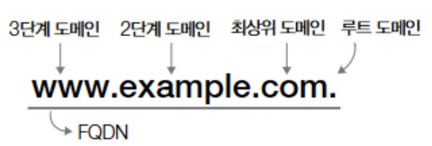
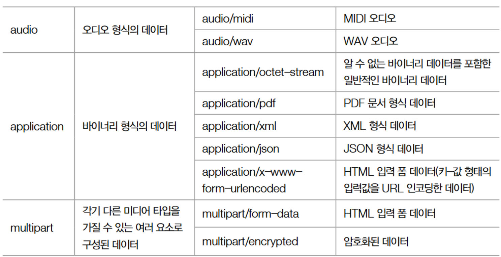

# 5. 응용 계층 - HTTP의 기초

## 1. DNS 와 URI/URL
### 1. 도메인 네임과 DNS
1. **도메인 네임 (domain name)**
- 호스트 식별을 위한 문자 형태 주소(eg. www.naver.com). 호스트의 IP주소와 대응됨
- IP 주소는 네트워크 상에서 호스트 식별을 위한 기본 정보이지만, 가독성이 떨어지고 변경될 수 있기 때문에 도메인 네임을 사용함.
- 네임 서버(name server)/DNS 서버 : 도메인 네임과 IP 주소가 관리되는 서버.
    - DNS 서버를 통해 IP 주소로 변환
    - DNS 서버는 계층 구조를 가지며 전 세계에 분산되어 있음
    - 호스트가 네임 서버에 특정 도메인 이름을 가진 호스트의 IP 주소를 질의해 패킷을 주고받고자 하는 호스트의 IP를 얻어낼 수 있음.
    - 도메인 네임에 대응되는 IP 주소를 알아내는 과정을 "도메인 이름을 푼다(resolve)" 또는 "리졸빙(resolve+ing)한다"고 함
    
     
     

2. **도메인 네임의 계층적 구조**   
    
      - 루트 도메인 : 도메인 네임의 마지막 부분 '.'. 일반적으로 생략함.
      - 최상위 도메인 : com, net, org, kr, jp, cn, us 등
      - 2단계 도메인 : 최상위 도메인의 하부 도메인
      - 3단계 도메인 : 2단계 도메인의 하부 도메인
      - 도메인 단계는 위보다 더 늘어날 수 있지만 일반적으로 3~5단계로 구성됨.
      - 전체 주소 도메인 네임(FQDN) : 도메인 네임을 모두 포함하는 도메인 네임으로, FQDN을 알면 호스트를 식별 가능함.
      - 서브 도메인 : 다른 도메인이 포함된 도메인. 'mail.example.com. www.example.com, developer.example.com'은 모두 'example.com'의 서브 도메인
     
     

3. **DNS(Domain Name System)의 역할과 구조**
    - DNS : 계층적으로 분산된 도메인 네임 관리체계
    - DNS를 통한 도메인 네임 리졸빙   
      
      - 클라이언트와 가까운 로컬 네임 서버는 질의받은 도메인 이름에 대한 IP 주소를 모르는 경우, 계층적인 도메인 네임 서버들에게 질의 반복   
            - 로컬 네임서버(local name server) : 클라이언트가 도메인 네임을 통해 IP 주소를 알아내고자 할 때 가장 먼저 찾게 되는 네임 서버.   
            - ISP(Internet Service Provider): 로컬 네임 서버를 할당
      - **DNS 캐시**: 네임 서버들이 받은 응답을 임시 저장하고 같은 질의에 재사용. 보다 적은 트래픽으로 짧은 시간 안에 원하는 IP 주소를 얻어낼 수 있도록 함.   
            - 자주 질의되는 도메인 네임인 경우 로컬 네임 서버 선에서 캐시되어 있음.     
            - **TTL (Time To Live)**: DNS 캐시가 유효한 시간

> ### DNS 레코드 타입
>- DNS (자원) 레코드: 도메인 네임과 IP 주소 간의 대응 관계를 네임 서버에 추가하는 도메인 네임 설정 정보.
>- 이름(Record name)과 그에 대응하는 값(Value), <이름,값> 쌍의 유형을 나타내는 레코드 타입이 포함 됨.
>
>| 레코드 유형 | 설명 |
>|---|---|
>| A | 특정 호스트에 대한 도메인 이름과 IPv4 주소의 대응 관계 |
>| AAAA | 특정 호스트에 대한 도메인 이름과 IPv6 주소의 대응 관계 |
>| CNAME | 호스트 네임에 대한 별칭 지정 |
>| NS | 특정 도메인의 IP 주소를 찾을 수 있는 네임 서버 |
>| MX | 해당 도메인과 연결되어 있는 메일 서버 |
>
>레코드 예시
>
>- `example.com`의 IP 주소는 `1.2.3.4`
>- `www.example.com`은 `example.com`의 별칭

### 2. 자원과 URI/URL
1. **자원(Resource)과 URI/URL**
- 자원(Resource): 네트워크를 통해 송수신하는 데이터
- URI(Uniform Resource Identifier): 자원을 식별하는 통일된 방식
- URL(Uniform Resource Locator): 자원의 '위치' 기반 식별
- URN(Uniform Resource Name): 자원의 '이름' 기반 식별
      - 자원의 위치와 무관하게 자원을 식별 가능함.

2. **URL 구조**

      1. **scheme**: 자원에 접근하는 방법 (http, https)
      2. **authority**: 호스트 정보 (IP 주소, 도메인 네임, 포트 번호)
      3. **path**: 자원 경로('/'를 기준으로 계층적으로 표현)
      4. **query**: 쿼리문자열, 쿼리 매개변수. 매개 변수역할을 하는 문자열.
            - '?'로 시작되는 <키=값> 형태
            - '&'를 사용해 여러 쿼리 문자열을 연결할 수 있음.
            
      5. **fragment**: 자원의 특정 부분(북마크 느낌)

## 2. HTTP의 특징과 메시지 구조
- HTTP 목적: 다양한 자원을 네트워크를 통해 송수신
- 데이터 형식에 구애받지 않고 다양한 애플리케이션 데이터를 송수신 가능

### 1. HTTP의 특징
1. **요청-응답 기반 프로토콜**: 클라이언트 요청, 서버 응답으로 동작
2. **미디어 독립적 프로토콜**: HTTP는 전송하는 데이터 형식(미디어 타입/MIME)에 제한을 두지 않고, 자원을 주고받는 인터페이스 역할만 수행.
      - 미디어 타입
            
            
        > 미디어 타입 추가 표기 방법
        > - 여러 미디어 타입을 통칭하기 위해 '*' 문자 사용
        > - `text/*`: text 타입의 모든 서브타입을 의미
        > - `*/*`: 모든 미디어 타입 의미
        > - 부가 설명을 위해 선택적으로 매개변수 포함 가능('타입/서브타입;매개변수=값')
        > - `type/html;charset=UTF-8` : HTML 미디어타입, 문자가 UTF-8로 인코딩됨. 
            
3. **스테이트리스 프로토콜(Stateless Protocol)**
      - 서버가 클라이언트의 관련 상태를 유지하지 않음
      - 클라이언트의 모든 HTTP 요청은 독립적인 요청으로 간주됨
      - HTTP 서버가 수많은 클라이언트와 동시에 상호작용하기 때문에 해당 특성이 필수적.   
            - 필요시 언제든 쉽게 서버를 추가할 수 있어 확장성을 높이고, 서버 중 하나에 문제가 생기더라도 다른 서버로 쉽게 대체할 수 있어 견고성 확보에 유리

4. **지속 연결 프로토콜(persistent connection)**
      - HTTP 1.1, HTTP 2.0에서 사용
      - TCP 연결 상에서 여러 개의 요청-응답을 주고 받는 기술
      - 추가적인 요청/응답을 위해 새 연결을 생성하는 오버헤드 감소   
            - **비지속 연결**: 요청마다 새로운 연결 생성   
            - **지속 연결(keep-alive)**: 연결 재사용
            

 

> ### HTTP 버전별 특징
> 1. **HTTP 1.1**   
      - 지속 연결을 공식적으로 지원.
      - HTTP 1.1 버전 이전에는 공식적으로 비지속 연결을 기반으로 동작함.
      - 평문으로 메세지를 주고받으며, 콘텐츠 협상 기능 등 다양한 편의기능 추가.
> 2. **HTTP 2.0**   
      - HTTP 1.1의 단점을 개선, 성능 향상   
      - **바이너리 데이터 전송**: 메시지를 바이너리 형태로 전송하여 효율 증대   
      - **헤더 압축**: 반복되는 헤더를 압축하여 네트워크 이용 효율 증대   
      - **서버 푸시(server push)**: 서버가 클라이언트 요청 없이, 미래에 필요할 것으로 예상되는 자원을 미리 함께 전송.   
      - **HTTP 멀티플렉싱(multiplexing) 기법**: 여러 독립적인 스트림을 바탕으로 요청/응답 메세지를 병렬적으로 처리.   
      - **HTTP 1.1의 HOL(Head-Of-Line) Blocking 문제 해결** : HOL Blocking이란 같은 큐에 대기하며 순차적으로 처리되는 여러 패킷이 있을 때, 첫 번째 패킷의 처리 지연으로 인해 나머지 채킷들의 처리도 모두 지연되는 문제상황.
            
> 3. **HTTP 3.0**   
      - UDP 기반의 QUIC(Quick UDP Internet Connections) 프로토콜 사용   
      - TCP에 비해 빠른 송수신 속도

### 3. HTTP 메시지 구조

1. **HTTP 메시지 구조**
      - 시작 라인, 필드 라인(헤더), 메시지 본문으로 구성
      1. **시작 라인**: 메시지의 종류(요청 또는 응답)와 상태 구분 가능.
          - 요청 메시지: 시작 라인이 요청 라인
          - 응답 메시지: 시작 라인이 상태 라인   
             
              

    | 구분 | 필드 이름 | 설명 | 예시 |
    |---|---|---|---|
    | **요청 라인** | 메서드(method) | 클라이언트가 서버에 대해 수행하고자 하는 작업의 종류를 나타냅니다. | `GET`, `POST`, `PUT` 등 |
    | | 요청 대상(request-target) | 요청하는 서버의 자원을 명시합니다. 일반적으로 쿼리 문자열을 포함한 URL의 경로를 나타냅니다. | `/`, `/hello?q=network`, `http://example.com/` |
    | | HTTP 버전(HTTP-version) | 사용된 HTTP 버전을 나타냅니다. 'HTTP/버전' 형식으로 표시합니다. | `HTTP/1.1`, `HTTP/2` |
    | **상태 라인** | 상태 코드(status code) | 요청에 대한 결과를 나타내는 3자리 정수를 나타냅니다. | `200`, `404`, `500` 등 |
    | | 이유 구문(reason phrase) | 상태 코드에 대한 문자열 형태의 설명입니다. | `OK`, `Not Found`, `Internal Server Error` |
    | | HTTP 버전(HTTP-version) | 사용된 HTTP 버전을 나타냅니다. 'HTTP/버전' 형식으로 표시합니다. | `HTTP/1.1`, `HTTP/2` |
          
      2. **필드 라인**: 메시지에 대한 추가 정보를 제공. 0개 이상 존재.
            - HTTP 메시지 전송과 관련된 부가 정보 및 제어 정보를 제공하는 HTTP 헤더가 명시
            - 일반적으로 하나의 HTTP 메시지에는 여러 헤더가 포함
            -  HTTP 헤더는 콜론(:)을 기준으로 헤더 이름(header-name)과 그에 대응하는 헤더 값(header-value)으로 구성
            
      3. **메시지 본문**: 요청 또는 응답 시 전송되는 실제 데이터. 선택적으로 존재.
            - 개발자 도구" -> "네트워크" 탭에서 HTTP를 사용하는 웹사이트에 접속한 후, 특정 자원을 클릭하여 주고받은 요청/응답 메시지를 확인 가능.

## 3. HTTP 메서드와 상태 코드

| HTTP 메서드 | 설명                                          |
| ----------- | --------------------------------------------- |
| GET         | 자원을 습득하기 위한 메서드                           |
| HEAD        | GET과 동일하나, 헤더만을 응답받는 메서드                 |
| POST        | 서버로 하여금 특정 작업을 처리하도록 하는 메서드             |
| PUT         | 자원을 대체하기 위한 메서드                         |
| PATCH       | 자원에 대한 부분적 수정을 위한 메서드                  |
| DELETE      | 자원을 삭제하기 위한 메서드                         |
| CONNECT     | 자원에 대한 양방향 연결을 시작하는 메서드             |
| OPTIONS     | 사용 가능한 메서드 등 통신 옵션을 확인하는 메서드         |
| TRACE       | 자원에 대한 루프백 테스트를 수행하는 메서드            |

1.  **GET과 HEAD** 
- GET : 자원을 조회하는 용도로 사용.   
      - Host 헤더에는 '요청을 보낼 호스트'가 명시됨. Host 헤더와 요청 라인의 '요청 대상'을 조합하면 요청을 보내는 전체 URL을 알 수 있음.
      

- HEAD : GET과 동일하지만 응답 메세지에 메세지 본문이 포함되지 않음.
      

2. **POST**
- 서버에 특정 작업을 처리하도록 요청하는 데 사용
- 주로 새로운 자원을 생성하고자 할 때 사용
- 요청 메시지: 메시지 본문에 서버에서 처리할 데이터를 포함
      
- 응답 메시지: 새로운 자원이 성공적으로 생성되었을 경우, 일반적으로 Location 헤더를 통해 생성된 자원의 위치를 응답하고, 메시지 본문으로 생성된 자원을 응답
      

3. **PUT과 PATCH**
      1. PUT 메서드 : 자원을 대체하기 위한 메서드. 요청 메시지의 본문으로 자원을 완전히 대체
      2. PATCH 메서드 : 자원에 대한 부분적 수정을 위한 메서드. 요청 메시지의 본문에 해당하는 부분만 자원을 수정.

4. **DELETE**
- 특정 자원 삭제를 요청할 때 사용용

### 2. HTTP 상태코드
- HTTP 상태 코드: 웹 서버가 클라이언트의 요청에 대한 처리 결과를 나타내는 3자리 숫자 코드
- 각 코드는 특정 유형의 결과를 나타내며, 백의 자릿수를 기준으로 분류할 수 있음.

| 상태 코드 | 설명                |
| -------- | ------------------- |
| 100번대  | 정보성 상태 코드       |
| 200번대  | 성공 상태 코드        |
| 300번대  | 리다이렉션 상태 코드  |
| 400번대  | 클라이언트 에러 상태 코드 |
| 500번대  | 서버 에러 상태 코드   |

1. 200번대: 성공 상태 코드
- 200번대 상태 코드는 요청이 성공적으로 처리되었음을 의미함.

| 상태 코드 | 이유 구분 | 설명                                                                 |
| -------- | ------- | -------------------------------------------------------------------- |
| 200      | OK      | 요청이 성공했음을 나타냄.                                                     |
| 201      | Created | 요청이 성공하여 새로운 리소스가 생성되었음을 나타냄.                                         |
| 202      | Accepted  | 요청은 잘 받았으나, 아직 처리 중이거나 처리가 완료되지 않았음을 나타냄.                                  |
| 204      | No Content | 요청이 성공했으나, 응답 본문에 표시할 데이터가 없음을 나타냄. |

2. 300번대: 리다이렉션 상태 코드

- 300번대 상태 코드는 리다이렉션과 관련된 상태 코드.
- 리다이렉션(Redirection) : 클라이언트가 요청한 자원이 다른 곳에 있을 때 다른 곳으로 요청을 이동시키는 것
- 클라이언트가 요청한 자원이 다른 URL에 있을 경우, 서버는 리다이렉션 관련 상태 코드와 함께 응답 메세지의 Location 헤더를 통해 요청한 자원이 위치한 URL을 안내함.

2.1. 리다이렉션 유형

* **영구적 리다이렉션:** 요청된 리소스가 영구적으로 새로운 위치로 이동되었음을 나타냄.
* **일시적 리다이렉션:** 요청된 리소스가 일시적으로 다른 위치에 있음을 나타냄.
* **캐시:** 캐시된 리소스가 변경되지 않았음을 나타냄.

| 상태 코드 | 이유 구분          | 설명                                                                  |
| -------- | ---------------- | --------------------------------------------------------------------- |
| 301      | Moved Permanently | 영구적 리다이렉션, 재요청 메소드가 변경될 수 있음.                                         |
| 308      | Permanent Redirect | 영구적 리다이렉션, 재요청 메소드가 변경되지 않음.                                         |
| 302      | Found            | 일시적 리다이렉션, 재요청 메소드가 변경될 수 있음.                                         |
| 303      | See Other        | 일시적 리다이렉션, 재요청 메소드가 GET으로 변경됨.                                     |
| 307      | Temporary Redirect | 일시적 리다이렉션, 재요청 메소드가 변경되지 않음.                                         |
| 304      | Not Modified     | 캐시된 리소스가 변경되지 않았음을 나타냄.                                                 |

*   **301 (Moved Permanently)**: 영구적으로 리소스가 이동되었음을 나타내며, 향후 요청 시에도 새 URL을 사용하도록 권장함.
*   **308 (Permanent Redirect)**: 301과 유사하지만, 재요청 시에도 원래 요청 메서드(POST 등)를 유지해야 함.
*   **302 (Found)**: 일시적으로 리소스가 다른 위치에 있음을 나타내며, 재요청 시에도 원래 URL을 사용할 수 있음.
*   **303 (See Other)**: 302와 유사하지만, 재요청 시 반드시 GET 메서드를 사용해야 함.
*   **307 (Temporary Redirect)**: 302와 유사하지만, 재요청 시에도 원래 요청 메서드를 유지해야 함.

3. 400번대: 클라이언트 에러 상태 코드

| 상태 코드 | 이유 구분          | 설명                                                                    |
| -------- | ---------------- | ----------------------------------------------------------------------- |
| 400      | Bad Request       | 요청 메시지의 내용이나 형식에 문제가 있음을 나타냄.                                             |
| 401      | Unauthorized      | 요청한 자원에 대한 유효한 인증 정보가 없음을 나타냄.                                         |
| 403      | Forbidden         | 요청한 자원에 대한 접근 권한이 없음을 나타냄.                                               |
| 404      | Not Found         | 요청한 리소스를 찾을 수 없음을 나타냄.                                                  |
| 405      | Method Not Allowed | 요청한 메서드를 지원하지 않음을 나타냄.                                                    |

3.1. 권한 관련 상태 코드

*   **401 (Unauthorized)**: 인증(Authentication)을 요구하는 상태 코드임. 유효한 인증 정보가 필요한 자원에 접근하려 할 때 사용함.
*   **403 (Forbidden)**: 인증은 되었으나, 권한(Authorization)이 없어 자원에 접근할 수 없을 때 사용함.

4. 500번대: 서버 에러 상태 코드

| 상태 코드 | 이유 구분             | 설명                                               |
| -------- | ------------------- | -------------------------------------------------- |
| 500      | Internal Server Error | 요청을 처리할 수 없음을 나타냄.                             |
| 502      | Bad Gateway         | 중간 서버에서 통신 오류가 발생했음을 나타냄.                    |

- 보안상 문제가 발생한 원인을 공개하는 것은 바람직하지 않기 때문에, 500번대 상태 코드 대부분은 500 (Internal Server Error) 코드임.
- 502 (Bad Gateway) 코드는 중간 서버에서 통신 오류가 발생한 경우에 사용됨.

## 4. HTTP 주요 헤더
### 1. 요청 메시지에서 주로 활용되는 HTTP 헤더
1. Host
*   요청을 보낼 호스트가 명시되는 헤더. 도메인 네임 또는 IP 주소, 포트 번호를 지정함.
*   Host 헤더와 요청 라인을 조합하면 요청을 보낸 URL을 짐작할 수 있음.

2. User-Agent
*   클라이언트(웹 브라우저, 모바일 앱 등)의 정보를 서버에 전달함.
*   클라이언트 프로그램의 종류, 운영체제, 버전 정보 등을 포함함.
*   서버는 이 정보를 활용하여 클라이언트 환경에 최적화된 응답을 제공할 수 있음.
*   User-Agent를 통해 HTTP 요청 메시지를 보낸 클라이언트의 접속 수단을 유추 가능함.

3. Referer 헤더
*   클라이언트가 요청을 보낼 때 머무르던 URL이 명시되어, 이를 통해 클라이언트의 유입 경로를 파악 가능.
*   예시: `Referer: https://minchul.net`

### 2. 응답 메시지에서 주로 활용되는 HTTP 헤더
1. Server 헤더
*   응답 메시지를 보내는 서버 호스트 관련 정보가 명시(서버의 종류 및 버전 정보 등)
*   예시: `Server: Apache/2.4.1 (Unix)`

2. Allow 헤더
*   처리 가능한 HTTP 헤더 목록을 알려줌.
*   상태 코드 405 (Method Not Allowed)와 함께 사용됨.

3. Location 헤더
*   클라이언트에게 리소스의 위치를 알려줌.
*   리다이렉션 발생 시 또는 새로운 리소스 생성 시 사용.

### 3. 요청과 응답 메시지 모두에서 활용되는 HTTP 헤더
1. Date 헤더
*   메시지가 생성된 날짜와 시간을 명시
*   예시: `Date: Tue, 15 Nov 1994 08:12:31 GMT`

2. Content-Length 헤더
*   메시지 본문의 바이트 단위 크기(길이)를 나타냄.
*   예시: `Content-Length: 123`

3. Content-Type, Content-Language, Content-Encoding 헤더
- 이 세 가지 헤더는 메시지 본문이 어떻게 표현되었는지를 나타내는 헤더로서, '표현 헤더'라고도 불림.

*   **Content-Type 헤더**: 메시지 본문의 미디어 타입을 명시함.
    *   예시: `Content-Type: text/html; charset=UTF-8`
*   **Content-Language 헤더**: 메시지 본문에 사용된 자언어를 나타냄.
    *   언어 태그로 표시되며, 여러 개의 서브 태그로 구성될 수 있음.
    *   일반적으로 첫 번째 또는 두 번째 서브 태그까지만 사용함.
    *   '언어 코드(특정언어)'-'국가 코드(특정국가)'
    *   예시: `ko-KR` (한국에서 사용하는 한국어), `en-US` (미국에서 사용하는 영어)
    | 첫 번째 서브 태그 | 언어 코드 | 두 번째 서브 태그 | 국가 코드 |
    | --------------- | ----- | --------------- | ---- |
    | 한국어             | ko    | 한국             | KR   |
    | 영어              | en    | 미국             | US   |
    | 중국어              | zh    | 영국             | GB   |
    | 일본어             | ja    | 중국             | CN   |
    | 독일어             | de    | 대만             | TW   |
    | 프랑스어             | fr    | 일본             | JP   |
                                     |        | 독일              | DE   |
                                     |        | 프랑스              | FR   |

*   **Content-Encoding 헤더**: 메시지 본문을 압축 또는 변환한 방식을 명시함.
    *   압축 또는 변환 방식을 알려줌으로써 수신지에서 압축을 해제하고 재변환 할 수 있음.
    * 'gzip', 'compress', 'deflate', 'br' 등이 대표적
    *   예시: `Content-Encoding: gzip`, `Content-Encoding: br`, `Content-Encoding: deflate, gzip`

4. Connection 헤더
*   HTTP 메시지 송신 호스트가 어떤 방식의 연결을 원하는지 명시.
    *   `keep-alive` : 지속적인 연결을 희망함을 나타낼 수 있음.
    *   `close` : 연결 종료를 희망함을 나타낼 수 있음.
    *   예시: `Connection: keep-alive`, `Connection: close`
