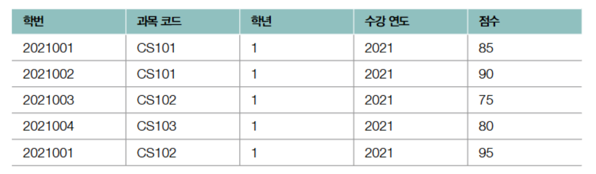

# RDBMS 의 기본

### 테이블의 구성 : 필드와 레코드

---

필드 : 사용 가능한 데이터 유형이 

키 : 테이블 내의 특정 레코드를 식별할 수 있는 필드의 집합

| 교수 이름 | 과목 이름 | 학생 수 |
| --- | --- | --- |
| Kim | 자료구조 | 20 |
| Lee | 운영체제 | 30 |
| Park | 컴퓨터구조 | 20 |
| Kim | 데이터베이스 | 30 |
| Park | 데이터베이스 | 30 |

| 글 ID | 글 제목 | 작성글 | 작성자 | 작성 날짜 |
| --- | --- | --- | --- | --- |
| 1 | 오늘 일기 | 오늘은 밥을 먹었다. 어디를 놀러 갔는데.... | Kim | 2024-01-12 |
| 2 | 독후감 | 오늘은 C++ 책을 리뷰해 볼게요... | Lee | 2024-01-15 |
| 3 | 영화 후기 | 오늘은 어벤져스 영화를 리뷰해 보겠습니다..... | Park | 2024-01-20 |

- 필드타입
    
    
    
- 키 : 테이블의 레코드를 식별할 수 있는 하나 이상의 필드
- **키의 종류**
- **후보 키 (Candidate Key):** 테이블에서 각 레코드를 유일하게 식별할 수 있는 필드 또는 필드들의 최소 집합입니다. 특정 레코드를 유일하게 식별한다는 점에서 '유일성을 갖추었다'고 표현됨
- **복합 키 (Composite Key):** 두 개 이상의 필드로 구성된 키입니다. 위의 '교수 이름'과 '과목 이름' 조합, '글 제목'과 '작성 날짜' 조합은 복합 키의 예시입니다.
- **슈퍼 키 (Super Key):** 테이블에서 각 레코드를 유일하게 식별할 수 있는 필드 또는 필드들의 집합입니다. 후보 키는 슈퍼 키의 부분 집합입니다. 즉, 모든 후보 키는 슈퍼 키입니다. 하지만 슈퍼 키는 최소성을 만족하지 않아도 됩니다. 예를 들어, '글 ID', '글 제목', '작성 날짜'의 조합은 슈퍼 키이지만, '글 ID'만으로도 유일하게 식별 가능하므로 후보 키이기도 합니다.
- **기본 키 (Primary Key):** 후보 키 중에서 테이블의 대표로 선택된 키입니다. 테이블 당 하나의 기본 키만 존재합니다. 위의 '게시글 테이블'에서 '글 ID'가 기본 키로 적합합니다. 기본 키는 NULL 값을 가질 수 없습니다.
- **대체 키 (Alternate Key 또는 Secondary Key):** 기본 키로 선택되지 않은 후보 키입니다.
- **외래 키 (Foreign Key):** 다른 테이블의 기본 키를 참조하는 필드입니다. 테이블 간의 관계를 설정하는 데 사용됩니다. 예를 들어, '수강 테이블'이 있고, 이 테이블에 '교수 테이블'의 '교수 ID'를 외래 키로 포함하면, 어떤 교수가 어떤 강의를 하는지 연결할 수 있습니다.

### 테이블 관계

---

1. **일대일 대응 관계** : 한 테이블의 각 레코드가 다른 테이블의 *오직 하나의* 레코드와 연결되는 관계’
    1. 두 테이블 모두 기본 키를 가지고, 한 테이블의 기본 키가 다른 테이블에서 외래 키 역할을 하는 경우
        
        
        
    2. 두 테이블이 같은 기본 키를 공유하는 경우
        
        
        
2. **다대 다 대응 관계  :** 한 테이블의 각 레코드가 다른 테이블의 *여러* 레코드와 연결될 수 있고, 반대로 다른 테이블의 각 레코드 역시 첫 번째 테이블의 *여러* 레코드와 연결될 수 있는 관계
    
    
    
    
    

### 무결성 제약 조건 :

---

무결성 : 데이터베이스에 저장된 데이터의 일관성과 유효성을 유지하기 위해 마땅히 지켜야 하는 조건

무결성 제약 조건 :

- **도메인 무결성 제약 조건 (Domain Integrity Constraint):** 각 필드 데이터는 원자 값을 가져야 하고/ 필드 타입을 준수하고/ 값의 범위나 기본값이 지정되었을 경우 이를 따라야 함.
    
    <aside>
    💡
    
    원자 값이란?
    
    더 이상 쪼갤 수 없는 단일한 값
    
    
    
    아래와 같은 값은 쪼갤 수 있으므로 원자 값이라고 부르기 어려움
    
    
    
    </aside>
    
- **키 제약 조건** : 레코드를 고유하게 식별할 수 있는 키로 지정된 필드에 중복된 값이 존재해서는 안된다는 제약 조건
- **엔티티 무결성 제약 조건** : 기본 키로 지정한 필드는 고유한 값이어야 하며, NULL이 되어서는 안 된다는 규칙
    - **고유성 (Uniqueness):** 기본 키는 테이블 내의 모든 레코드에 대해 고유한 값을 가져야 합니다.
    - **NULL 불가 (Not NULL):** 기본 키는 NULL 값을 가질 수 없습니다. 모든 레코드는 고유한 식별자를 가져야 하기 때문입니다.
- **참조 무결성 제약 조건 (Referential Integrity Constraint)** : 외래 키를 통해 다른 테이블을 참조할 때 데이터의 일관성을 지키기 위한 제약 조건으로, 외래 키는 참조하는 테이블의 기본 키와 같은 값을 갖거나 NULL 값을 가져야 한다는 규칙
    - **유효한 참조 (Valid Reference):** 외래 키 값은 참조하는 테이블의 기본 키 값 중 하나여야 함. 즉, 외래 키가 존재하지 않는 레코드를 참조해서는 안됨.
    - **NULL 허용 (Nullable):** 외래 키는 NULL 값을 가질 수 있음.

<aside>
💡

**참조하는 테이블이 삭제/수정되는 경우**

- **연산 제한 (Restrict):** 주어진 수정 및 삭제 연산 자체를 거부. 즉, 참조하는 테이블의 레코드를 삭제하거나 변경하려고 할 때, 해당 레코드를 참조하는 외래 키가 있는 경우 오류를 발생시켜 연산을 막는다.
- **기본값 설정 (Set Default):** 참조하는 레코드를 미리 지정한 기본값으로 설정. 즉, 참조되는 테이블의 레코드가 삭제될 경우, 참조하는 테이블의 외래 키 값을 미리 설정해둔 기본값으로 변경함.
- **NULL 값 설정 (Set NULL):** 참조되는 테이블의 레코드가 삭제될 경우, 참조하는 테이블의 외래 키 값을 NULL로 변경함
- **연쇄 변경 (Cascade):** 참조하는 레코드도 함께 수정되거나 삭제. 즉, 참조되는 테이블의 레코드가 수정되거나 삭제될 경우, 해당 레코드를 참조하는 외래 키를 가진 모든 레코드도 함께 수정되거나 삭제됨.
</aside>

