# 효율적 쿼리
- 보다 효율적으로 데이터 베이스에 질의할 수 있는 방법을 탐구해보자.
  - 서브쿼리, 조인, 뷰, 인덱스

## 1. 서브 쿼리와 조인
- 서브 쿼리(Sub Query) :  다른 SQL 문이 포함된 SQL문을 의미한다.
- 조인 (JOIN) : 2개의 테이블을 하나로 합치는 것을 의미한다.
  - 이들은 데이터베이스에 복잡한 요청을할 때 유용하게 사용됨.

### 여러 테이블에 질의하기.
- 실제 db를 다룰 때는 여러 테이블을 대상으로 작업하는 것이 일반적인데, 특히 여러 테이블을 대상으로 SELECT 문을 사용하는 경우가 많다.
- 우선 다음처럼 만들어진 users, posts 테이블을 보자.
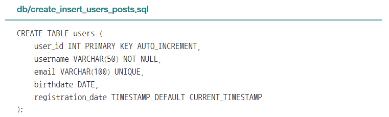
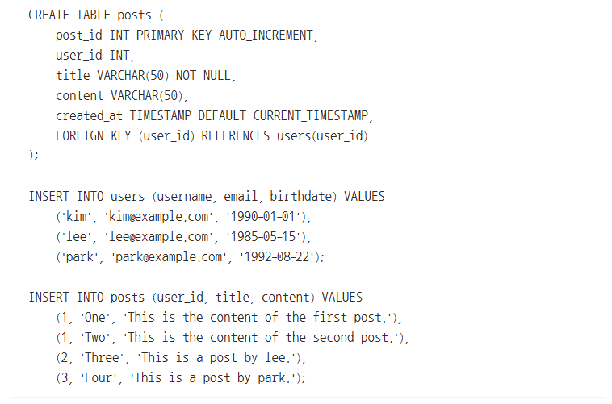
- 우리는 하나의 SELECT 문으로 여러 테이블의 레코드를 조회할 수 있으며, 방법은 간단하다.
1. SELECT 문의 FROM 에 여러 테이블의 이름을 명시하면 된다.
```SQL
# 구조
SELECT 테이블1.필드1, 테이블2.필드2
FROM 테이블1, 테이블2
WHERE 테이블1.필드X = 테이블2.필드Y;

# 실사용
SELECT users.username, users.email, posts.title
FROM users, posts
WHERE users.user_id = posts.user_id;
```
### SQL 필기 정리: SELECT문과 여러 테이블의 JOIN

#### 1. **테이블 생성 예시**
- `posts` 테이블:
  ```sql
  CREATE TABLE posts (
      post_id INT PRIMARY KEY AUTO_INCREMENT,
      user_id INT,
      title VARCHAR(50) NOT NULL,
      content VARCHAR(50),
      created_at TIMESTAMP DEFAULT CURRENT_TIMESTAMP,
      FOREIGN KEY (user_id) REFERENCES users(user_id)
  );
  ```

- `users` 테이블 데이터 삽입:
  ```sql
  INSERT INTO users (username, email, birthdate) VALUES
  ('kim', 'kim@example.com', '1990-01-01'),
  ('lee', 'lee@example.com', '1985-05-15'),
  ('park', 'park@example.com', '1992-08-22');
  ```

- `posts` 테이블 데이터 삽입:
  ```sql
  INSERT INTO posts (user_id, title, content) VALUES
  (1, 'One', 'This is the content of the first post.'),
  (1, 'Two', 'This is the content of the second post.'),
  (2, 'Three', 'This is a post by lee.'),
  (3, 'Four', 'This is a post by park.');
  ```

---

#### 2. **SELECT문 기본 구조**
- 특정 테이블에서 원하는 필드를 조회:
  ```sql
  SELECT 테이블1.필드1, 테이블2.필드2
  FROM 테이블1, 테이블2
  WHERE 테이블1.필드X = 테이블2.필드Y;
  ```

- 위 SQL문 실행 시 결과:
  | username | email             | title  |
  |----------|-------------------|--------|
  | kim      | kim@example.com   | One    |
  | kim      | kim@example.com   | Two    |
  | lee      | lee@example.com   | Three  |
  | park     | park@example.com  | Four   |
---
### 서브 쿼리
- 정의 : SQL문 내부에 다른 SQL문이 포함된 형태로 일반적으로 소괄호 ( )로 감싸진 쿼리.
- 다양한 유형 중에서 대표적인 유형인 2가지 유형을 정리해보겠다.
1. SELECT문 안에 SELECT문을 포함:
    - 하나의 쿼리에서 보조 데이터 계산을 위해 사용.
    ```SQL
    SELECT 
    users.username,
    (SELECT COUNT(*) 
     FROM posts 
     WHERE posts.user_id = users.user_id) AS post_count
    FROM users;
    ```
    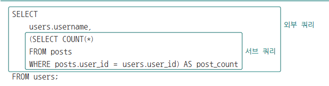
    - 외부 쿼리와 서브 쿼리를 별개의 SQL문이라 보면 된다.
      - **외부 쿼리**: users 테이블에서 사용자 이름(username)을 조회.
      - **서브 쿼리**: posts 테이블에서 해당 사용자의 게시물 개수를 계산.
    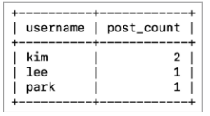
      ---
2. DELETE문 안에 SELECT문을 포함:
    - 특정 조건의 데이터를 삭제할 때 사용.
    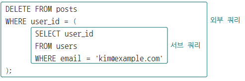
    -  이메일이 kim@example.com인 사용자의 게시물(user_id가 해당 사용자와 동일한 모든 레코드)이 삭제됩니다.
  ---
### 조인
- 조인(JOIN): 여러 테이블을 하나로 합치는 SQL 기법.
  - 서브 쿼리를 통해 복잡한 상황을 처리할 수 있지만, SQL문이 복잡해질 경우 조인을 사용하여 간결하게 작성 가능.
- 대표적으로 INNER 조인과 OUTER 조인으로 나눌 수 있으며, OUTER조인은 다시 LEFT, RIGHT, FULL OUTER 조인으로 구분된다.
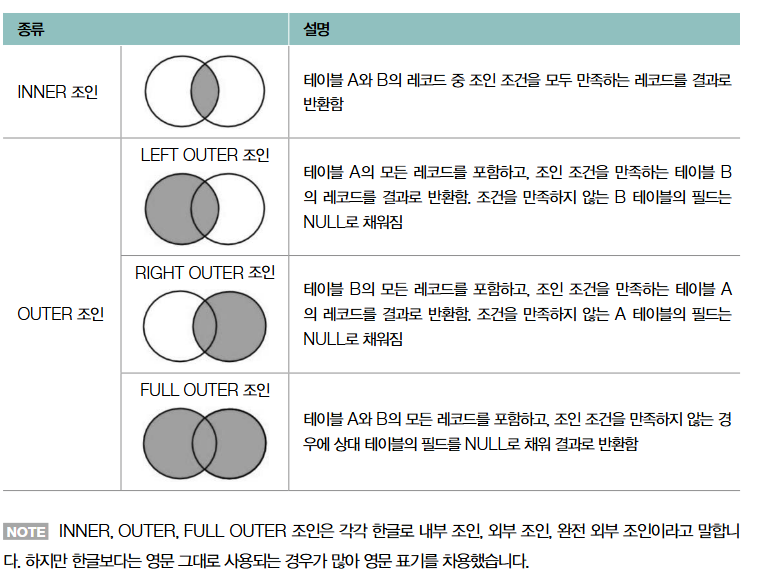
- 
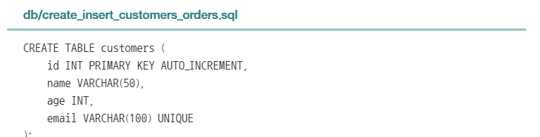

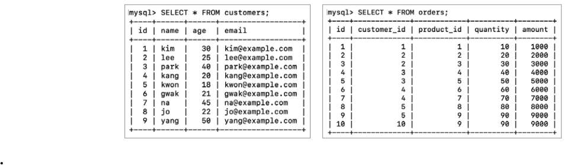


#### **INNER JOIN 활용**
- 가장 일반적인 JOIN으로 다음과 같은 형태를 가지며, 일종의 교집합 연산
  ```SQL
  SELECT 필드
  FROM 테이블1
      INNER JOIN 테이블2 ON 조인 조건;
  ```
- `customers`와 `orders` 테이블을 **`INNER JOIN`**으로 결합.
- `customers.id`와 `orders.customer_id`를 조인 조건으로 사용.

##### **SQL문 예시**:
```sql
SELECT 
    customers.name, 
    customers.age, 
    customers.email, 
    orders.id, 
    orders.product_id, 
    orders.quantity, 
    orders.amount
FROM customers
INNER JOIN orders ON customers.id = orders.customer_id;
```

##### **결과**: 아래와 같이 선택한 필드로 구성된 하나의 테이블 형태로 조회
| **name** | **age** | **email**         | **id** | **product_id** | **quantity** | **amount** |
|----------|---------|-------------------|--------|----------------|--------------|------------|
| kim      | 30      | kim@example.com   | 1      | 1              | 10           | 1000       |
| lee      | 25      | lee@example.com   | 2      | 2              | 20           | 2000       |
| lee      | 25      | lee@example.com   | 3      | 3              | 30           | 3000       |
| park     | 40      | park@example.com  | 4      | 4              | 40           | 4000       |
| park     | 40      | park@example.com  | 5      | 5              | 50           | 5000       |
| kang     | 20      | kang@example.com  | 6      | 6              | 60           | 6000       |
| kang     | 20      | kang@example.com  | 7      | 7              | 70           | 7000       |
| gwak     | 21      | gwak@example.com  | 8      | 8              | 80           | 8000       |
| gwak     | 21      | gwak@example.com  | 9      | 9              | 90           | 9000       |
| yang     | 50      | yang@example.com  | 10     | 9              | 90           | 9000       |

---

#### **WHERE절 조건 추가**
##### **목적**:
- `orders.amount`가 **5000 이상**인 데이터를 필터링. -> 조건 추가

##### **SQL문 예시**:
```sql
SELECT 
    customers.name, 
    customers.age, 
    customers.email, 
    orders.id, 
    orders.product_id, 
    orders.quantity, 
    orders.amount
FROM customers
INNER JOIN orders ON customers.id = orders.customer_id
WHERE orders.amount >= 5000;
```

##### **결과**:
| **name** | **age** | **email**         | **id** | **product_id** | **quantity** | **amount** |
|----------|---------|-------------------|--------|----------------|--------------|------------|
| park     | 40      | park@example.com  | 5      | 5              | 50           | 5000       |
| kang     | 20      | kang@example.com  | 6      | 6              | 60           | 6000       |
| kang     | 20      | kang@example.com  | 7      | 7              | 70           | 7000       |
| gwak     | 21      | gwak@example.com  | 8      | 8              | 80           | 8000       |
| gwak     | 21      | gwak@example.com  | 9      | 9              | 9000         |
| yang     | 50      | yang@example.com  | 10     | 9              | 90           | 9000       |

---
#### **OUTER 조인**
- 먼저 OUTER 조인은 크게 LEFT/RIGHT/FULL OUTER 조인을 나뉜다.

##### 1. **LEFT OUTER JOIN**
- 테이블1의 모든 레코드를 기준으로 테이블2의 레코드를 합치되, 테이블2에 대응되는 레코드가 없다면 해당 값을 NULL로 간주.
  ```SQL
  SELECT 필드
  FROM 테이블1
      LEFT OUTER JOIN 테이블2 ON 조인 조건;
  ```
- **특징**: 
  - `테이블1`의 모든 행과 `테이블2`의 매칭된 데이터를 반환.
  - 매칭되지 않는 경우 `NULL`로 채워짐.
- **SQL 예시**:
  ```sql
  SELECT customers.name, 
         orders.id AS order_id, # orders.id -> order_id로 추가
         orders.product_id, 
         orders.quantity, 
         orders.amount
  FROM customers
  LEFT OUTER JOIN orders 
  ON customers.id = orders.customer_id;

  # customers 테입르의 모든 항목을 선택하고, 
  # 이를 기준으로  orders 테이블의 레코드를 합치되, 
  # customers 테이블 레코드 중 orders 테이블의 레코드에 대응되는 데이터가 없는 경우에 NULL 이 채워짐.
  ```
- **결과**: `customers`의 모든 데이터가 포함, 매칭되지 않는 데이터는 `NULL`.
  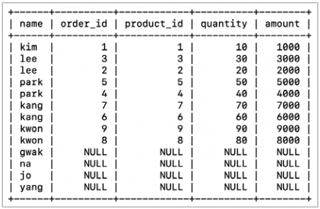
---
##### 2. **RIGHT OUTER JOIN**
- LEFT와 반대로 테이블2의 레코드를 모두 선태갛고, 이를 기준으로 테이블1를 합치되 대응되는 레코드가 없을 시 NULL 처리하는 방식
  ```SQL
  SELECT 필드
  FROM 테이블1
      RIGHT OUTER JOIN 테이블2 ON 조인 조건;
  ```
- **특징**:
  - `테이블2`의 모든 행과 `테이블1`의 매칭된 데이터를 반환.
  - 매칭되지 않는 경우 `NULL`로 채워짐.
- **SQL 예시**:
  ```sql
  SELECT customers.name, 
         orders.id AS order_id, 
         orders.product_id, 
         orders.quantity, 
         orders.amount
  FROM customers
  RIGHT OUTER JOIN orders 
  ON customers.id = orders.customer_id;
  ```
- **결과**: `orders`의 모든 데이터가 포함, 매칭되지 않는 데이터는 `NULL`.
  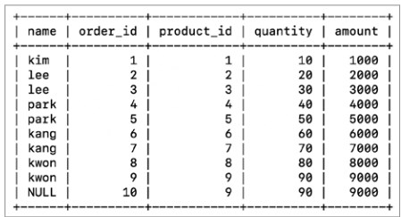
---

##### 3. **FULL OUTER JOIN**
- 두 테이블의 모든 레코드를 선택하되, 대응되지 않는 모든 레코드를 NULL로 표기
- 대부분의 RDBMS에서는 FULL OUTER 조인 문법을 따로 지원하지 않지만, LEFT/RIGHT OUTER JOIN의 결과를 합쳐서 구현할 수 있다. (UNION 사용)
  ```SQL
  SELECT 필드
  FROM 테이블1
      LEFT JOIN 테이블2 ON 조인 조건 # LEFT (OUTER) JOIN 대부분의 RDBMS에서 동일하게 인식
      UNION # 합집합
  SELECT 필드
  FROM 테이블1
      RIGHT JOIN 테이블2 ON 조인 조건;
  ```

- **특징**:
  - `테이블1`과 `테이블2`의 모든 데이터를 반환.
  - 매칭되지 않는 경우 `NULL`로 채워짐.
- **SQL 예시**:
  ```sql
  SELECT customers.name, 
         orders.id AS order_id, 
         orders.product_id, 
         orders.quantity, 
         orders.amount
  FROM customers
      LEFT OUTER JOIN orders 
      ON customers.id = orders.customer_id
      UNION
  SELECT customers.name, 
         orders.id AS order_id, 
         orders.product_id, 
         orders.quantity, 
         orders.amount
  FROM customers
      RIGHT OUTER JOIN orders 
      ON customers.id = orders.customer_id;
  ```
- **결과**: 두 테이블의 데이터를 모두 포함.
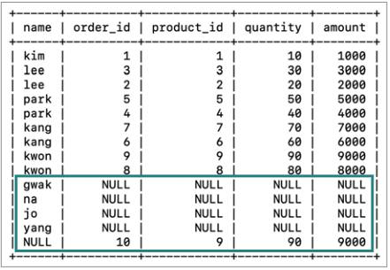
---

##### 4. **조인으로 대체 가능한 서브 쿼리**
- 일부 서브 쿼리 연산은 조인으로 대체 가능하기도 함.
- **SQL 예시**:
  ```sql
  SELECT users.username, COUNT(posts.post_id) AS post_count
  FROM users
      LEFT JOIN posts ON users.user_id = posts.user_id
      GROUP BY users.username;
  ```
- **결과**:
  | username | post_count |
  |----------|------------|
  | kim      | 2          |
  | lee      | 1          |
  | park     | 1          |

---
## 뷰

### SQL 뷰(View)와 서브 쿼리 간소화
#### **1. SELECT문으로 여러 테이블 데이터를 조합**
```sql
SELECT result.username, result.email, result.title
FROM (
    SELECT users.username, users.email, posts.title
    FROM users, posts
    WHERE users.user_id = posts.user_id
) AS result
WHERE result.username = 'kim';
```

#### **결과**
| username | email            | title   |
|----------|------------------|---------|
| kim      | kim@example.com  | One     |
| kim      | kim@example.com  | Two     |

#### **설명**
- 서브 쿼리를 통해 먼저 데이터를 가공한 후, 결과를 `AS result`로 별칭 부여.
- 이후 외부 쿼리에서 추가 필터링 조건(`username = 'kim'`)을 적용.
- 
- 위 결과처럼 서브쿼리를 이용해 SELECT문을 테이블처럼 다룰 수 있다. 그러나, SELECT 문의 결과를 토대로 SQL 문을 자주 실행해야 할 경우, 매번 서브 쿼리를 작성하기에는 `중복되는 쿼리가 많다.`
---

### **2. 뷰(View) 활용**
- 이럴 때 뷰(SELECT 문의 결과를 만들어진 가상의 테이블)를 활용.
- 뷰를 생성한 뒤, 해당 뷰에 다양한 SQL문을 실행할 수 있다.
```SQL
  CREATE VIEW 뷰_이름 AS 'SELECT문';

  DROP VIEW # 뷰 삭제 명령어.
```
#### **뷰 생성 예제.**
```sql
CREATE VIEW myview AS
    SELECT users.username, 
          users.email, 
          posts.title
    FROM users, posts
    WHERE users.user_id = posts.user_id;
```

#### **뷰 조회**
`SHOW TABLES`를 통해 여느 테이블과 같이 조회 가능.
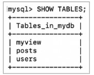


#### 뷰 생성성 예제2
```sql
SELECT username, email, title
    FROM myview
    WHERE username = 'kim';
```

#### **결과**
| username | email            | title   |
|----------|------------------|---------|
| kim      | kim@example.com  | One     |
| kim      | kim@example.com  | Two     |

---

### **3. 뷰의 장점**
1. **쿼리 간소화**:
   - 복잡한 SQL문을 한 번 정의해두고 간단히 사용할 수 있음.
2. **재사용성 증가**:
   - 동일한 데이터 조회 로직을 여러 곳에서 재활용 가능.
3. **보안성 강화**:
   - 특정 컬럼이나 데이터를 제한적으로 노출 가능.
      - 특정 사용자에게 테이블의 특정 데이터만 보여주고자 할 떄, 테이블 상의 노출 가능한 데이터만을 포함하는 뷰를 만들어 접근 권한을 부여

---

### **4. 뷰의 제한 사항**
1. **수정 제한**:
   - 뷰로 생성된 데이터는 직접 삽입(INSERT), 수정(UPDATE), 삭제(DELETE)가 어려운 경우가 있음.
   - 특히 여러 테이블을 조인한 뷰는 변경이 제한됨.
2. **조회 목적**:
   - 뷰는 대부분 조회(SELECT) 용도로 사용.

---
## 인덱스


### **1. 인덱스란?**
- **인덱스의 정의**:
  - 인덱스는 RDBMS의 성능을 최적화하는 핵심 요소 중 하나로, 테이블의 특정 필드에 대한 자료구조이다.
  - 검색 속도를 향상시키기 위해 활용되며, 많은 레코드 중에서 원하는 데이터를 빠르게 찾을 수 있도록 돕는 역할을 함.

- **인덱스와 색인(찾아보기)의 유사점**:
  - 인덱스는 책의 ‘찾아보기’와 유사합니다. 예를 들어, 책에서 특정 용어를 찾기 위해 찾아보기를 사용하면 해당 용어가 등장하는 페이지를 빠르게 확인할 수 있습니다.
  - 마찬가지로, `데이터베이스에서 특정 필드에 인덱스를 생성`하면, 해당 `필드값을 기준으로 레코드를 조회`하여 `데이터를 빠르게 탐색`할 수 있습니다.

- **인덱스를 생성하지 않을 경우의 문제**:
  - 인덱스가 없는 테이블에서는 모든 레코드를 하나씩 검사하는 **전체 스캔(full table scan)**이 필요합니다.
  - 이는 대량의 데이터에서 검색 성능을 저하시킬 수 있습니다.
---
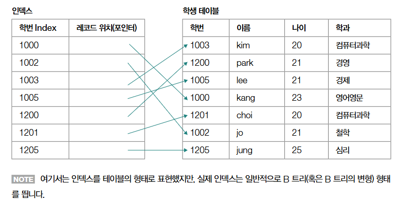
- 위와 같이 '학생' 테이블이 있다고 할 때, '학번' 필드에 인덱스를 생성할 경우, 데이터베이스 내부에 '학번' 필드를 기준으로 정렬된 인덱스 자료구조가 생성됨.
    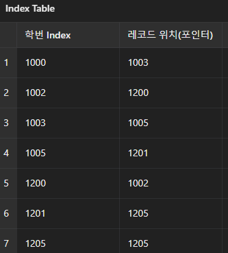
  - 인덱스 ('학번' 필드)를 기준으로 빠른 레코드 조회가 가능
---

### **2. 인덱스의 구조 및 구현 방식**
#### **대표적인 자료구조**:
- **B 트리(B-Tree)** 또는 **B+ 트리(B+ Tree)**가 데이터베이스에서 인덱스를 구현하는 데 사용됩니다.
  - B+ 트리 구조는 노드마다 키 값과 데이터 레코드의 위치를 저장하며, 효율적으로 데이터를 탐색할 수 있도록 설계되었습니다.
  - 예시:
    - B 트리에서는 각 노드가 키 값과 레코드의 위치를 저장합니다.
    - 키 값을 기준으로 데이터를 빠르게 탐색하며, 대량 데이터에서도 성능을 유지합니다.

- **해시 테이블**:
  - 해시 테이블은 동등 조건(= 연산)에 최적화된 자료구조입니다.
  - WHERE 조건이 특정 값과의 비교인 경우(예: `id=1005`), 해시 테이블을 사용하는 것이 효과적입니다.

- **예시: 제품 테이블**:
  - 테이블 예제:
    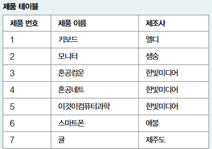
  - 제품 번호를 기준으로 클러스터형 인덱스를 생성하면, 데이터는 제품 번호 순서대로 정렬됩니다.
    - 제품 번호를 기본 키로 간주하여 생성하면, 아래와 같은 B트리 생성.
    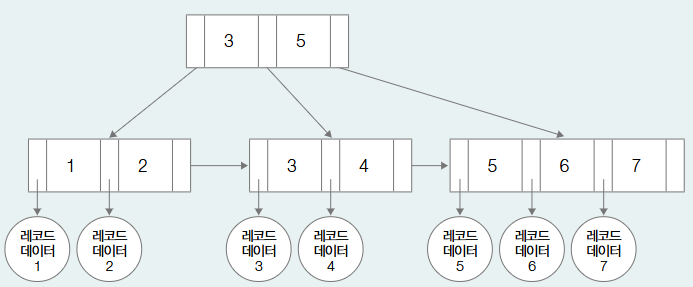
  - B+ 트리 구조를 사용하면 각 노드에 키와 데이터 위치가 저장되어 빠른 탐색이 가능합니다.

---

### **3. 인덱스의 종류**
#### **3.1. 클러스터형 인덱스 (Clustered Index)**
- **특징**:
  - 테이블당 하나만 생성 가능.
  - 기본 키(Primary Key)로 지정된 필드 또는 NOT NULL 혹은 UNIQUE 제약 조건이 적용된 필드는 클러스터형 인덱스로 간주
    - NULL 값이 될 수 없는 고유한 값을 갖는 필드
  - 예: 학생 테이블에서 `학번` 필드를 기준으로 데이터를 정렬하면, 클러스터형 인덱스가 생성됩니다.


#### **3.2. 세컨더리 인덱스 == 비클러스터형 인덱스 (Non-Clustered Index)**
- **특징**:
  - 클러스터형 인덱스 외에 생성되는 모든 인덱스를 의미.
  - 한 테이블에 여러 개 생성 가능.
  - 클러스터형 인덱스를 활용한 검색보다 일반적으로 느림.

---

### **4. 인덱스 생성과 관리**
#### **4.1. 인덱스 생성**
- **SQL 명령어**:
  ```sql
  CREATE INDEX 인덱스_이름 ON 테이블_이름(필드);
  ```
- 예시:
  - `nickname` 필드에 인덱스를 생성:
    ```sql
    CREATE INDEX idx_user ON users(nickname);
    ```

#### **4.2. 인덱스 조회**
- 생성된 인덱스 확인:
  ```sql
  SHOW INDEX FROM 테이블_이름;
  ```

#### **4.3. 인덱스 삭제**
- 불필요한 인덱스를 삭제:
  ```sql
  DROP INDEX 인덱스_이름 ON 테이블_이름;
  ```

---

### **5. 인덱스 사용 시 성능 비교**
#### **5.1. 실험 조건**
- 70만 개의 레코드가 삽입된 테이블에서 인덱스 생성 전후의 성능을 비교.
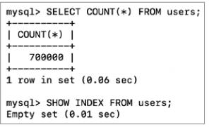
  - 아래는 레코드 10개만 뽑아봄.
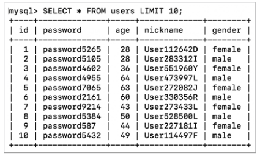

- **인덱스 없이 SELECT 쿼리 실행**:
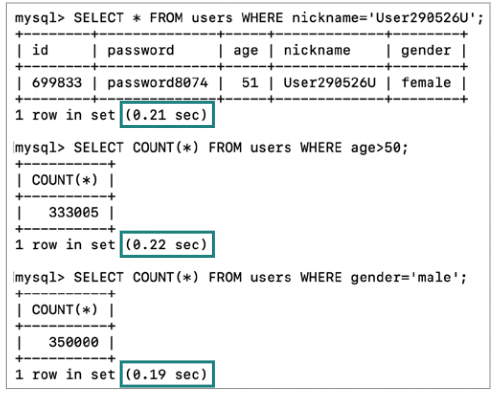
  - WHERE 조건 검색에 약 0.21초 ~ 0.22초 소요.
- **인덱스 생성 후 SELECT 쿼리 실행**:
  ```SQL
  CREATE INDEX idx_user ON users(nickname);
  ```
  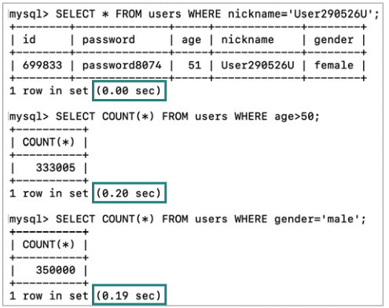
  - 동일 조건 검색 시 속도가 **0.00초**로 단축.
    - SELECT 문에 따로 INDEX를 명시해줄 필요는 없다고 함.(MySQL 기준 자동선택)

#### **5.2. 인덱스 사용의 이점**
- SELECT 쿼리의 성능이 비약적으로 향상됨.
- 데이터가 많을수록 인덱스의 효과가 두드러짐.

#### **5.3. 인덱스 사용의 단점**
- INSERT/UPDATE/DELETE 작업의 성능 저하.
  - 데이터 변경 시 인덱스도 업데이트되므로 추가적인 연산 발생.
  - 새로운 데이터를 삽입하거나 기존 데이터를 수정/삭제할 때 인덱스에 대한 작업도 동시에 이루어져야하므로 추가적인 자원과 연산이 필요.
- 저장 공간 증가:
  - 인덱스를 저장하기 위한 디스크 공간이 필요.

---

### **6. 인덱스 생성 시 고려사항**
- **인덱스를 생성하기 전에 고려할 사항**:
  - 데이터가 충분히 많지 않은 상황에서 굳이 사용 X
  - SELECT 연산이 적은 경우나 삽입/수정/삭제 연산이 많은 경우 굳이 인덱스가 필요하지 않음.
  - 즉 인덱스는 데이터가 충분히 많은 테이블, 조회가 빈번히 이루어지는는 테이블 필드에 만드는 것이 효율적!
    - 특히 자주 JOIN 되거나, WHERE, ORDER BY에서 자주 언급되는 필드.
  - 테이블당 인덱스 개수는 일반적으로 3개 이하를 권고함
  - 중복되는 데이터가 많은 필드에 대한 인덱스 생성은 비효율적
    - 인덱스 사용 여부르 ㄹ떠나서 테이블의 수많은 레코드를 탐색해보아야 함.

---
