# 5. 데이터 베이스 설계

## 1. ER 다이어그램
### 1. 정의, 중요성
- ERD(Entity Relationship Diagram) : 엔터티 간의 관계를 표현하는 그림.
- 데이터베이스에 저장되는 엔터티의 구조를 시각적으로 설계하는 것.
- 사용 목적 : 유지보수 용이성을 높이고 개발자간 원활한 소통을 위함
- 적절하지 않은 ERD 구성시 문제점 : 데이터의 중복과 불일치가 발생할 가능성을 높여 데이터베이스에 대한 질의의 성능 저하

###  2. ERD 표기방식
1. 피터 첸 표기법 Peter Chen diagram
  - 엔티티를 개념적으로 모델링하는 데에는 장점이 있지만, 엔터티가 많아 질 경우 ERD가 복잡해져서 해당 표기법은 잘 사용하지 않음.

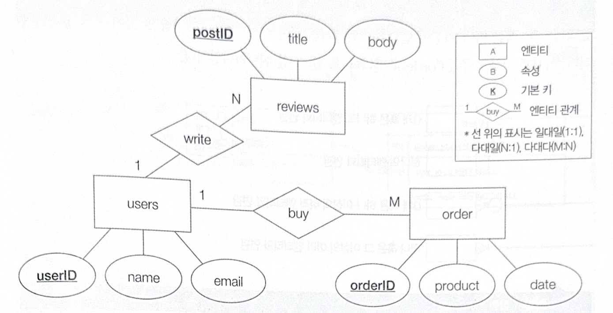
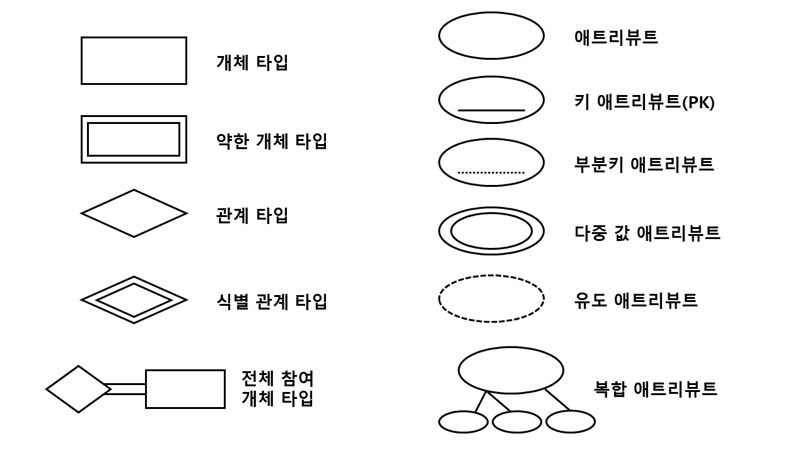
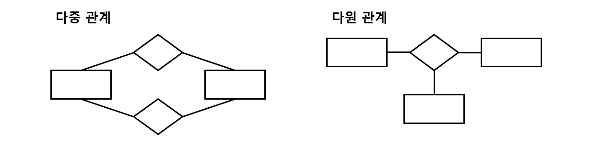

2. IE(Information Engineering notaion) 표기법   
  - 대부분의 RDBMS ERD가 사용하는 표기 형식식 
   1) 구성
    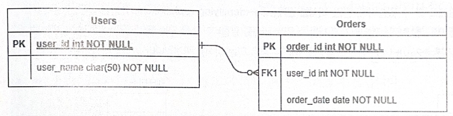
    - 테이블 상단에 이름 작성, 사각형 내부에 속성(필드) 이름 작성
    - PK (Primary Key) : 기본 키
    - FK (Foreign Key) : 외래 키   
     
   2) 연관 관계 표현
    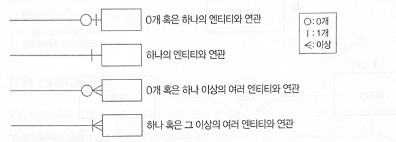   
     
   3) 식별/비식별 관계   
   - 식별 관계(identifying relationship) : 실선으로 표현
      - 참조되는 엔티티가 존재해야만 참조하는 엔티티가 존재할 수 있는 관계
      - 참조되는 테이블의 기본키를 참조하는 테이블의 외래 키이자 기본키로 활용하는 경우
  - 비식별 관계(non-identifying relationship) : 점선으로 표현
      - 참조되는 엔티티가 존재하지 않아도 참조하는 엔티티가 존재할 수 있는 관계
      - 참조되는 테이블의 기본키를 참조하는 테이블의 기본키가 아닌 외래키로 이용할 경우
    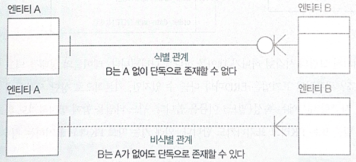

3. ERD 작성 툴
  - draw.io, ERWin, ERDCloud

## 2. 정규화
- 정규화 Normal Form : 잠재적인 문제가 발생하지 않도록 테이블의 필드를 구성하고, 필요할 경우 테이블을 나누는 작업.
- 정규화된 테이블 형태를 정규형이라 부름.
- 제1~5 정규형, 보이스/코드 정규형이 존재하나, 대부분의 경우 제3 정규형 혹은 보이스/코드 정규형까지만 수행됨.
    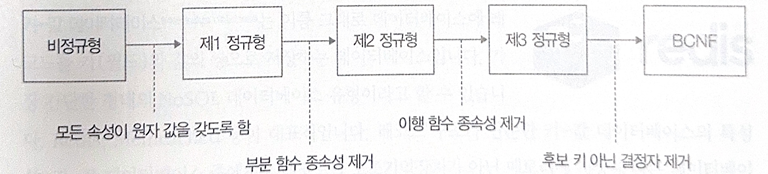

### 1. 제 1정규형
- 모든 필드 데이터가 더 이상 쪼개질 수 없는 값(원자성)을 가진 경우.
- 특정 필드의 값이 쪼개질 수 있는 경우 제 1정규화를 수행.
- 제 1정규화 이전
  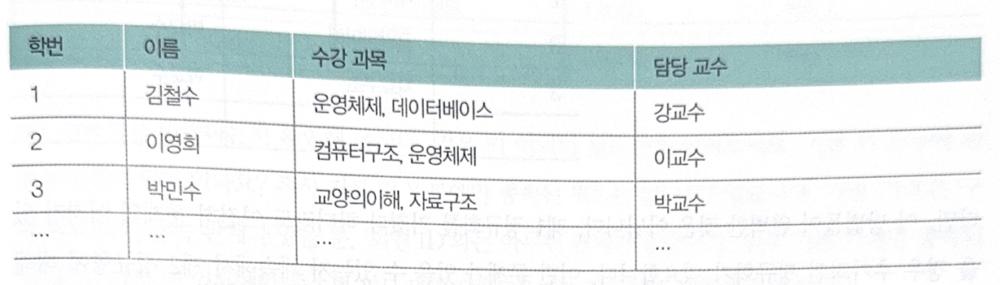
  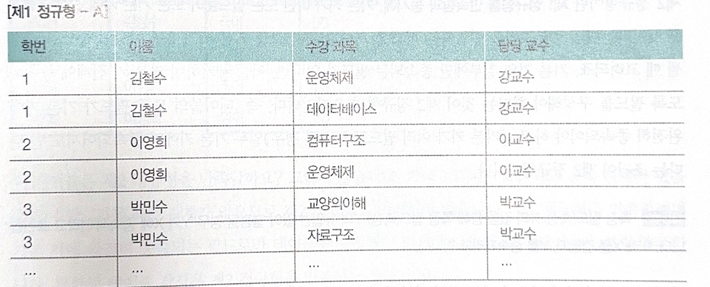
  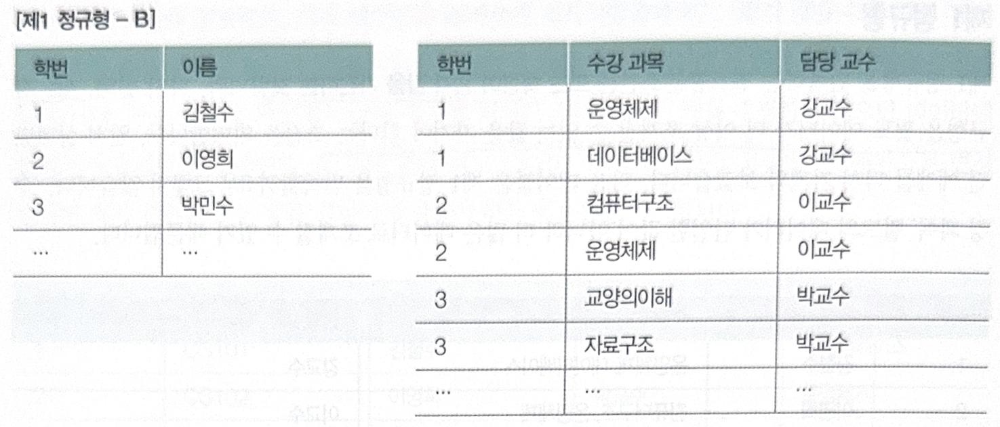

### 2. 제 2정규형
- 제1 정규형을 만족함과 동시에, 테이블의 모든 필드가 기본키에 완전히 종속되어야 함(완전 함수 종속인 상태).
  >- 종속성 : 특정 필드 X의 값을 통해 특정 필드 Y의 유일한 값이 결정될 경우 'Y가 X에 종속적'이라고 표현함. X를 결정자, Y를 종속자라고 함.
  > - 부분 함수 종속성 :기본키가 아닌 필드가 기본 키의 일부에 종속되어 있는 경우
  > - 완전 함수 종속성 : 기본키가 아닌 필드가 기본키 전체에 완전하게 종속되어 있는 경우
- 기본키의 일부에만 종속되는 필드가 있다면, 이를 제거해서 기본키 전체에 종속되도록 필드는 구성하는 것(기본키가 2개 이상의 필드로 구성될 때 고려되는 사항)

- 제 2정규화 이전
  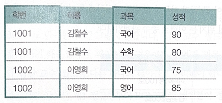
  - 기본키 : 학번, 과목
  - 이름과 학번 사이에는 종속관계가 있지만, 과목과는 관계가 없음.
- 테이블 분할을 통한 제 2정규화
  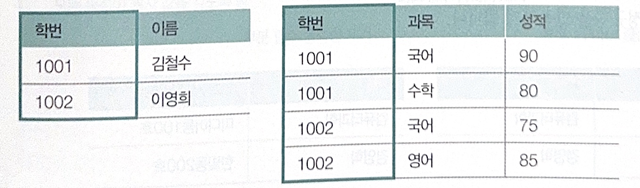

### 3. 제 3정규형
- 제2 정규형을 만족하면서, 기본키가 아닌 모든 필드가 기본키에 이행적 종속성이 없는 상태
  - 이행적 종속 관계 transitive dependency : 한 테이블에 A, B, C라는 필드가 있을 때 A가 B를 결정하고 B가 C를 결정한다면, A도 C를 결정하게 돼 종속 관계를 형성함. 이때, A와 C 필드 사이에는 이행 함수 종속성이 있다고 표현 함.
  - 예시
  
    - 기본키 : 학번
    - 한 학생당 하나의 학과에 속해있고 학과당 학과 사무실 위치가 하나뿐이라면 학번->학과->학과 사무실 위치 관계가 형성되어 학번과 학과 사무실 위치는 이행적 종속관계.
- 즉, 기본 키가 아닌 나머지 모든 필드들이 간접적으로라도 종속되어서는 안됨.
- 테이블 분할을 통해 제3 정규형을 만족
  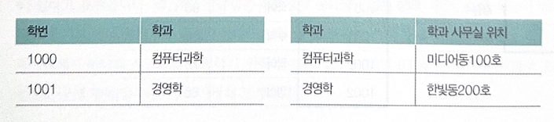

### 4. 보이스/코드 정규형(BCNF Boy-Code Normal Form)
- 제3 정규형을 만족하는 동시에 모든 결정자가 후보 키여야 한다는 조건.
  - 결정자 : 특정 필드를 식별할 수 있는 필드
    - 예시) 필드 B가 필드 A에 종속적일 경우 A는 B의 결정자임.
- 제3 정규형은 만족하지만 BCNF는 만족하지 못하는 경우
  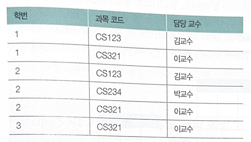
  - 담당 교수 필드는 키가 아니지만, 과목코드의 결정자 역할을 함. 
- 테이블 분할을 통해 BCNF를 만족
  - 학번과 과목코드 필드, 과목코드와 담당 교수 필드를 서로 다른 테이블로 분리해야 함.

### 5. 역정규화 denormalization
- 역정규화 : 검색 속도를 높이기 위해 분할되어 있는 테이블을 하나로 합치는 작업.
- 정규화를통해 데이터를 정돈하고 데이테베이스 작업 시 이상현상을 줄일 수 있지만, 테이블이 쪼개지는 경향이 있어 조인 연산이 빈번해지고 다른 테이블을 참조하기 위한 성능 비용이 증가.
- 성능상의 이점을 활용하고자 NoSQL에서는 기본적으로 정규화를 하지 않음.
- 때에 따라 정규화를 하지 않거나 정규화된 테이블을 역정규화하기도 함.