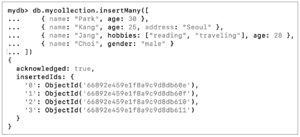

NoSQL (605p ~ 620p)

대규모 데이터를 다루기에 용이하고 확장성이 좋음

# 1. RDBMS vs NoSQL : NoSQL의 특징

- **NoSQL = Not Only SQL**

레코드를 (테이블 형태 이외의) 다양한 형태로 저장할 수 있고, SQL 이외의 방법으로 저장된 데이터도 다룰 수 있음.

## 키-값 데이터베이스

- 데이터베이스에 레코드를 **키 (필드)와 값의 쌍**으로 저장하는 데이터베이스. 가장 간단한 형태의 NoSQL 데이터베이스 유형.


- **Redis**, **Memcached**
- **인메모리 데이터베이스** : 레코드를 보조기억장치가 아닌 메모리에 저장해 빠른 데이터베이스 접근 속도를 제공. (Redis, Memcached)
- **캐시**나 **세션** 등 비교적 가벼운 정보를 저장하는 경우가 많음. 이 경우 주로 다른 주요 데이터베이스의 **보조 데이터베이스**로써 사용되는 경우도 많음.

## 도큐먼트 데이터베이스

- 문서지향 데이터베이스
- 레코드를 **도큐먼트라는 단위로 저장하고 관리**하는 데이터베이스

- **도큐먼트** : 정형화되어 있지 않은 NoSQL 레코드의 단위를 통칭, **JSON** 이나 **XML**과 같은 형식을 도큐먼트로 활용.


- **MongoDB**
→ 하나의 레코드를 **JSON 형태의 데이터**로 만들어 관리. **JSON의 키가 필드**, **JSON 데이터 하나 하나가 RDBMS의 행**인 셈. MongoDB에서는 고정된 스키마가 없기 때문에 **유연한 스키마**를 가질 수 있음.


- 관련 있는 열 → 칼럼 패밀리 → 키스페이스
    - **키스페이스(keyspace)** : 여러 칼럼 패밀리들을 포괄하는 칼럼 페밀리 데이터베이스의 최상위 단위. 일반적으로 애플리케이션마다 키스페이스가 하나씩 사용됨.

### NoSQL의 주요 이점 : 확장성, 유연성, 가용성, 성능

따라서, 높은 부하를 감당하거나 대용량 데이터를 다루는 분산 환경에서 빛을 발함.

RDBMS에 비해 데이터 무결성과 일관성이 다소 저하될 수 있는 대신, 큰 성능 향상을 얻을 수 있음.

# 2. 다양한 NoSQL : MongoDB와 Redis 맛보기

## MongoDB

- 레코드는 도큐먼트 단위로 저장됨.
- 레코드 → 컬렉션 → 데이터베이스

### 컬렉션 생성


### 컬렉션 조회


### 데이터 삽입

1. **단일 레코드를 삽입하는 방법**

```sql
db.컬렉션_이름.insertOne({도큐먼트(레코드)})
```


- **ObjectId** : 도큐먼트마다 부여되는 고유한 값


- JSON 형태의 도큐먼트는 변수 형태로도 사용 가능


- 특정 컬렉션의 도큐먼트를 확인하는 명령

```sql
db.컬렉션_이름.find()
```


- ‘db.컬렉션_이름.find()’의 인자로 도큐먼트의 필드(JSON의 키)의 값을 하나 이상 명시하면 원하는 도큐먼트만 필터링하여 조회할 수 있음.


1. **여러 레코드를 삽입하는 방법**

```sql
db.컬렉션_이름.insertMany()
```



---

### MongoDB의 연산자


---

### 도큐먼트 갱신

1. **단일 도큐먼트를 갱신하는 방법**

```sql
db.컬렉션_이름.updateOne()
```


1. **여러 도큐먼트를 갱신하는 방법**

```sql
db.컬렉션_이름.updateMany()
```

- ‘age’가 ‘20’ 이상인 모든 도큐먼트 (age: { $gte: 20 })의 ‘status’ 필드를 ‘active’로 설정하도록 갱신


- 갱신 결과 조회 : 도큐먼트에 ‘status’라는 필드가 없었다면 새로 생성함.


- 특정 필드를 없앨 때 : **$unset**


### 도큐먼트 삭제

- 단일 도큐먼트 삭제

```sql
db.컬렉션_이름.deleteOne()
```

- 여러 도큐먼트 삭제

```sql
db.컬렉션_이름.deleteMany()
```

- ‘name’ 필드가 ‘Lee’인 도큐먼트를 삭제, ‘age’ 필드가 ‘20’ 이상인 도큐먼트 삭제


## Redis

저장된 레코드를 키-값의 대응 쌍으로 관리함.

- ‘값’으로 활용될 수 있는 자료구조 : 문자열, 리스트, 해시테이블, 집합 등


### 문자열 타입


- SETNX : SET if Not eXists

### 리스트


### Q1. RDBMS와 NoSQL의 주요 차이점은 무엇인가요?
<details>
<summary>A1.</summary>
<div markdown="1">
RDBMS는 관계형 데이터베이스로, 고정된 스키마를 기반으로 데이터를 테이블에 저장합니다. 데이터의 무결성과 일관성을 보장하며, 복잡한 쿼리를 SQL을 통해 처리할 수 있습니다.

반면, NoSQL은 "Not Only SQL"로, 다양한 데이터 형식을 지원하며 고정된 스키마가 없습니다. NoSQL은 대규모 데이터와 높은 트래픽을 처리하기에 적합하며, 확장성과 유연성이 뛰어난 것이 특징입니다. 하지만 데이터의 무결성과 일관성이 다소 저하될 수 있습니다.
</div>
</details>

### Q2. Redis의 주요 특징과 사용 사례는 무엇인가요?
<details>
<summary>A1.</summary>
<div markdown="1">
Redis는 키-값 데이터베이스로, 데이터를 메모리에 저장하여 빠른 읽기/쓰기 성능을 제공합니다. 문자열, 리스트, 해시테이블, 집합 등의 자료구조를 지원합니다. 주요 사용 사례로는 캐싱, 세션 관리, 실시간 분석 데이터 저장 등이 있으며, 특히 빠른 응답이 요구되는 애플리케이션에서 주로 사용됩니다.
</div>
</details>