## RAM의 특징

램에는 실행할 프로그램의 명령어와 데이터가 저장되며,
램은 휘발성 저장 장치에 속한다.

휘발성 저장장치 

- 전원을 끄면 저장된 내용(명령어, 데이터)이 사라지는 저장 장치

비휘발성 저장장치 ( HDD, SSD, USB, CD-ROM )

- 전원을 꺼도 저장된 내용이 유지되는 저장장치 → 보조 기억장치

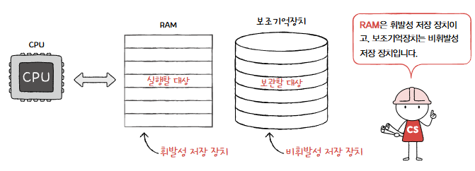


보조 기억장치는 전원을 꺼도 내용을 유지하지만, CPU에 직접 접근할 수가 없음.

→ 그래서 `RAM에는 실행할 대상`, `비휘발성 저장장치에는 보관할 대상`을 저장함

## RAM의 용량과 성능

램의 용량은 컴퓨터 성능에 어떤 영향을 미칠까??

- 램의 용량이 부족하다면, 보조 기억장치에서 실행할 프로그램을 가져오는 일이 잦아지고, 실행 시간이 길어짐.

1. 램의 용량이 프로그램 A,B,C 중 하나만 저장할 수 있을만큼 작은 경우


- CPU가 특정 프로그램을 실행하고 싶을 때마다 보조기억장치에서 RAM으로 해당 프로그램을 가져와야 함. → 굉장히 비효율적

1. 램의 용량이 충분할 때


- 보조 기억장치에서 많은 데이터를 미리 가져와 RAM에 저장할 수 있음.
즉, 많은 프로그램을 동시에 빠르게 실행하는 데 유리하다.

또한 램 용량이 무지하게 크다고 해서 (64gb, 128gb) 실행속도가 비례하여 빨라지지는 않는다. 

## RAM의 종류

- DRAM, SRAM, SDRAM, DDR SDRAM

### DRAM (dynamic RAM)

- 저장된 데이터가 일정 주기(시간에 따라)로 사라지는 RAM을 의미한다.
그래서 해당 주기에 맞춰 데이터를 다시 저장하는(Refresh) 절차가 필요함.
    - 이런 단점에도 소비전력이 낮고, 저렴하고, 집적도가 높아 대용량으로 생산 및 설계하기 용이하여 주로 사용됨. (삼멘… 하멘…)
        - 집적도가 높다?? : 같은 공간에 더 작고 빽빽하게 만들 수 있다.

---

### SRAM (static RAM)

- 저장된 데이터가 변하지 않는 RAM!
+ 속도도 DRAM보다 빠르다.
+ 시간이 지나도 데이터를 재활성화(다시 저장)할 필요가 없다.
    - 단 전원이 공급되지 않으면, 데이터가 날아가기에 비휘발성 메모리는 아님

여기까지 봤을 때 왜 SRAM 대신 DRAM을 쓰지??? 생각하겠지만, 

- SRAM은 DRAM보다 
1. 집적도가 낮고, 2. 소비 전력도 크며, 3. 가격도 더 비쌈

→ 그래서 SRAM은 
`대용량으로 만들어질 필요는 없지만, 속도가 빨라야하는 저장 장치` 에
가령 `캐시 메모리` 에서 사용됨.
    
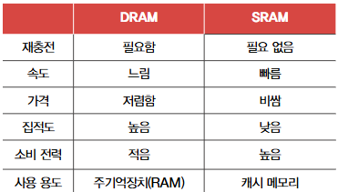

    

---

### SDRAM (Synchronous Dynamic RAM)

- 클럭 신호와 동기화된, 발전된 형태의 DRAM임.
    - 클럭(CLK) 신호와 동기화 되었다??
    ⇒ 클럭 타이밍에 맞춰 CPU와 정보를 주고받을 수 있음 을 의미
        - 즉 SDRAM은 클럭에 맞춰 동작하며, 클럭마다 CPU와 정보를 주고 받을 수 있음.

---

### DDR SDRAM (Double Data Rate SDRAM)

- 최근 가장 흔히 사용되는 DRAM임.
대역폭을 넓혀 속도를 빠르게 만든 SDRAM
    - 대역폭(Data Rate)???
    ⇒ 데이터를 주고 받는 길의 너비
    ⇒ 정확히는 초당 전송할 수 있는 데이터 양
    ⇒ 100Mbps
    
    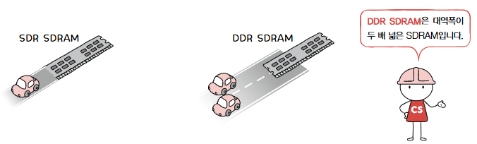

    
    대역폭은 흔히 자동차 도로에 비유되곤 하는데,  
    SDRAM과 비교했을 때 DDR SDRAM은 너비가 2배인 도로와 같음.
    
    - 한 클럭에 한 번씩 CPU와 데이터를 주고 받을 수 있는 SDRAM에 비해 
    DDR SDRAM은 두 배의 대역폭으로 한 클럭당 두 번씩 주고 받을 수 있음
        - SDR SDRAM (Single Date Rate SDRAM)
    
    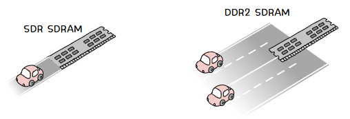

    
    또한 DDR2 SDRAM은 DDR SDRAM보다 대역폭이 두 배 넓고,
             DDR3 SDRAM은 DDR2 SDRAM보다 대역폭이 두 배 넓다.
    
</aside>

# 06-2 메모리의 주소 공간

<aside>

메모리에는 두 가지 주소가 있다.

1. 물리 주소
2. 논리 주소

이번 절에서는 두 주소의 개념 및 변환 방법에 대해 알아보자.

---

## 물리 주소와 논리 주소

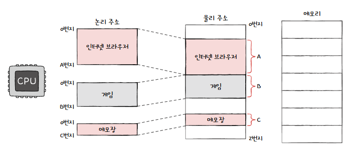


`물리 주소` : 정보가 실제로 저장된 하드웨어 상의 주소

- 실제 메모리(RAM)의 주소. 메모리 장치에 데이터가 저장되거나 읽힐 때 사용

`논리 주소` : 실행 중인 프로그램 각각에게 부여된 0번지부터 시작되는 주소

- CPU가 프로그램 실행 중 생성하는 주소
이 주소는 가상적인 주소로, 직접 메모리에 접근할 수 없음.

왜 논리 주소를 쓰는가???

⇒ 메모리에 크롬, 게임, 메모장 프로그램이 적재되어 있다고 가정해보자.
적재된 프로그램들은 현재 다른 프로그램들의 물리 주소에 대해 알 필요가 없다 
(프로세스 간 독립성 → 보안과 안정성 보장)

### 물리 주소와 논리 주소 간의 변환

- 논리 주소와 물리 주소 간의 변환은 CPU와 주소 BUS 사이에 위치한 
`메모리 관리장치 (MMU, Memory management Unit)`이라는 하드웨어에 의해 수행
    - MMU :  CPU와 메모리 간에 위치한 하드웨어 장치로, **논리 주소를 물리 주소로 변환**
    
    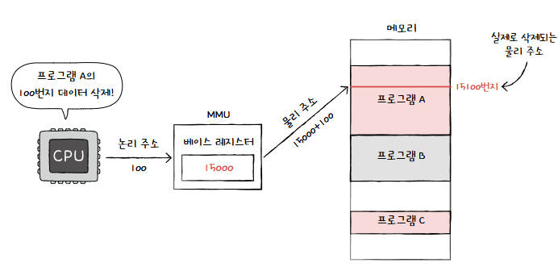

    
    MMU는 CPU가 발생시킨 논리 주소에 베이스 레지스터 값을 더하여 논리 주소를 물리 주소로 변환함
    
    - 예를 들어 현재 베이스 레지스터에 15000 이 저장되어 있고, CPU가 발생시킨 논리 주소가 100 이라면, 
    위 그림처럼 15100 (100 + 15000) 번지로 변환됨.
    
    ### 물리 주소 계산
    
    - **물리 주소(Physical Address) = 베이스 레지스터 값 + 논리 주소(Offset)**
    
    `베이스 레지스터`(MMU)는  프로그램의 가장 작은 물리주소, 즉 프로그램의 첫 물리 주소를 저장하고,
    `논리 주소`는 프로그램의 시작점으로부터 떨어진 거리인 셈. (상대적인 위치)
    

---

## 메모리 보호 기법.

### 한계 레지스터

- **메모리 보호**와 **메모리 관리**를 위해 사용되는 레지스터

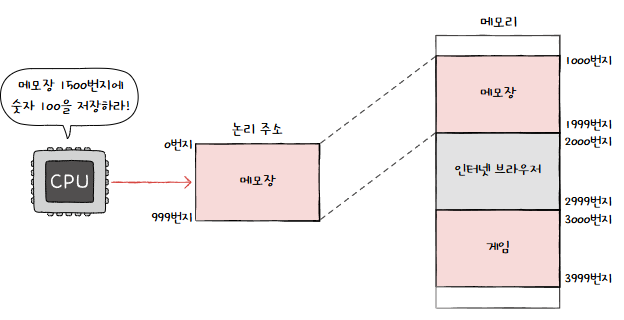


```python
물리주소
- 메모장 프로그램 : 1000~1999번지
- 인터넷 브라우저 : 2000~2999번지
- 게임 프로그램 : 3000~3999번지
```

위와 같은 프로그램 주소가 있다고 가정했을 때 아래와 같은 명령어가 실행될까??

1. 메모장 프로그램 명령어 중 `논리 주소 1500번지에 숫자 100을 저장하라`
2. 인터넷 브라우저 프로그램 명령어 중 `논리주소 1100번지의 데이터를 삭제하라`

    ⇒ 당연히 X 

    프로그램의 논리 주소 영역을 벗어났기 때문이다.

    위 명령어들이 실행된다면, 

    1. 애꿎은 인터넷 브라우저 프로그램에 숫자 100을 저장하고, 
    2500 (1500 + 1000) 번지 100 추가
    (논리주소 + 베이스 레지스터 값=물리주소 최소값)
    2. 인터넷 브라우저 프로그램 명령어는 자신과는 관련 없는 게임 프로그램 정보를 삭제하게 됨.
    3100 (1100 + 2000) 번지 제거

    한계 레지스터는 논리 주소 범위를 벗어나는 명령어 실행을 방지하고, 실행 중인 프로그램이 다른 프로그램에 영향을 받지 않도록 보호하는 역할.

    - 한계 레시스터는 논리 주소의 최대 크기를 저장한다.
        - 베이스 레지스터는 가장 작은 물리주소를 저장.
        
            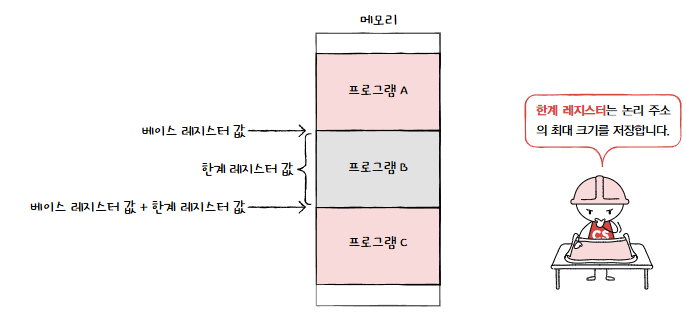

        
            → 위 그림과 같이 프로그램의 물리 주소 범위는 
        `베이스 레지스터 값` 이상, `베이스 레지스터 값 + 한계 레지스터 값` 미만이 됨.
        
            CPU가 접근하려는 논리 주소의 한계는 한계 레지스터가 저장한 값보다 커서는 안 됨.
        
            - 예시.
            
                ---
                
                

                
                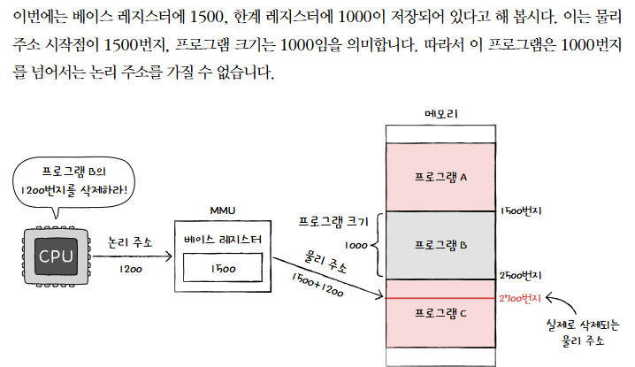

            

    ### 이를 어기는 명령어를 실행시키면??

    


    CPU는 메모리 접근 전에 논리 주소가 범위 안에 있는지 항상 검사하고,

    만약 CPU가 한계 레지스터보다 높은 논리 주소에 접근하려고 하면 `인터럽트를 발생`시켜 실행을 중단시킴.

</aside>

# 06-3 캐시 메모리

<aside>

CPU는 프로그램을 실행하는 과정에서 메모리에 저장된 데이터를 빈번하게 사용함.
But, CPU가 메모리에 접근하는 시간은 CPU의 연산 속도보다 느립니다.

→ 즉 CPU 연산속도가 빨라도 메모리에 접근하는 시간이 느리면 소용이 없다!!

---

먼저 저장 장치 계층 구조에 대해서 알아보고 시작하자.

### 저장 장치 계층 구조

가장 이상적인 저장 장치는 `빠르고` `용량이 큰` 장치일 것이다. 그러나 이는 양립하기 어렵다.

1. CPU와 가까운 저장 장치는 빠르고, 멀리 있는 저장 장치는 느리다.
2. 속도가 빠른 저장 장치는 저장 용량이 작고, 가격이 비싸다.
    
    → 그래서 실제로 우리는 PC를 맞출 때 둘 다 사용한다.
    

컴퓨터가 사용하는 저장 장치들은 `CPU와의 거리`를 기준으로 계층적으로 나타낼 수 있는데,

이를 `저장 장치 계층 구조` 라고 한다.

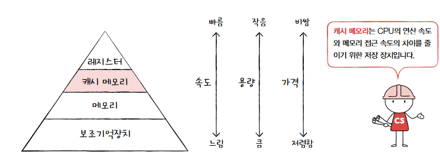

- 상위 계층 : CPU와 가까운 장치, 용량이 작지만 빠르다. + 비싸다
- 하위 계층 : CPU와 먼 장치, 용량이 크지만 느리다. + 저렴하다

| **계층** | **실제 제품 예시** | **용도** |
| --- | --- | --- |
| **레지스터** | Intel/AMD/ARM CPU 내장 레지스터 | CPU 연산, 데이터 저장, 명령어 주소 관리. |
| **캐시 메모리** | Intel L1/L2/L3 캐시, NVIDIA GDDR6X | CPU와 RAM 간 데이터 속도 차이 완화. |
| **메모리(RAM)** | DDR4, DDR5 (Corsair, Samsung) | 프로그램 실행, 임시 데이터 저장. |
| **보조기억장치** | Samsung SSD, Seagate HDD, 외장 드라이브 | 운영체제, 대규모 데이터 저장. |
| **외부 저장 장치** | Blu-ray, IBM 테이프 드라이브, NAS | 장기 데이터 백업 및 보관. |
| **클라우드 저장소** | AWS S3, Google Drive, OneDrive | 원격 저장, 백업, 협업. |

---

그럼 이제 레지스터와 메모리의 중간 단계에 위치하는 캐시메모리에 대해 알아보자

### 캐시 메모리

- CPU 연산속도와 메모리 접근 속도 차이를 조금이나마 줄이기 위해 탄생.
- CPU와 메모리 사이에 위치하며, 
레지스터보다 용량이 크고, 메모리보다 빠른 SRAM 기반 저장장치
    - CPU가 매번 메모리와 데이터를 주고 받는 건 비효율적이니, 
    `캐시 메모리에 CPU가 사용할 일부 데이터를 미리 저장`해두는 것.
        
        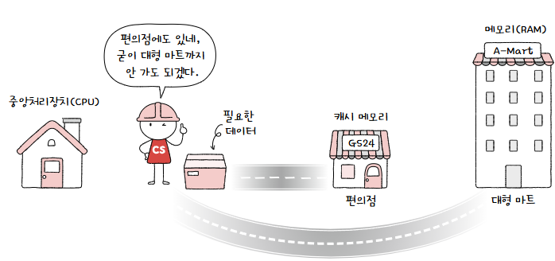

        
        - 메모리 : 대형 마트
        캐시 메모리 : 편의

    그래서 캐시 메모리를 사용하는 경우와 사용하지 않는 경우를 아래와 같이 그릴 수 있음.

    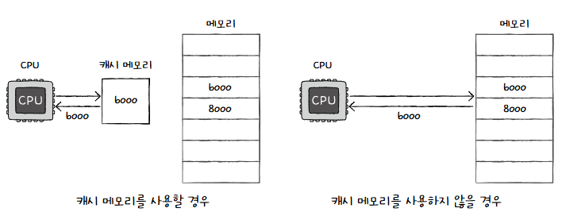


    - 물론 데이터 하나만 가져오진 않음.

    우리가 사용하는 컴퓨터 내부에는 `여러 개`의 `캐시 메모리`가 존재함.

    그리고 이 캐시 메모리들은 다시 CPU와 가까운 순서대로 계층을 구성함.

    - 가까운 순서대로 `L1 (level 1) 캐시 → L2 캐시 → L3 캐시`
    
    

    
    1. 일반적으로 L1 과 L2는 CPU(코어) 내부에, L3 캐시는 코어 외부에 위치하며,
    2. 캐시 메모리 또한 저장 장치 계층과 마찬가지로 
    L1 → L3 순으로 커지며,
    L3 → L1 순으로 빨라지고, 비싸진다.
    3. 또한 CPU 가 메모리 내에서 데이터가 필요하다고 판단되면, 우선 L1 캐시에 해당 데이터가 있는지를 확인하고, L2 L3 순으로 데이터를 검색한다.
    
        
        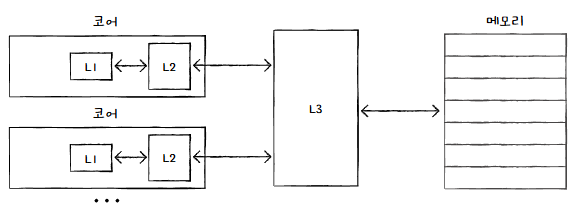

        
        위 그림은 멀티 코어 프로세서에서의 캐시를 그린 것인데, 주로
        
        `L1 & L2` : 코어마다 `고유한 캐시 메모리`로 할당

        `L3`           : `모든 코어가 공유`한다.
        
    
        ### 분리형 캐시(Split Cache)
        
        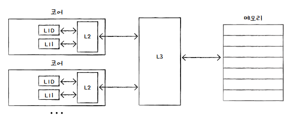

        
        속도 향상을 위해 개선된 캐시 구조.
        
        코어와 가장 가까운 L1 캐시를 L1l, L1D로 분리한 구조이다.
        
        - `L1I` : `명령어`만을 저장한 캐시
        - `L1D` : `데이터`만을 저장하는 캐시
    
    최종 저장 계층 구조
    
    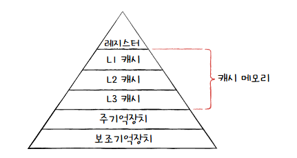

    
    위 구조에 포함되지 않은 저장 장치(원격 스토리지 등..)들이 많으니, 외우진 말고 이해만 합시다.
    

---

캐시 메모리에는 메모리에서 필요한 친구들만 저장한다. 

그렇다면 캐시 메모리는 무엇을 저장해야 할까?

## 참조 지역성 원리

참조 지역성의 원리는 캐시 메모리의 성능을 높이기 위한 원칙.

- `보조 기억 장치`는 전원이 꺼져도 기억할 대상을 저장
- `메모리`는 실행 중인 대상을 저장
- `캐시 메모리`는 CPU가 사용할 법한 대상을 예측하여 저장함.
    
    
    ### 캐시 히트(Cache hit)
    
    - 자주 사용될 것으로 예측한 데이터가 실제로 들어맞아 캐시 메모리 내 데이터가 CPU에서 활용될 경우
        
        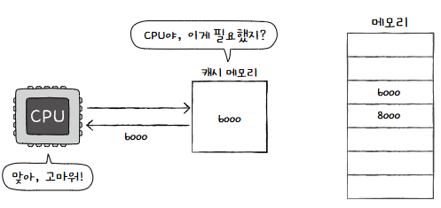

        
    
    ### 캐시 미스(Cache miss)
    
    - 반대로 예측이 틀려 메모리에서 필요한 데이터를 직접 가져와야 하는 경우
        
        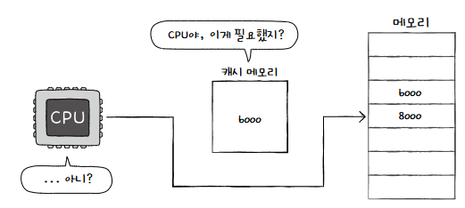

        
        (캐시 미스가 자주 발생할 경우, 캐시 메모리의 이점을 활용할 수 없으니 성능 저하 발생)
        
    
    ### 캐시 적중률
    
    - 캐시가 히트되는 비율
        - `캐시 적중률` = `캐시 히트 횟수 / ( 캐시 히트 횟수 + 캐시 미스 횟수)`
    
    우리가 사용하는 컴퓨터의 캐시 적중률은 대략 85~95% 이상이라고 합니다.
    
    우리는 위와 같은 높은 적중률을 구현하기 위해 `참조 지역성의 원리` 를 따릅니다.
    
    참조 지역성의 원리는 아래 두 경향을 토대로 만들어짐.
    
    
    ### 1. 최근에 접근했던 메모리 공간에 다시 접근하려는 경향 (시간 지역성)
    프로그래밍을 하며 `변수에 값을 저장한 뒤`로는 `언제든` 변수에 접근해 `저장된 값을 사용`할 수 있다.
    
    → CPU에서도 변수가 저장된 메모리 공간을 언제든 다시 참조할 수 있음.
    
    - 일반적으로 변수에 저장된 값을 여러 번 사용하듯이 
    CPU 또한 최근 접근했던 메모리 공간을 여러 번 다시 접근할 수 있음.
    
    이렇게 `최근에 접근했던 메모리 공간에 다시 접근하려는 경향`을 **시간 지역성**이라고 함
    
    ### 2. 접근한 메모리 공간 근처를 접근하려는 경향 (공간 지역성)
    
    - 프로그램이 메모리를 접근할 때, **인접한 메모리 공간**도 곧 접근할 가능성이 높다는 특성
    
    1. **프로그램 데이터의 저장 방식**:
        - CPU가 실행해야 하는 프로그램은 관련된 데이터끼리 한데 모여 저장되는 경향이 있음
        - 예를 들어, 가정 메모리에 **워드 프로세서**, **웹 브라우저**, **게임 프로그램**이 있다고 가정하면:
            - 워드 프로세서와 관련된 데이터는 한 곳에 모여 저장
            - 웹 브라우저 관련 데이터도 한 곳에 저장
            - 게임 프로그램 데이터도 마찬가지로 따로 모여 저장
    2. **세부 프로그램 기능 데이터의 집합**:
        - 하나의 프로그램 내부에서도 관련 있는 데이터들이 모여 저장
            - 예: 워드 프로세서가 자동 저장, 입력, 출력 기능을 포함하고 있다면, 각각의 기능과 관련된 데이터들이 서로 가까운 위치에 저장
            
        
            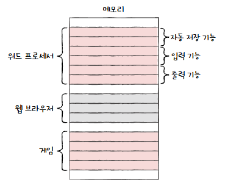

        
        **공간 근처 접근의 경향**:
        
        - CPU가 워드 프로세서 프로그램을 실행할 때, 워드 프로세서와 관련된 **데이터가 모여 있는 공간 근처**를 집중적으로 접근합니다.
        - 마찬가지로, 사용자가 입력 작업을 수행할 때, **입력 기능과 관련된 데이터가 있는 공간 근처**를 집중적으로 접근합니다.
        
        **공간 지역성의 정의**:
        
        - 이처럼 **접근한 메모리 공간 근처를 다시 접근하려는 경향**을 **공간 지역성(Spatial Locality)**라고 합니다.
    
    ---
    