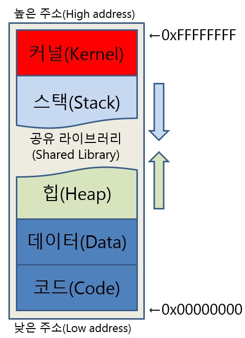
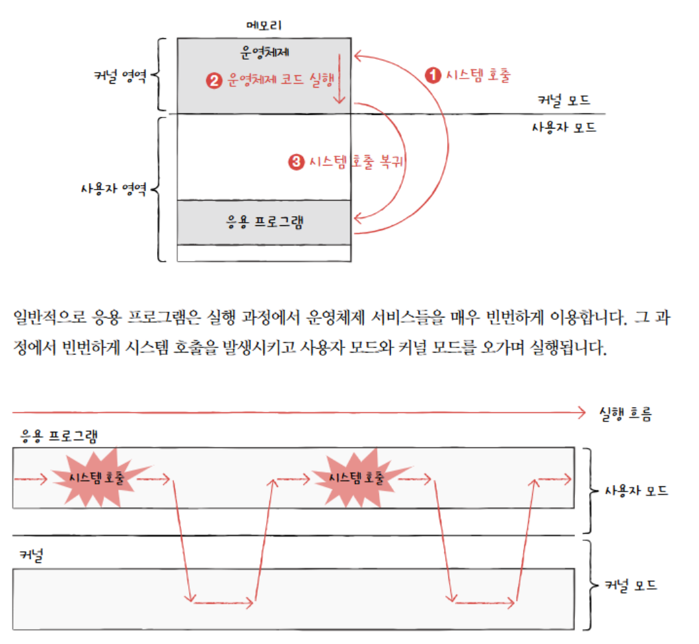
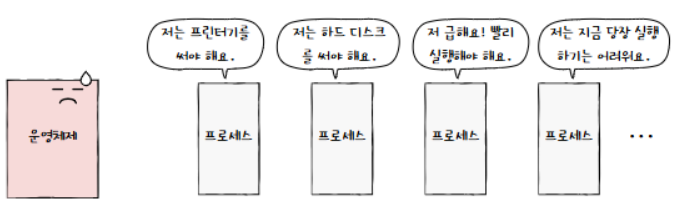
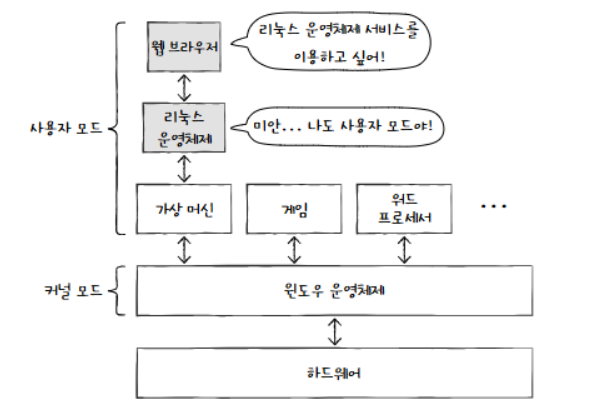
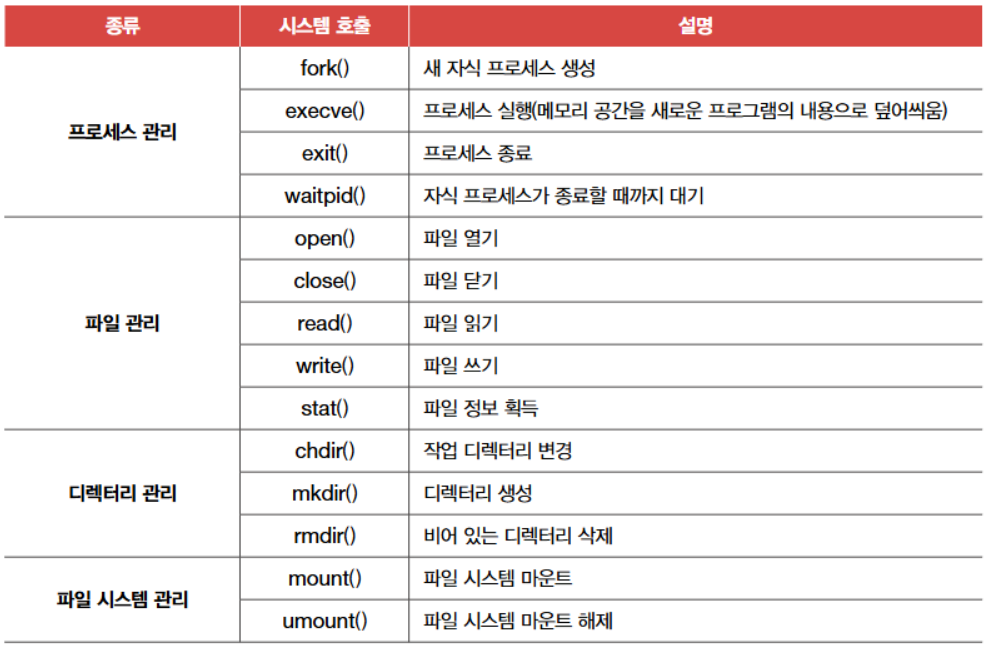

# 운영체제

## 운영 체제 소개

1. 자원(메모리, cpu, 보조기억장치, 입출력 장치 등)을 적절하게 할당하는 프로그램
2. **cpu**의 커널 영역에 존재한다!
    
    <aside>
    ❓
    
    커널 영역이란?
    
    아래 링크에서 엄청 잘 설명해줌. 해당 페이지는 요약본일 뿐이므로, 아래 링크에 들어가서 보는걸 추천합니다!!
    
    [https://blog.naver.com/PostView.naver?blogId=sheep_horse&logNo=221271033909&parentCategoryNo=&categoryNo=&viewDate=&isShowPopularPosts=false&from=postView](https://blog.naver.com/PostView.naver?blogId=sheep_horse&logNo=221271033909&parentCategoryNo=&categoryNo=&viewDate=&isShowPopularPosts=false&from=postView)
    
    - 메모리의 가장 높은 영역에 위치하는 영역.
    - 유저가 직접 접근이 불가, SYSTEM CALL로 불러야 함
    

    
    - 간단한 메모리 구조 설명
        - 코드 :
            - 시스템이 알아들을 수 있는 명령어가 저장되는 영역
            - CPU가 코드영역의 데이터를 수행할 때 하나의 명령어만을 수행하는 형태로 되어있다.
        - 데이터 :
            - 전역 변수(Global Variable)와 정적 변수(Staticariable) 저장 영역
            - 초기화된 데이터영역과 초기화되지 않은 데이터영역으로 나눌 수 있음
            - 초기화하지 않은 데이터 영역이 더 높은 주소
        - 힙 :
            - 동적할당된 변수가 저장되는 영역(실행중 변수 할당, 스택과 다름)
            - 메모리 할당해놓고 사용 후 해제하지 않으면 메모리 과다 사용으로 메모리 누수 일어날 수 있음.
        - 스택 :
            - 함수 내 지역변수(Local Variable)와 매개변수(parameter)가 저장되는 영역
            - 함수가 끝나면 해당 영역 소멸
            - 다른 영역들과 달리 높은 주소에서 낮은 주소로 자라나는 형태를 가진다
                - 커널이랑 붙어 있어서 스택이 커널 침범하면 안되서 그럼
            - 문자 그대로 스택처럼 Last In First Out  로 행동함.
                - 이건 함수 변수 저장하는 거여서 그런듯. 재귀로 call을 하기 위해선 먼저 콜 한 함수를 스택하고 다음 함수를 call하고, 거기서 또 다음 함수 call이 되면 실행 중인 함수는 또 stack이 되고… 이런 구조라서.
    
    </aside>
    

## 운영 체제의 큰 그림

### **핵심 용어**

1. 커널이란? 
    1. 운영체제의 핵심 부분
    2. 하드웨어와 응용 프로그램 사이의 인터페이스 역할
    3. 시스템의 모든 자원(CPU, 메모리, 입출력 장치 등)을 관리
2. 커널이 아닌 운영체제
    1. User Interface
        1. GUI(Graphic User Interface) : 아이콘과 같이 그래픽으로 사용자가 컴 조작 
            1. 직관적이며 사용이 쉬움
        2. CLI(Command Line Interface) : 커맨드 라인으로 사용자가 컴 조작
            1. GUI가 젝공하지 않는 세밀한 조작 가능
3. 이중 모드
    1. 운영체제가 CPU의 동작 모드를 사용자 모드(User Mode)와 커널 모드(Kernel Mode)로 나누어 관리하는 방식
    2. 시스템 안정성 보장
        1. 사용자 모드 : 응용 프로그램이 제한된 권한으로 실행
        2. 커널 모드 : 운영체제가 모든 권한을 가지고 실행됨
4. 시스템 호출 : 응용 프로그램이 운영체제의 서비스를 요청하기 위한 인터페이스
    1. 응용 프로그램이 기능 수행을 위해 운영체제의 도움이 필요한 경우 : 시스템 호출 → 커널에 요청 전달 → 커널이 해당 기능 수행 → 결과를 응용 프로그램에 반환

### **이중모드와 시스템 호출**

이중 모드는 CPU의 실행 모드를 사용자 모드와 커널 모드로 나누어 시스템을 보호하는  메커니즘임. 운영 체제는 사용자가 실행하는 응용 프로그램이 하드웨어 자원(CPU, 메모리, 하드 디스크 등)에 직접 접근하는 것을 막아 데이터 손실 및 덮어쓰기와 같은 문제 차단함.  

1. 이중모드 : CPU가 명령어를 실행하는 모드를 사용자 모드(User Mode)와 커널 모드(Kernel Mode)**로 구분하는 방식을 의미함
    1. 사용자 모드 : 일반적인 응용 프로그램이 해당 모드로 실행
        1. 운영 체제 서비스 불가 모드(커널 영역 코드 실행 불가)
    2. 커널 모드 
        1. 운영 체제 서비스 제공 가능 모드(커널 영역 코드 실행 가능)
        2. 커널이 커널 모드로 실행됨
        3. 커널 모드로 실행중인 CPU는 모든 명령어 실행 가능, 하드웨어 접근 가능
2. 시스템 호출(소프트웨어 인터럽트) : 운영 체제 서비스를 받기 위해 사용자 모드에서 커널 모드로 변경하는 것
    1. CPU의 커널 모드 변경 순서
        1. 시스템 호출(소프트웨어 인터럽트) → CPU가 사용자에서 커널 모드로 변경 → 운영 체제 요청 작업 수행 → 작업완료 → 사용자 모드로 전환 ㅇ
            
            
            

### **운영 체제의 핵심 서비스**

핵심 서비스 3개 : 프로세스 관리, 자원 접근 및 할당, 파일 시스템 관리

1. 프로세스 관리 : 
    1. **프로세스의 정의:** 실행 중인 프로그램
    2. **프로세스 확인:** 윈도우의 [작업 관리자]를 열어 [프로세스] 항목을 보면 매우 많은 프로세스가 실행 중인 것을 확인할 수 있음
    3. **프로세스의 생명 주기:** 컴퓨터를 사용하는 동안 메모리 안에서는 새로운 프로세스들이 계속 생성되고, 사용되지 않는 프로세스는 메모리에서 삭제됨 
    4. **CPU의 프로세스 처리:** 일반적으로 하나의 CPU는 한 번에 하나의 프로세스만 실행할 수 있음. 따라서 CPU는 이 프로세스들을 조금씩 번갈아 가며 실행함. 즉, CPU는 한 프로세스를 실행하다가 다른 프로세스로 실행을 전환하고, 그 프로세스를 실행하다가 또 다른 프로세스로 실행을 전환하는 것을 반복. 이러한 방식을 통해 사용자는 여러 프로그램이 동시에 실행되는 것처럼 느끼게 됨(시분할(Time-Sharing))

**다양한 프로세스의 특성:**

각 프로세스는 상태도, 사용하고자 하는 자원도 다양함. 

- **자원 사용의 다양성:** 어떤 프로세스는 입출력 장치(프린터 등)를 주로 사용하는 반면, 어떤 프로세스는 입출력 장치는 거의 사용하지 않고 주로 CPU만 사용함.
- **실행 가능 여부:** 당장 실행할 수 있는 프로세스가 있는 반면, 특정 조건(예: 입출력 완료 대기)으로 인해 당장 실행이 불가능한 프로세스도 있음.

이런 이유들로 인해서 프로세스 관리가 중요함.

**프로세스 관리의 중요성:**

운영체제가 프로세스를 관리하는 것은 다음과 같은 이유에서 중요

- **다중 작업(Multitasking) 지원:** 여러 프로그램을 동시에 실행할 수 있도록 함.
- **자원 효율성 증대:** CPU, 메모리 등의 시스템 자원을 효율적으로 분배하여 시스템 성능을 최적화함.
- **시스템 안정성 유지:** 프로세스 간의 충돌을 방지하고, 오류가 발생한 프로세스가 시스템 전체에 영향을 미치지 않도록 격리함.
- **사용자 편의성 제공:** 사용자가 여러 프로그램을 동시에 편리하게 사용할 수 있도록 환경을 제공함.

### 자원 접근 및 할당

운영 체제가 할당해줄 주요 4가지 자원에 대해서 알아봅시다

주요 4가지 자원 : CPU, 메모리, 보조기억장치, 입출력 장치

1. **CPU 관리:**
    - **CPU의 한계:** 일반적으로 메모리에는 여러 프로세스가 적재되지만, 하나의 CPU는 한 번에 하나의 프로세스만 실행할 수 있음.
    - **프로세스 대기:** 따라서 하나의 프로세스가 CPU를 이용하고 있다면 다른 프로세스들은 대기
    - **CPU 스케줄링:** 운영체제는 프로세스들에 공정하게 CPU를 할당하기 위해 어떤 프로세스부터 CPU를 이용하게 할 것인지, 얼마나 오래 CPU를 이용하게 할지를 결정하는 것
    - **CPU 스케줄링의 목적:**
        - **공정성(Fairness):** 모든 프로세스에게 공평하게 CPU 사용 기회를 제공.
        - **효율성(Efficiency):**  CPU 사용률을 최대화함.
        - **반환 시간 최소화(Minimizing Turnaround Time):** 프로세스가 요청된 후 완료될 때까지 걸리는 시간을 최소화 함
        - **대기 시간 최소화(Minimizing Waiting Time):** 프로세스가 CPU를 얻기 위해 대기하는 시간을 최소화합니다.
        - **응답 시간 최소화(Minimizing Response Time):** 사용자의 상호 작용에 대한 시스템의 응답 시간을 최소화 함.
    - **CPU 스케줄링 관련 추가 설명:**
        - **스케줄링 알고리즘:** 운영체제는 다양한 스케줄링 알고리즘을 사용하여 CPU를 할당합니다. 대표적인 알고리즘으로는 선입 선처리(FCFS), 최단 작업 우선(SJF), 우선 순위 스케줄링, 라운드 로빈 등이 있습니다.
        - **문맥 교환(Context Switching):** CPU가 한 프로세스에서 다른 프로세스로 전환할 때 현재 프로세스의 상태를 저장하고 다음 프로세스의 상태를 복원하는 과정을 문맥 교환이라고 합니다. 문맥 교환은 시스템의 오버헤드를 발생시키지만, 다중 프로그래밍 환경에서 필수적인 과정입니다.

**메모리 관리:**

- **다양한 프로세스 크기와 주소:** 메모리에 적재된 프로세스들은 크기도, 적재되는 주소도 제각각입니다. 같은 프로세스라 할지라도 실행할 때마다 적재되는 주소가 달라질 수 있습니다.
- **메모리 할당의 필요성:** 따라서 운영체제는 새로운 프로세스가 적재될 때마다 어느 주소에 적재해야 할지를 결정해야 합니다.
- **메모리 부족 문제:** 때로는 메모리가 이미 꽉 차 있어 꼭 실행해야 할 프로세스를 적재할 공간이 없는 경우도 있고, 메모리에 공간이 남았는데도 불구하고 프로세스를 적재하지 못하는 상황도 발생합니다.
- **메모리 관리 방법:** 14장

**입출력 장치 관리:**

- **인터럽트 서비스 루틴:** 인터럽트 서비스 루틴은 운영체제가 제공하는 기능으로 커널 영역에 있습니다.
- **하드웨어 인터럽트:** 입출력 장치가 발생시키는 하드웨어 인터럽트도 마찬가지입니다.
- **인터럽트 처리 과정:** 입출력 장치가 CPU에 하드웨어 인터럽트 요청 신호를 보내면 CPU는 하던 일을 잠시 백업한 뒤 커널 영역에 있는 인터럽트 서비스 루틴을 실행합니다.
- **입출력 작업 수행:** 이처럼 운영체제는 인터럽트를 처리하는 프로그램, 즉 인터럽트 서비스 루틴을 제공함으로써 입출력 작업을 수행합니다. 즉, 운영체제가 인터럽트를 관리함으로써 효율적인 입출력 처리를 가능하게 합니다.

**파일 시스템 관리:**

- **파일과 디렉터리 관리:** 컴퓨터를 사용할 때 여러 파일을 열고, 생성하고, 삭제하며, 이 파일들을 한데 묶어 디렉터리(폴더)로 관리합니다.
- **파일 시스템의 중요성:** 이렇게 당연해 보이는 파일 시스템(file system)도 운영체제가 지원하는 핵심 서비스입니다.
- **파일 시스템 관리 방법:** 15장

### 가상 머신과 이중 모드의 발전

이중 모드는 커널 모드와 사용자 모드, 두 가지 모드를 지원하는 실행 모드임. 하지만 현대 CPI는 가상환경으로 새로운 모드인 하이퍼바이저 모드를 사용 가능함. 

**가상 머신(Virtual Machine)이란?**

- **소프트웨어적인 가상 컴퓨터:** 하나의 물리적인 컴퓨터 하드웨어 위에서 여러 개의 독립적인 가상 컴퓨터를 실행할 수 있도록 하는 기술
- **독립적인 운영체제 및 응용 프로그램 실행:** 가상 머신을 설치하면 새로운 운영체제와 응용 프로그램을 설치하고 실행 가능
- **예시:** 윈도우 운영체제에 가상 머신을 설치하면, 가상 머신 상에 리눅스 운영체제와 그를 기반으로 여러 응용 프로그램들을 설치하고 실행할 수 있습니다. 즉, 하나의 컴퓨터에서 윈도우와 리눅스를 동시에 사용할 수 있게 되는 것입니다.

**가상 머신의 장점:**

- **다양한 운영체제 실행:** 하나의 물리적 시스템에서 여러 운영체제를 동시에 실행할 수 있습니다.
- **자원 활용의 효율성 증대:** 하나의 하드웨어 자원을 여러 가상 머신이 공유함으로써 하드웨어 활용률을 높일 수 있습니다.
- **테스트 및 개발 환경 구축 용이:** 새로운 소프트웨어나 운영체제를 테스트할 때, 실제 시스템에 영향을 주지 않고 가상 환경에서 안전하게 테스트할 수 있습니다.
- **시스템 복구 및 백업 용이:** 가상 머신 이미지를 백업해두면 시스템에 문제가 발생했을 때 빠르게 복구할 수 있습니다.
- **서버 통합:** 여러 대의 서버를 하나의 물리적 서버로 통합하여 관리 비용을 절감할 수 있습니다.

추가 : 

**가상 머신 환경에서의 문제점:**

- **가상 머신도 응용 프로그램:** 여러분의 컴퓨터에 설치된 운영체제(예: 윈도우)에서 가상 머신을 설치하고 실행한다면, 그 가상 머신은 하나의 응용 프로그램으로 간주됩니다. 따라서 가상 머신은 사용자 모드로 작동합니다.
- **가상 머신 내부의 운영체제도 사용자 모드:** 마찬가지로 가상 머신 상에 설치된 운영체제(예: 리눅스) 또한 사용자 모드로 작동합니다.
- **운영체제 서비스 이용의 어려움:** 가상 머신에 설치된 응용 프로그램(예: 웹 브라우저)이 운영체제 서비스를 제공받기 위해서는 커널 모드로 전환되어야 합니다. 하지만 가상 머신에 설치된 운영체제도 사용자 모드로 작동하면 운영체제 서비스를 제공받기 어렵습니다. 즉, 가상 머신 내의 운영체제가 커널 모드로 전환되어야 그 안의 응용 프로그램이 운영체제 서비스를 받을 수 있는데, 가상 머신 자체가 응용 프로그램으로 사용자 모드에서 실행되므로 이러한 전환이 직접적으로 이루어질 수 없는 것입니다.

### 시스템 호출의 종류

POSIX 운영체제(리눅스, 유닉스 등)의 대표적인 운영체제 명령어

아래 링크에 system_call 종류가 정리되어 있으니 참고
    ◦ URL: [https://github.com/kangtegong/self-learning-cs](https://github.com/kangtegong/self-learning-cs)