# 프로세스와 스레드

### 프로세스 개요

프로세스 = 실행중인 프로그램

프로세스 생성  =  보조기억 장치에 저장된 프로그램을 메모리에 적재하고 실행 시키는 것

아래와 같은 작업관리자에서 프로세스 실행을 확인 가능함. 유닉스 체계에서는 ps 명령어로 확인 가능함. 

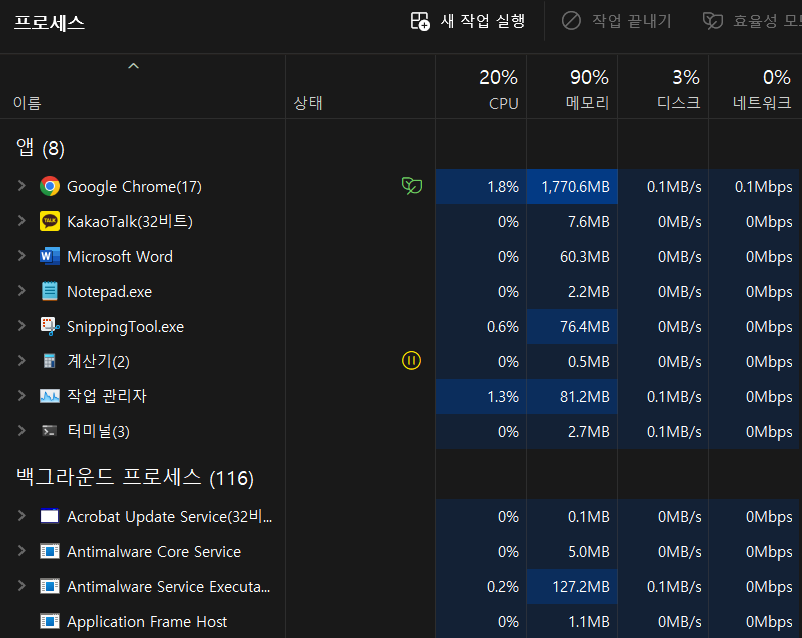

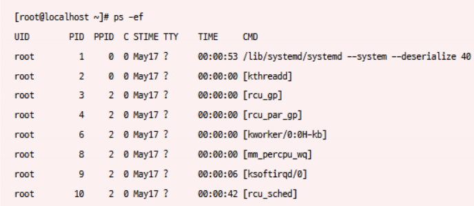

용어 설명

포그라운드 프로세스 : 사용자가 보는 앞에서 실행되는 프로세스

백그라운드 프로세스 : 사용자가 보지 않는 뒤편에서 실행되는 프로세스 

서비스(유닉스 명칭 : 데몬) : 사용자와 상호작용 하지 않고 정해진 일만 처리하는 백그라운드 서비스

### 프로세스 제어 블록

CPU의 자원은 한정되어 있기 때문에 CPU 사용 순서와 시간을 정해야 함. 시간이 끝났음을 알리는 타이머 인터럽트가 발생하면 자신의 차례를 양보하고 다음 차례가 올 때 까지 기다림.

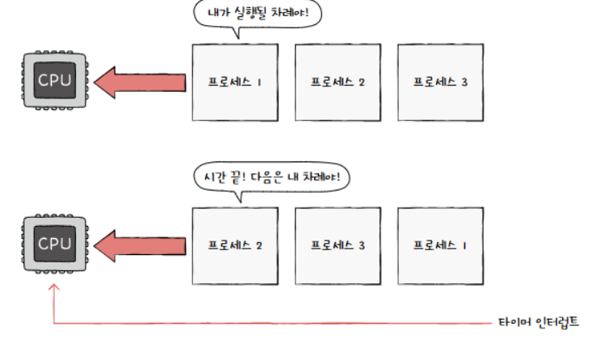

CPU를 포함한 자원을 효율적으로 사용하도록 관리할 때 PCB(Process Control Block) 프로세스 제어 블록이 중요한 역할을 함.

**PCB : 각 프로세스와 관련된 정보를 저장하는 자료 구조**

- **PCB 정의** : PCB에는 해당 프로세스를 식별하고 관리하는 데 필요한 정보들이 저장됨
- **저장 위치** : 커널 영역
- **비유** : 옷 가게 점원이 수많은 옷들 사이에서 태그를 보고 특정 옷을 식별하고 정보를 파악하는 것처럼, 운영체제도 수많은 프로세스들 사이에서 PCB를 통해 특정 프로세스를 식별하고 해당 프로세스를 처리하는 데 필요한 정보를 판단
- **PCB에 저장되는 정보** :
    - **프로세스 ID (PID):** 각 프로세스를 고유하게 식별하는 번호
        - ex ) 학교의 학번, 회사의 사번
        - 같은 일을 수행하는 프로그램이라 할지라도 두 번 실행하면 PID가 다른 두 개의 프로세스가 생성
        - 윈도우 작업 관리자에서 PID를 확인할 수 있음
    - **프로세스 상태:** 프로세스의 현재 상태 (생성(New), 준비(Ready), 실행(Running), 대기(Waiting), 종료(Terminated)) 등)
    - **프로그램 카운터:** 다음에 실행할 명령어의 주소
    - **레지스터 정보:** CPU의 레지스터 값
        - 프로세스는 자신의 실행 차례가 돌아오면 이전까지 사용했던 레지스터의 중간값들을 모두 복원함.  이전까지 진행했던 작업을 그대로 이어 실행하기 위함입니다.
    - **메모리 관리 정보:** 프로세스가 사용하는 메모리 영역 정보
        - 프로세스마다 메모리에 저장된 위치가 다름. 따라서 프로세스 주소가 필요함.
    - **페이지 테이블** : 프로세스 주소 확인에 필요한 정보 (14장 참조)
    - **CPU 스케줄링 정보 :** 프로세스가 언제, 어떤 순서로 CPU를 할당받을지에 대한 정보(우선순위, 할당 시간, 대기 시간 등)
    - **사용한 파일과 입출력 상태 정보:** 프로세스가 사용하는 입출력 장치 정보
        - 프로세스 실행 과정 중 특정 입출력 장치나 파일을 사용하면 PCB에 해당 내용 명시됨.
    - **기타 정보** : 소유자 ID, 자원 할당 정보  등
- **PCB의 생성과 폐기**
    - 프로세스가 생성될 때 만들어지고, 프로세스의 실행이 끝나면 폐기
    - 새로운 프로세스가 생성되었다 = 운영체제가 PCB를 생성했다
    - 프로세스가 종료되었다=운영체제가 해당 PCB를 폐기했다
    
    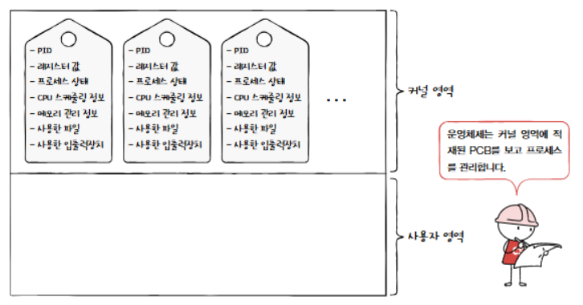
    

### 문맥 교환

문맥 교환이란 ? 

CPU가 하나의 프로세스에서 다른 프로세스로 전환될 때 발생하는 과정으로, 현재 실행 중인 프로세스의 상태(문맥)를 저장하고 다음 실행할 프로세스의 상태를 복원하는 작업을 의미함

여러 프로세스가 번갈아 가며 실행되는 다중 프로그래밍 환경을 효율적으로 운영 가능

- **문맥 (Context):** 프로세스의 현재 실행 상태를 나타내는 정보의 집합입니다. 여기에는 다음과 같은 정보들이 포함됩니다.
    - 프로그램 카운터: 다음에 실행할 명령어의 주소
    - 레지스터 값: CPU의 레지스터에 저장된 값들
    - 메모리 관리 정보: 프로세스가 사용하는 메모리 영역에 대한 정보
    - 열린 파일 목록: 프로세스가 사용 중인 파일 목록
    - 입출력 장치 상태: 프로세스가 사용 중인 입출력 장치의 상태
- **PCB (Process Control Block):** 각 프로세스의 문맥을 저장하는 자료 구조입니다. 문맥 교환이 발생할 때 운영체제는 현재 프로세스의 문맥을 PCB에 저장하고, 다음 프로세스의 문맥을 PCB에서 읽어와 복원합니다.
- **문맥 교환의 필요성:** 다중 프로그래밍 환경에서 여러 프로세스가 동시에 실행되는 것처럼 보이게 하기 위해서는 CPU가 각 프로세스를 매우 빠른 속도로 번갈아 가며 실행해야 합니다. 이때 문맥 교환이 필수적입니다.
- **문맥 교환의 과정:**
    1. 현재 실행 중인 프로세스 A의 문맥을 PCB에 저장합니다.
    2. 다음에 실행할 프로세스 B의 문맥을 PCB에서 읽어와 복원합니다.
    3. CPU가 프로세스 B의 실행을 시작합니다.

문맥 교환이 자주 일어나면 프로세스는 그만큼 빨리 번갈아 가며 수행되기 때문에 여러분의 눈에는 프로세스들이 동시에 실행되는 것처럼 보입니다.

**주의 사항:** 문맥 교환을 너무 자주 하면 오버헤드가 발생할 수 있기 때문에 문맥 교환이 자주 일어난다고 해서 반드시 좋은 건 아닙니다. 

- 오버헤드는 시스템의 부하를 의미하며, 문맥 교환 자체에 소요되는 시간과 자원으로 인해 실제 작업 수행 시간이 줄어드는 현상을 말합니다.)

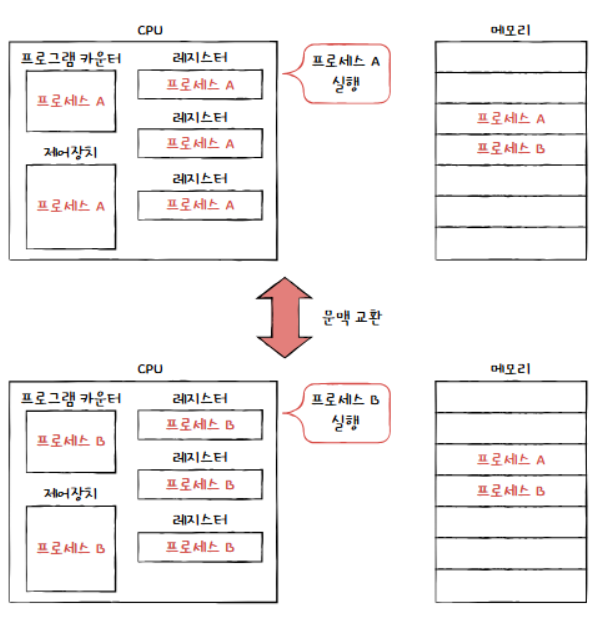

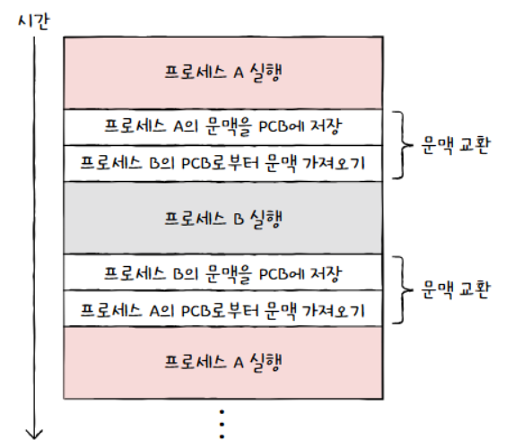

**프로세스의 메모리 영역**

프로세스가 생성되면 커널 영역에 PCB가 생성된다고 했습니다. 그렇다면 사용자 영역에는 프로세스가 어떻게 배치될까요?

하나의 프로세스는 사용자 영역에 크게 코드 영역, 데이터 영역, 힙 영역, 스택 영역으로 나뉘어 저장됩니다. 

- **코드 영역 (Code Segment 또는 Text Segment)**
    - 프로그램의 실행 코드가 저장되는 곳입니다.
    - CPU가 실행할 명령어들로 구성되어 있습니다.
    - 읽기 전용(read-only) 속성을 가지므로, 프로그램 실행 중에는 내용이 변경되지 않습니다. 이는 코드의 무결성을 보장하기 위함입니다.
    - 보통 텍스트 세그먼트(.text)라고 불리기도 합니다.
- **데이터 영역 (Data Segment)**
    - 프로그램이 실행되는 동안 유지되어야 하는 데이터가 저장되는 곳입니다.
    - 전역 변수(global variables), 정적 변수(static variables), 문자열 상수(string literals) 등이 이 영역에 저장됩니다.
    - 읽기/쓰기(read/write)가 가능합니다.
    - 초기화된 데이터는 초기화된 데이터 영역에, 초기화되지 않은 데이터는 BSS(Block Started by Symbol) 영역 또는 초기화되지 않은 데이터 영역에 저장됩니다.
    - **초기화된 데이터 영역 (Initialized Data Segment):** 프로그램이 시작될 때 초기값을 가지는 전역 변수와 정적 변수들이 저장됩니다.
    - **BSS 영역 (Block Started by Symbol) 또는 초기화되지 않은 데이터 영역 (Uninitialized Data Segment):** 프로그램이 시작될 때 0 또는 null로 초기화되는 전역 변수와 정적 변수들이 저장됩니다. 이 영역은 초기화된 데이터 영역보다 크기가 작습니다. 이유는 초기화되지 않은 변수들의 공간만 확보해 놓기 때문입니다.
    - 
    
    <aside>
    💡
    
    **코드 영역과 데이터 영역의 특징**
    
    - **크기 변화:** 프로그램 실행 중 크기가 변하지 않습니다.
    - **이유:**
        - **코드 영역:** 프로그램의 명령어는 실행 중에 바뀌지 않기 때문입니다.
        - **데이터 영역:** 프로그램 실행 동안 유지될 데이터만 저장하기 때문입니다.
    - **용어:** 크기가 고정된 영역이라는 의미에서 **정적 할당 영역**이라고 부릅니다.
    
    **힙 영역과 스택 영역:**
    
    - **크기 변화:** 프로세스 실행 과정에서 크기가 변할 수 있습니다.
    - **용어:** 크기가 변할 수 있는 영역이라는 의미에서 **동적 할당 영역**이라고 부릅니다.
    </aside>
    
- 힙 영역 (Heap Segment)
    - 프로그램을 만드는 사용자, 즉 프로그래머가 직접 할당할 수 있는 저장 공간
    - 프로그래밍 과정에서 힙 영역에 메모리 공간을 할당했다면 언젠가는 해당 공간을 반환(더 이상 해당 메모리 공간을 사용하지 않겠다'라고 운영체제에 말해주는 것)해야 합니다
    - **메모리 누수** : 반환하지 않는다면 할당한 공간은 메모리 내에 계속 남아 메모리 낭비를 초래함.
        
        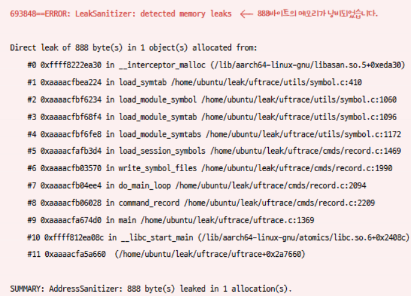
        
- 스택 영역 (Stack Segment)
    - **스택 영역의 역할:**
        - 함수 호출과 관련된 데이터를 임시로 저장합니다.
        - 주요 저장 대상:
            - 지역 변수 (Local Variables): 함수 내부에서 선언된 변수
            - 매개 변수 (Parameters): 함수에 전달되는 값
            - 반환 주소 (Return Address): 함수 실행 후 돌아갈 주소
        - LIFO (Last-In, First-Out) 구조로 관리됩니다. 즉, 가장 최근에 들어온 데이터가 가장 먼저 나갑니다. 이는 함수의 호출 순서와 반환 순서에 맞춰 데이터를 관리하기 위함입니다.
        - `PUSH` 연산으로 데이터를 스택에 넣고, `POP` 연산으로 데이터를 스택에서 꺼냅니다.
    - **동적 할당 영역:** 힙 영역과 함께 스택 영역은 프로그램 실행 중에 크기가 변할 수 있는 동적 할당 영역에 속합니다.
    - **메모리 주소 할당 방향:**
        - 힙 영역은 낮은 주소에서 높은 주소 방향으로 할당됩니다.
        - 스택 영역은 높은 주소에서 낮은 주소 방향으로 할당됩니다. 이러한 할당 방식은 힙과 스택이 서로 충돌하지 않도록 하기 위함입니다. 만약 같은 방향으로 할당된다면, 프로그램이 실행되면서 힙이나 스택이 너무 커질 경우 다른 영역을 침범할 수 있습니다.
    - **스택의 동작 방식 (추가 설명)**
        - 함수가 호출되면 스택 프레임(Stack Frame)이라는 단위가 스택에 생성됩니다.
        - 스택 프레임은 해당 함수에 필요한 지역 변수, 매개 변수, 반환 주소 등을 저장하는 공간입니다. 함수 실행이 끝나면 해당 스택 프레임은 스택에서 제거(POP)됩니다.
        - 이러한 과정을 통해 함수 호출의 흐름을 관리하고, 지역 변수들의 유효 범위를 보장합니다.

### 프로세스 상태와 계층 구조

프로세스는 생성부터 종료까지 여러 상태를 거치며, 주요 상태는 다음과 같습니다.

1. **생성 (New):** 프로세스가 생성되는 단계입니다. 운영체제는 프로세스에 필요한 메모리를 할당하고 PCB(Process Control Block)를 생성합니다.
2. **준비 (Ready):** 프로세스가 CPU를 할당받을 준비가 된 상태입니다. CPU가 사용 가능해지면 언제든지 실행될 수 있습니다. 여러 개의 준비 상태 프로세스가 있을 경우, 운영체제의 스케줄러가 어떤 프로세스를 실행할지 결정합니다.
3. **실행 (Running):** 프로세스가 CPU를 점유하여 명령어를 실행하고 있는 상태입니다.
4. **대기 상태 (Blocked/Waiting):**
    - 프로세스가 특정 사건(예: 입출력 완료, 이벤트 발생)을 기다리는 상태입니다.
    - CPU를 할당받더라도 원하는 작업을 진행할 수 없기 때문에 대기 상태로 전환됩니다.
    - 입출력 작업 외에도 다음과 같은 경우에 대기 상태가 될 수 있습니다.
        - 파일 또는 네트워크로부터 데이터를 읽어오는 경우
        - 사용자의 입력을 기다리는 경우
        - 다른 프로세스의 특정 작업 완료를 기다리는 경우
        - 특정 시간 동안 대기해야 하는 경우 (sleep 등)
    - 대기 상태의 프로세스는 CPU를 사용하지 않으므로, 다른 프로세스들이 CPU를 효율적으로 사용할 수 있도록 합니다.
- **종료 상태 (Terminated):**
    - 프로세스의 실행이 완료된 상태입니다.
    - 정상적으로 종료될 수도 있고, 오류 등으로 인해 비정상적으로 종료될 수도 있습니다.
    - 운영체제는 종료된 프로세스의 PCB를 제거하고, 프로세스가 사용했던 메모리 등의 자원을 회수합니다.
    - 종료된 프로세스는 더 이상 실행되지 않습니다.

**상태 전이 (State Transition)**

프로세스는 다음과 같은 과정을 거쳐 상태를 전이합니다.

- **생성 -> 준비:** 프로세스 생성 후 실행 준비가 완료되면 준비 상태로 전이됩니다.
- **준비 -> 실행:** 운영체제의 스케줄러가 프로세스를 선택하여 CPU를 할당하면 실행 상태로 전이됩니다. 이를 **디스패치(dispatch)**라고 합니다.
- **실행 -> 준비:** 프로세스가 할당된 시간(타임 슬라이스)을 모두 사용하거나, 우선순위가 높은 다른 프로세스에 의해 CPU를 빼앗기면 준비 상태로 전이됩니다.
- **실행 -> 대기:** 프로세스가 입출력 작업, 이벤트 대기 등 특정 조건을 기다려야 하는 경우 대기 상태로 전이됩니다.
- **대기 -> 준비:** 대기하던 조건(예: 입출력 작업 완료)이 충족되면 다시 준비 상태로 전이되어 CPU 할당을 기다립니다.
- **실행 -> 종료:** 프로세스의 실행이 완료되면 종료 상태로 전이됩니다.

이러한 프로세스 상태와 상태 전이를 통해 운영체제는 여러 프로세스를 효율적으로 관리하고, 시스템 자원을 효과적으로 활용할 수 있습니다.

아래는 Process 상태 다이어그램, 운영체제는 이 상태를 PCB에 기록하며 프로세스들을 관리함. 

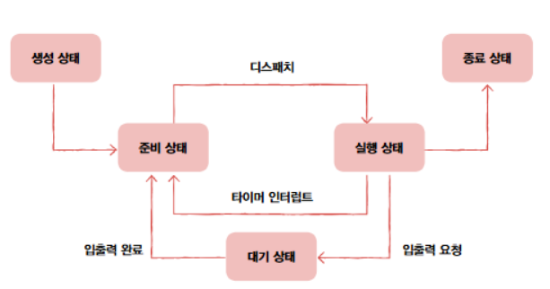

<aside>
💡

특정 이벤트가 일어나길 기다릴 때 프로세스는 대기 상태가 됨. 다만, 프로세스가 대기 상태가 되는 대부분의 원인이 입출력 작업이기 때문에 '프로세스가 입출력 작업을 하면 대기 상태가 된다'고 생각해도 무방함.

</aside>

- **프로세스 계층 구조:**
    - 프로세스는 다른 프로세스를 생성할 수 있으며, 이 관계를 부모-자식 관계로 표현합니다.
    - **부모 프로세스 (Parent Process):** 다른 프로세스를 생성한 프로세스입니다.
        - 트리의 루트(root)는 시스템 부팅 시 최초로 생성되는 프로세스(init, systemd 등)이고, PID는 항상 1번임
    - **자식 프로세스 (Child Process):** 부모 프로세스에 의해 생성된 프로세스입니다.
    - 각 프로세스는 고유한 PID(Process ID)를 가지며, 자식 프로세스의 PCB에는 부모 프로세스의 PID인 PPID(Parent Process ID)가 기록될 수 있습니다.
    - 프로세스는 계층적인 트리 구조를 형성할 수 있으며, 이는 프로세스 관리의 효율성을 높입니다.
- **프로세스 계층 구조의 중요성**
    - **자원 관리:** 부모 프로세스는 자식 프로세스에게 자원을 할당하고 관리할 수 있습니다.
    - **프로세스 그룹 관리:** 관련된 프로세스들을 하나의 그룹으로 묶어 관리할 수 있습니다.
    - **프로세스 추적:** 부모-자식 관계를 통해 프로세스의 생성 및 실행 흐름을 추적할 수 있습니다.
    - **종료 처리:** 부모 프로세스가 종료될 때 자식 프로세스를 함께 종료하는 등의 일괄적인 처리가 가능합니다.

터미널 또는 명령 프롬프트에서 명령어를 실행하면 새로운 프로세스가 생성됩니다. 이 터미널 또는 명령 프롬프트 프로세스가 부모 프로세스가 되고, 실행된 명령어에 해당하는 프로세스가 자식 프로세스가 됩니다. 만약 실행된 명령어가 또 다른 명령어를 실행하는 경우, 자식 프로세스는 또 다른 자식 프로세스를 생성하는 부모 프로세스가 될 수 있습니다.

프로세스 계층 구조

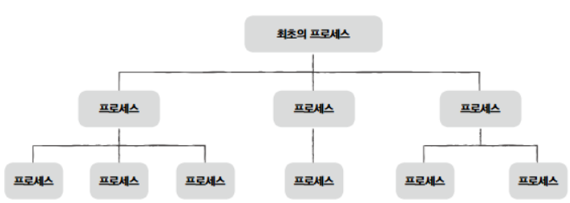

예시 ) 사용자가 컴을 키고, 로그인 후 bash shell 로 Vim 이라는 문서 편집기 프로그램 실행 했다고 가정

1. 컴퓨터를 킨 순간 최초의 프로세스 생성 
2. 로그인 프로세스로 로그인 
3. 로그인 프로세스가 bash shell을 부르고 
4. bash의 사용자 인터페이스가 Vim 프로세스를 생성함.

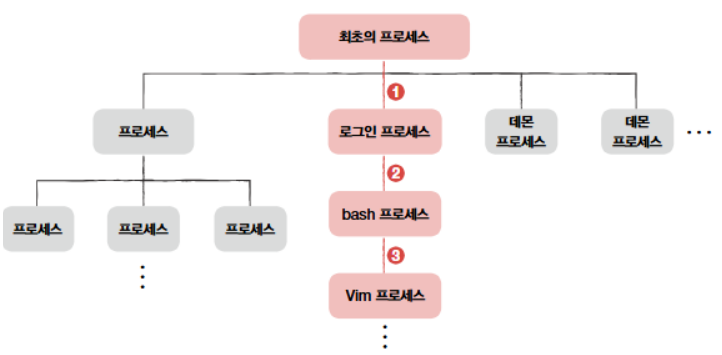

### 프로세스 생성 기법

프로세스 생성은 크게 두 단계로 이루어집니다.

1. **복제 (fork):** 부모 프로세스가 `fork()` 시스템 호출을 통해 자신의 복사본을 생성합니다. 이 복사본이 자식 프로세스가 됩니다.
2. **교체 (exec):** 자식 프로세스가 `exec()` 계열의 시스템 호출을 통해 자신의 메모리 공간을 새로운 프로그램의 코드로 덮어씁니다. 이를 통해 자식 프로세스는 부모 프로세스와는 다른 프로그램을 실행하게 됩니다.

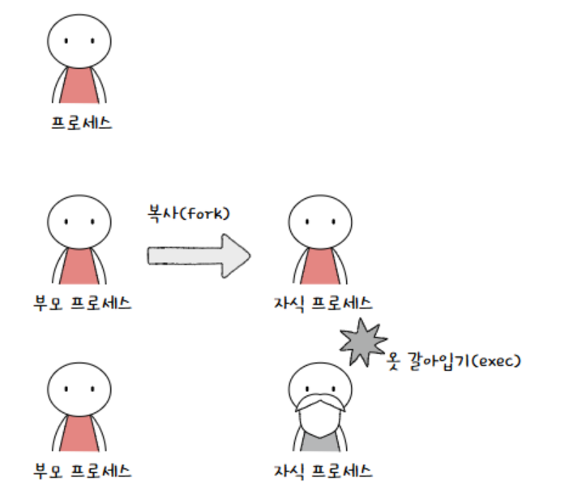

**`fork()` 시스템 호출:**

- 부모 프로세스의 거의 모든 것을 복사합니다.
    - 메모리 내용 (코드, 데이터, 스택 등)
    - 열린 파일 디스크립터
    - 프로세스 상태
    - 등등
- 하지만 다음은 복사되지 않습니다.
    - PID (Process ID): 자식 프로세스는 새로운 PID를 할당받습니다.
    - PPID (Parent Process ID): 자식 프로세스의 PPID는 부모 프로세스의 PID로 설정됩니다.
- `fork()`는 부모 프로세스와 자식 프로세스 모두에게 값을 반환합니다.
    - 부모 프로세스에게는 자식 프로세스의 PID를 반환합니다.
    - 자식 프로세스에게는 0을 반환합니다. 이 반환값을 통해 부모와 자식 프로세스는 자신의 역할을 구분할 수 있습니다.

**`exec()` 계열 시스템 호출:**

- 자식 프로세스의 현재 실행 중인 프로그램을 새로운 프로그램으로 대체합니다.
- 자식 프로세스의 메모리 공간을 새로운 프로그램의 코드, 데이터, 스택 등으로 덮어씁니다.
- `exec()` 호출 이후에는 이전 프로그램의 코드는 더 이상 실행되지 않습니다.
- `exec()` 계열에는 여러 함수가 있으며, 실행할 프로그램의 경로, 전달할 인자 등을 지정하는 방식에 따라 차이가 있습니다. (예: `execl()`, `execlp()`, `execv()`, `execvp()`)

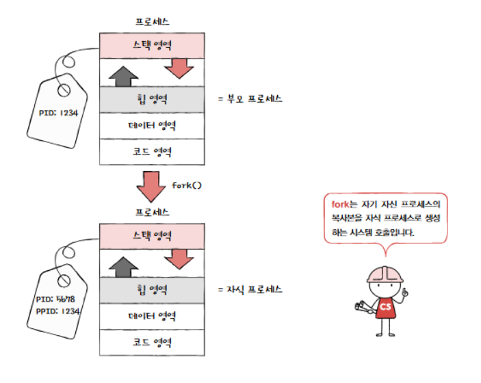

**fork 이후 exec가 호출되지 않는 경우**

부모 프로세스가 자식 프로세스를 `fork`한 뒤에 부모 프로세스, 자식 프로세스 누구도 `exec`를 호출하지 않는 경우도 있습니다. 이 경우 부모 프로세스와 자식 프로세스는 같은 코드를 병행하여 실행하는 프로세스가 됩니다.

**프로세스 예제** 
URL: [https://github.com/kangtegong/self-learning-cs](https://github.com/kangtegong/self-learning-cs)

### 스레드

- **스레드의 정의:** 스레드는 프로세스 내에서 실행되는 흐름의 최소 단위입니다. 하나의 프로세스는 하나 이상의 스레드를 가질 수 있습니다.
- **스레드의 역할:** 스레드를 사용하면 하나의 프로세스 내에서 여러 작업을 동시에 수행할 수 있습니다. 이를 통해 프로그램의 응답성을 향상시키고, 자원을 효율적으로 사용할 수 있습니다.
- **개발에서의 중요성:** 스레드는 현대 프로그래밍에서 매우 중요한 개념이며, 특히 동시성(concurrency)을 다루는 프로그래밍에서 필수적입니다.

### 프로세스와 스레드

단일 스레드 프로세스 시절에는 한번에 하나의 작업만 가능했으나, 스레드라는 개념이 도입되면서 프로세스가 한번에 여러 일을 동시에 처리 가능해짐. 

- **단일 스레드 프로세스:** 하나의 프로세스 내에 하나의 실행 흐름만 존재하는 경우입니다. 한 번에 하나의 작업만 처리할 수 있습니다. 마치 하나의 차선만 있는 도로와 같습니다.
- **멀티스레드 프로세스:** 하나의 프로세스 내에 여러 개의 실행 흐름(스레드)이 존재하는 경우입니다. 여러 작업을 동시에 처리할 수 있습니다. 여러 차선이 있는 도로와 같아서, 여러 대의 차(스레드)가 동시에 주행(실행)할 수 있습니다.

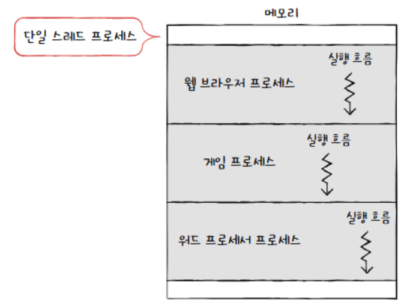

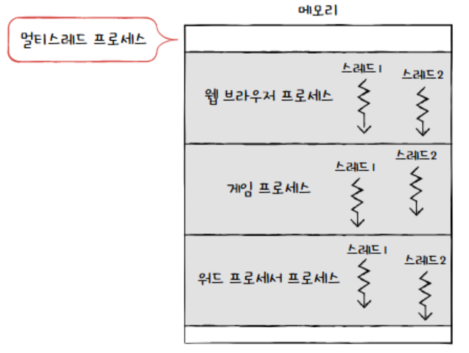

**멀티스레드의 장점 상세:**

- **응답성 향상:** 긴 시간이 걸리는 작업을 수행하는 동안에도 다른 스레드를 통해 사용자 입력을 처리하거나 화면을 업데이트할 수 있어, 프로그램이 멈춘 것처럼 보이는 현상을 방지합니다.
- **자원 효율성:** 프로세스 생성에 비해 스레드 생성 및 전환 비용이 적어 시스템 자원을 효율적으로 사용할 수 있습니다. 스레드는 프로세스의 메모리 공간을 공유하므로, 메모리 사용량도 줄일 수 있습니다.
- **데이터 공유 용이:** 스레드들은 프로세스의 메모리 공간을 공유하므로, 스레드 간 데이터 교환이 간편합니다. 프로세스 간 통신(IPC)보다 훨씬 효율적입니다.

**멀티스레드의 단점 상세 설명:**

- **동기화 문제:** 여러 스레드가 공유 자원에 동시에 접근하려고 할 때 데이터 불일치, 경쟁 조건(race condition), 교착 상태(deadlock) 등의 문제가 발생할 수 있습니다. 이러한 문제를 해결하기 위해 뮤텍스(mutex), 세마포어(semaphore) 등의 동기화 기법을 사용해야 합니다.
- **디버깅 어려움:** 여러 스레드가 동시에 실행되므로, 실행 순서를 예측하기 어렵고, 오류 발생 시 원인을 파악하기 어려울 수 있습니다.

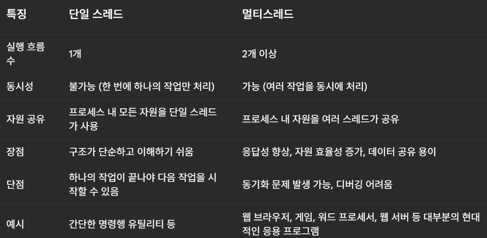

- **스레드의 구성 요소:**
    - **스레드 ID:** 각 스레드를 고유하게 식별하는 ID.
    - **프로그램 카운터 (Program Counter):** 다음에 실행할 명령어의 주소를 저장하는 레지스터. 각 스레드는 독립적인 프로그램 카운터를 가지므로, 서로 다른 코드를 실행할 수 있습니다.
    - **레지스터 (Registers):** CPU의 임시 저장 공간으로, 연산에 필요한 데이터나 주소 등을 저장합니다. 각 스레드는 독립적인 레지스터 세트를 가집니다.
    - **스택 (Stack):** 함수의 호출과 반환, 지역 변수 등을 저장하는 메모리 영역. 각 스레드는 독립적인 스택을 가집니다. 이를 통해 각 스레드는 독립적인 실행 흐름을 유지할 수 있습니다.
- **프로세스 자원 공유:** 스레드는 프로세스의 코드, 데이터, 힙 영역을 공유합니다. 이는 스레드 간 데이터 공유가 용이하다는 장점이 있지만, 동시에 동기화 문제(경쟁 조건, 교착 상태 등)를 발생시킬 수 있는 원인이 되기도 합니다.
- **운영체제의 스레드 관리:** 현대 운영체제는 CPU에 작업을 전달할 때 프로세스 단위가 아닌 스레드 단위로 전달합니다. 이는 스레드가 CPU 스케줄링의 기본 단위임을 의미합니다.

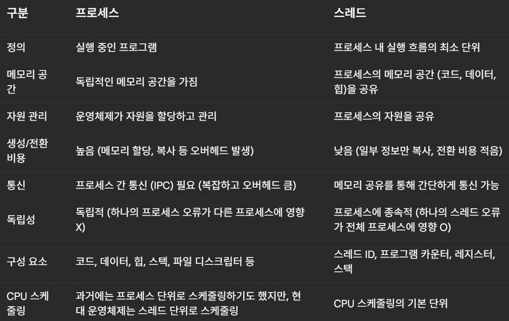

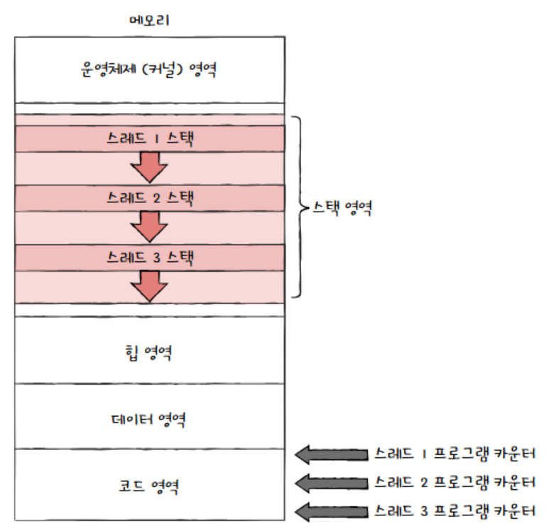

### **멀티프로세스와 멀티스레드**

- **리눅스의 관점:** 리눅스에서는 프로세스와 스레드를 엄격하게 구분하지 않고, 둘 다 '실행의 문맥(context of execution)'으로 간주합니다. 즉, 둘 다 태스크(task)라는 하나의 개념으로 통합하여 관리합니다. 이는 리눅스의 설계 철학을 보여주는 중요한 부분입니다.
- **리누스 토르발스의 발언:** 리누스 토르발스는 전통적인 프로세스와 스레드의 구분이 역사적인 이유 때문이라고 지적하며, 둘 다 단순히 실행 상태의 집합일 뿐이라고 주장합니다. 이러한 관점은 리눅스 커널의 설계를 이해하는 데 중요한 시사점을 제공합니다.
- **멀티프로세스:** 여러 개의 프로세스를 동시에 실행하는 방식입니다. 각 프로세스는 독립적인 메모리 공간을 가지므로, 프로세스 간의 데이터 공유가 어렵고, 프로세스 생성 및 전환에 오버헤드가 큽니다. 하지만 하나의 프로세스가 오류로 멈추더라도 다른 프로세스에는 영향을 주지 않는 안정성이 장점입니다.
- **멀티스레드:** 하나의 프로세스 내에서 여러 개의 스레드를 동시에 실행하는 방식입니다. 스레드들은 프로세스의 메모리 공간을 공유하므로, 데이터 공유가 용이하고, 스레드 생성 및 전환에 오버헤드가 적습니다. 하지만 하나의 스레드에서 오류가 발생하면 전체 프로세스에 영향을 줄 수 있다는 단점이 있습니다.

<aside>
💡

단일 프로세스를 여러개 실행하는 것과 하나의 프로세스를 여러 스레드로 실행하는 것은 무엇이 다를까?

ex) Hello os 출력 프로그램 

1. 해당 프로그램을 세번 fork하여 hello os 세번 출력 (프로세스 3번)
2. hello os 출력하는 스레드를 3개를 만들어 세번 출력 

프로세스까리는 자원을 공유하지 않지만, 스레드끼리는 자원을 공유함. 

1. 1번은  PID제외 모든 프로세스 메모리를 복사해서 적재함. 따라서 메모리 중복 발생

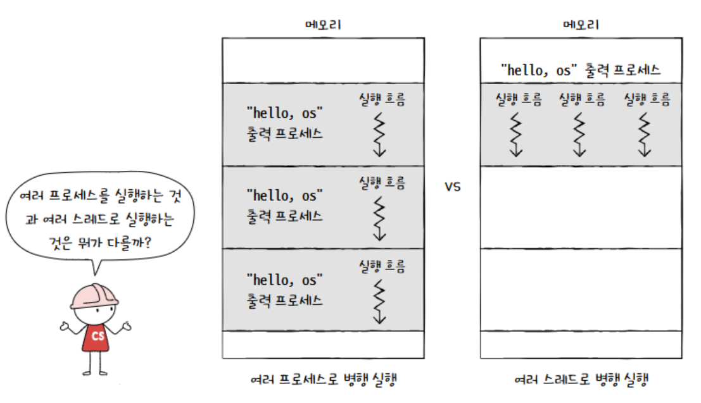

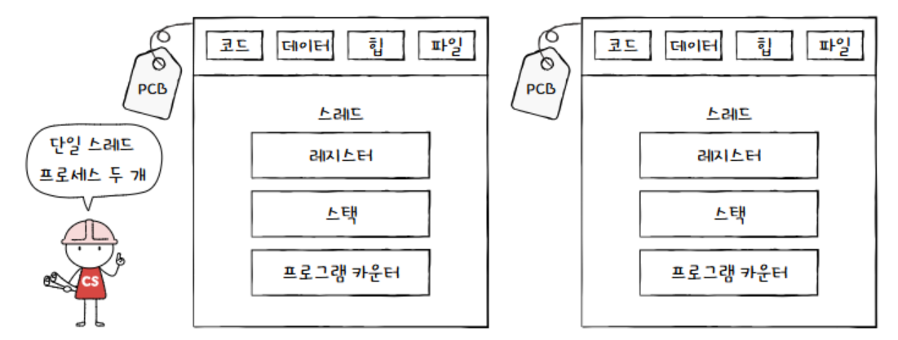

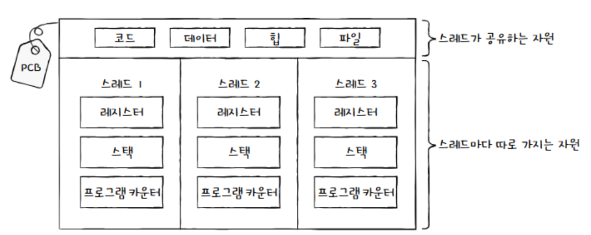

다만 문제 발생 시 모든 스레드가 영향을 받음 

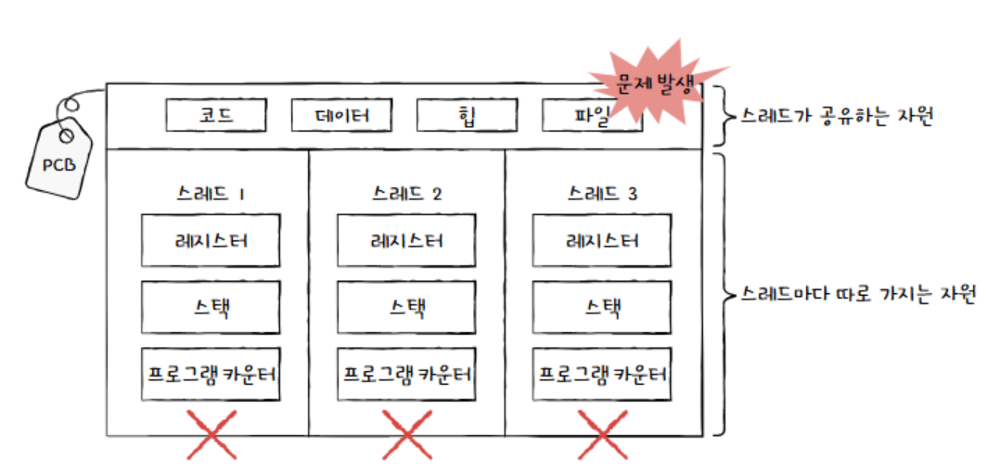

</aside>

<aside>
💡

**프로세스 간 통신 (IPC; Inter-Process Communication)** 

**프로세스 간 통신 (IPC):** 프로세스는 독립적인 메모리 공간을 가지기 때문에, 프로세스 간에 데이터를 주고받기 위해서는 특별한 메커니즘이 필요합니다. 이를 프로세스 간 통신(IPC)이라고 합니다.

- **IPC의 방법:**
    - **파일:** 파일 시스템을 이용하여 데이터를 공유하는 방식입니다. 한 프로세스가 파일에 데이터를 쓰고, 다른 프로세스가 그 파일을 읽는 방식으로 통신합니다. 비교적 간단하지만, 동시성 제어 등의 문제가 발생할 수 있습니다.
    - **공유 메모리:** 두 개 이상의 프로세스가 공유하는 메모리 영역을 사용하여 데이터를 주고받는 방식입니다. 파일 시스템을 사용하는 것보다 빠르지만, 동기화 문제를 신중하게 고려해야 합니다.
    - **소켓 (Socket):** 네트워크 통신에 사용되는 기술이지만, 같은 컴퓨터 내의 프로세스 간 통신에도 사용할 수 있습니다. 네트워크 프로그래밍과 유사한 방식으로 통신합니다.
    - **파이프 (Pipe):** 두 개의 프로세스를 연결하여 한쪽 프로세스의 출력을 다른 쪽 프로세스의 입력으로 전달하는 방식입니다. 단방향 통신만 가능합니다.
    - 기타: 메시지 큐, 시그널 등 다양한 IPC 방법이 존재합니다.
- **스레드와의 비교:** 스레드는 같은 프로세스의 메모리 공간을 공유하기 때문에, 별도의 IPC 메커니즘 없이도 데이터를 주고받을 수 있습니다. 이는 스레드가 프로세스보다 효율적인 이유 중 하나입니다. 하지만 공유 자원에 대한 동시 접근으로 인한 동기화 문제를 해결해야 합니다.

실제 코드로 학습하는 링크
URL: [https://github.com/kangtegong/self-learning-cs](https://github.com/kangtegong/self-learning-cs)

</aside>

**리눅스에서의 추가적인 고려 사항:**

리눅스에서는 프로세스와 스레드를 명확히 구분하지 않기 때문에, 스레드는 "경량 프로세스(lightweight process)"라고도 불립니다. 리눅스 커널은 모든 실행 단위를 태스크로 관리하며, 스레드는 단순히 부모 프로세스와 많은 부분을 공유하는 태스크로 구현됩니다. 이러한 설계는 리눅스의 유연성과 효율성에 기여합니다.

이러한 차이점을 이해하는 것은 운영체제와 시스템 프로그래밍을 이해하는 데 매우 중요합니다. 특히, 시스템의 성능과 안정성을 고려해야 하는 상황에서 멀티프로세스와 멀티스레드 중 어떤 방식을 선택할지 결정하는 데 도움이 됩니다.