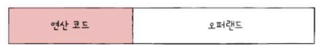

명령어 (78p ~ 101p)

### Q1. 컴파일 언어와 인터프리터 언어의 차이점은 무엇인가요?

A1.

컴파일 언어는 소스 코드 전체를 컴파일러를 통해 기계어로 변환한 후 실행되는 언어입니다. 대표적으로 C 언어가 있습니다. 컴파일 과정에서 모든 오류를 사전에 확인할 수 있어 실행 속도가 빠릅니다.
반면, 인터프리터 언어는 소스 코드를 한 줄씩 읽고 실행하는 방식으로 동작합니다. 대표적으로 Python이 있으며, 코드의 특정 줄에 오류가 있어도 오류가 발생하기 전까지의 코드는 정상적으로 실행됩니다. 다만, 실행 시마다 변환이 이루어지기 때문에 컴파일 언어보다 실행 속도가 느릴 수 있습니다.

### Q2. 명령어의 연산 코드와 오퍼랜드는 무엇인가요?

A2.

명령어는 연산 코드와 오퍼랜드로 구성됩니다.

- 연산 코드: 명령어가 수행할 연산을 지정합니다. 예를 들어, 데이터 전송, 산술/논리 연산, 제어 흐름 변경 등이 포함됩니다.
- 오퍼랜드: 연산에 사용할 데이터나 데이터가 저장된 위치를 지정합니다. 오퍼랜드는 연산에 직접 사용될 값을 포함하거나, 메모리나 레지스터의 주소를 가리킬 수 있습니다.
주소 지정 방식에 따라 즉시 주소 지정(데이터를 직접 포함), 직접 주소 지정(메모리 주소), 간접 주소 지정(메모리 주소의 주소) 등이 사용될 수 있습니다

 

# 1. 소스 코드와 명령어

## 1) 고급 언어와 저급 언어

- 고급 언어 : 사람을 위한 언어
- 저급 언어 : 컴퓨터가 직접 이해하고 실행할 수 있는 언어
    - 기계어 : 0과 1로 이루어진 명령어 모음
    - 어셈블리어 : 0과 1로 이루어진 기계어를 읽기 편한 형태로 변역한 저급 언어

## 2) 컴파일 언어와 인터프리터 언어

### 컴파일 언어

컴파일러에 의해 소스 코드 전체가 저급 언어로 변환되어 실행되는 고급 언어. (ex. C)

- 컴파일 : 소스 코드 전체가 저급 언어로 변환되는 과정
- 컴파일러 : 컴파일을 수행해 주는 도구. 소스 코드 내에서 오류를 하나라도 발견하면 해당 소스코드는 컴파일에 실패함.

### 인터프리터 언어

인터프리터에 의해 소스 코드가 한 줄씩 실행되는 고급 언어. (ex. Python)

- 인터프리터 : 소스 코드를 한 줄씩 저급 언어로 변환하여 실행해 주는 도구. 소스코드 N번째 줄에 문법 오류가 있더라고 N-1번째 줄까지는 올바르게 수행됨.

# 2. 명령어의 구조

## 1) 연산 코드와 오퍼랜드

- 명령어 : 연산 코드 + 오퍼랜드
    - 연산 코드 (연산자) : 명령어가 수행할 연산
    - 오퍼랜드 (피연산자) : 연산에 사용할 데이터, 연산에 사용할 데이터가 저장된 위치

### 오퍼랜드

오퍼랜드 필드에는 연산에 사용할 데이터를 직접 명시하기보다는 많은 경우 데이터가 저장된 위치를 명시한다.

- 0-주소 명령어 : 오퍼랜드가 하나도 없는 명령어
- 1-주소 명령어, 2-주소 명령어, 3-주소 명령어 : 오퍼랜드가 하나, 두 개, 세 개인 명령어

### 연산 코드

- 데이터 전송
- 산술/논리 연산
- 제어 흐름 변경
- 입출력 제어

## 2) 주소 지정 방식

- 유효 주소 : 연산의 대상이 되는 데이터가 저장된 위치
- 주소 지정 방식 : 연산에 사용할 데이터 위치를 찾는 방법

### 즉시 주소 지정 방식 : 연산에 사용할 데이터

### 직접 주소 지정 방식 : 유효 주소(메모리 주소)

### 간접 주소 지정 방식 : 유효 주소의 주소

직접 주소 지정 방식보다 표현할 수 있는 유효 주소의 범위가 더 넓지만, 두 번의 메모리 접근이 필요하기 때문에 일반적으로 느림.

### 레지스터 주소 지정 방식 : 유효 주소(레지스터 이름)

일반적으로 CPU 외부에 있는 메모리에 접근하는 것보다 CPU 내부에 있는 레지스터에 접근하는 것이 더 빨라서 보다 빠르게 데이터에 접근할 수 있음. But 표현할 수 있는 레지스터 크기에 제한이 생길 수 있음.

### 레지스터 간접 주소 지정 방식 : 유효 주소를 저장한 레지스터