# Chapter 5 CPU 성능 향상 기법

### Q1. 클럭 속도가 CPU 성능에 미치는 영향과 오버클럭킹의 개념은 무엇인가요?

A1.

    클럭 속도는 CPU가 1초 동안 명령어를 처리하는 빈도를 나타내며, 일반적으로 클럭 속도가 높을수록 CPU 성능이 뛰어납니다. 오버클럭킹은 고성능이 필요한 순간에 클럭 속도를 인위적으로 높여 CPU의 처리 능력을 일시적으로 증가시키는 기법입니다. 하지만 과도한 오버클럭은 발열이나 안정성 문제를 유발할 수 있습니다.

### Q2. 명령어 파이프라이닝의 개념과 주요 위험 요인은 무엇인가요?

A2.

    명령어 파이프라이닝은 명령어를 처리 단계별로 나누어 여러 명령어를 동시에 실행하는 CPU 처리 기법입니다. 그러나 데이터 위험(명령어 간 데이터 의존성), 제어 위험(분기로 인한 예기치 못한 흐름 변경), 구조적 위험(동시에 자원을 사용하는 충돌)과 같은 문제가 발생할 수 있습니다.

### Q3. RISC와 CISC CPU 설계 방식의 차이점은 무엇인가요?

A3.

    - RISC: 단순하고 고정 길이의 명령어를 사용하며, 주로 한 클럭 내외로 명령어를 실행합니다. 파이프라인 효율이 높아 성능 향상이 가능합니다.

    - CISC: 복잡하고 다양한 명령어를 사용하며, 가변 길이의 명령어를 포함합니다. 명령어 하나를 실행하는 데 여러 클럭 주기가 필요할 수 있어 파이프라인 효율이 낮습니다.

## 빠른 CPU를 위한 설계 기법

### 클럭

- 클럭 속도가 높은 CPU는 일반적으로 성능이 좋다 → 따라서 클럭 속도는 CPU 속도 단위로 간주되기도 한다.
- 클럭 속도는 Hz 단위로 측정한다.
    - 1초에 클럭이 몇 번 반복되는지를 나타낸다.
- **클럭 속도는 일정하지 않다.**
    - CPU는 고성능을 요구하는 순간에는 순간적을 클럭 속도를 높힐 수 있다.
    - 이러한 기법을 **오버클럭킹** 이라고 한다.

### 코어와 멀티코어

- 코어와 스레드 수를 늘려 CPU의 성능을 높힐 수 있다.
- **코어**: CPU 내에서 명령어를 실행하는 부품
    - 듀얼코어 → CPU 내에 명령어를 실행하는 부품이 2개
- CPU의 연산 속도가 꼭 코어 수에 비례하여 증가하지는 않는다.

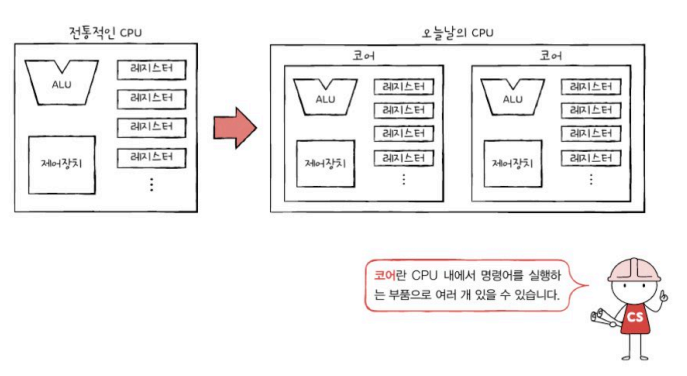

### 스레드와 멀티스레드

- **스레드**: 실행 흐름의 단위를 의미한다.
- 스레드에는 CPU에서 사용되는 하드웨어적 스레도와, 프로그램에서 사용되는 소프트웨어적 스레드가 있다.

### 하드웨어적 스레드

- 스레드의 하드웨어적 정의 → 하나의 코어가 동시에 처리하는 명령어 단위
- 1코어 1스레드 CPU
    
    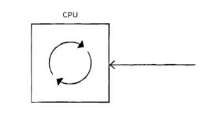
    
- 2코어 4스레드 CPU
    
    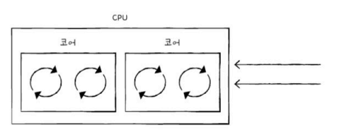
    
- **멀티스레드 CPU**: 하나의 코어로 여러 명령어를 동시에 처리하는 CPU

### 소프트웨어적 스레드

- 스레드의 소프트웨어적 정의 → 하나의 프로그램에서 독립적으로 실행되는 단위를 의미
- 하나의 프로그램은 실행되는 과정에서 여러 부분이 동시에 실행될 수도 있다.

### 멀티스레드 프로세서

- 하나의 코어로 여러 명령어를 동시에 처리하는 CPU를 의미한다.
- 하나의 명령어를 처리하기 위해 꼭 필요한 레지스터를 여러 개 가지고 있으면 된다.
    
    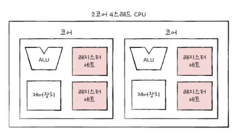
    
- 2코어 4스레드 CPU는 한 번에 네 개의 명령어를 처리할 수 있음 → 프로그램 입장에서는 CPU가 네 개 있는 것처럼 보인다.
    
    
    

## 명령어 병렬 처리 기법

- CPU를 한시도 쉬지 않고 작동시키는 기법

### 명령어 파이프라인

- 명령어 파이프라인을 이해하려면, 명령어 처리 과정을 비슷한 시간 간격으로 나누어야함
- 명령어 처리 과정
    1. 명령어 인출
    2. 명령어 해석
    3. 명령어 실행
    4. 결과 저장
- CPU는 아래 그림과 같이 각 단계를 동시에 실행할 수 있다.
    
    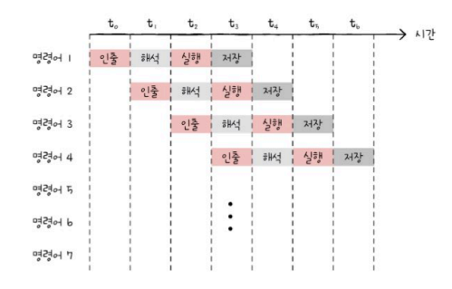
    
- **명령어 파이프라이닝**: 명령어들을 명령어 파이프라인에 넣고 동시에 처리하는 기법’
- 하지만 특정 상황에서는 성능 향상에 실패하는 경우도 있음 → **파이프라인 위험**
- 파이프라인 위험에는 데이터 위험, 제어 위험, 구조적 위험이 있다.

### 데이터 위험

- 명령어간 데이터 의존성에 의해 발생한다.
- 아래 그림처럼 어떤 명령어는 이전 명령어를 끝까지 실행해야 실행할 수 있는 경우도 있다!

### 제어 위험

- 분기 등으로 인한 프로그램의 카운터의 갑작스러운 변화에 의해 발생한다.
- 예를 들어 프로그램 카운터 값에 변화가 생기는 등…
    
    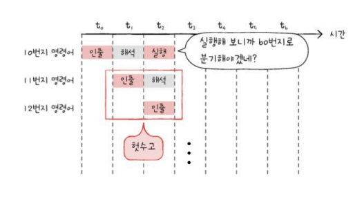
    
- **분기 예측**: 프로그램이 어디로 분기할지 미리 예측한 후 그 주소를 인출하는 기술

### 구조적 위험

- 명령어들을 겹처 실행하는 과정에서 서로 다른 명령어가 동시에 CPU 부품들(ALU, 레지스터 등)을 사용하려고 할 때 발생
- **자원 위험**이라고도 한다

### 슈퍼 스칼라

- CPU 내부에 여러 개의 명령어 파이프라인을 포함한 구조
    
    
    
- 명령어 파이프라인을 여러 개 둔 것이다.

### 비순차적 명령어 처리

- 명령어들을 순차적으로 실행하지 않는 기법이다.
- 파이프라인 위험과 같은 문제들로 명령어는 곧바로 처리되지 못하기도 함 → 그렇다고 파이프라인을 멈출 수는 없으니…. → 비순차적 명령어 처리!
- 아래 그림에서 3번 명령어는 1,2번 명령어가 처리되어야 처리할 수 있다.
- 또한 4,5,6번 명령어는 3번 명령어의 처리 여부와 무관하게 처리할 수 있음.
    
    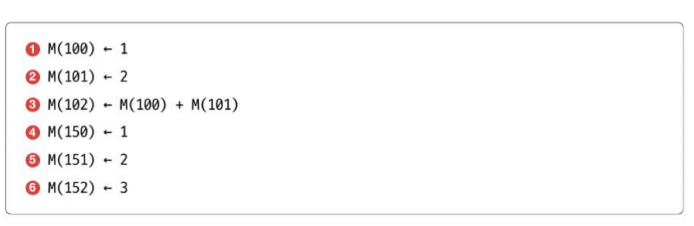
    
    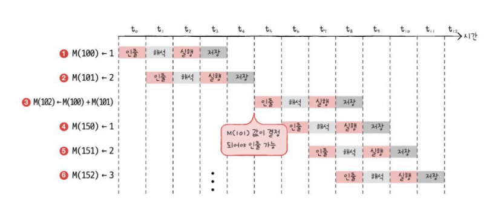
    
- 따라서 순서를 바꾸면 더 빠르다!
    
    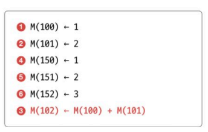
    
    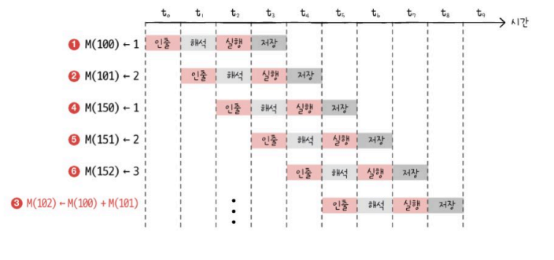
    

## CISC와 RISC

### 명령어 집합

- 명령어의 생김새나 주소 지정 방식 등은 제조사의 CPU 종류마다 조금씩 차이가 있다.
- **명령어 집합 구조(ISA)**: CPU가 이해할 수 있는 명령어들의 모음
- 아래 그림의 노트북과 아이폰은 서로 다른 ISA를 사용해 서로의 명령어를 이해할 수 없다.
    
    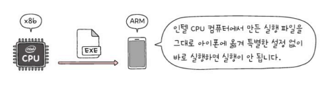
    
- 아래 그림은 서로 같은 프로그램을 다른 ISA를 가진 CPU가 어셈블리어로 컴파일 한 결과이다.
    
    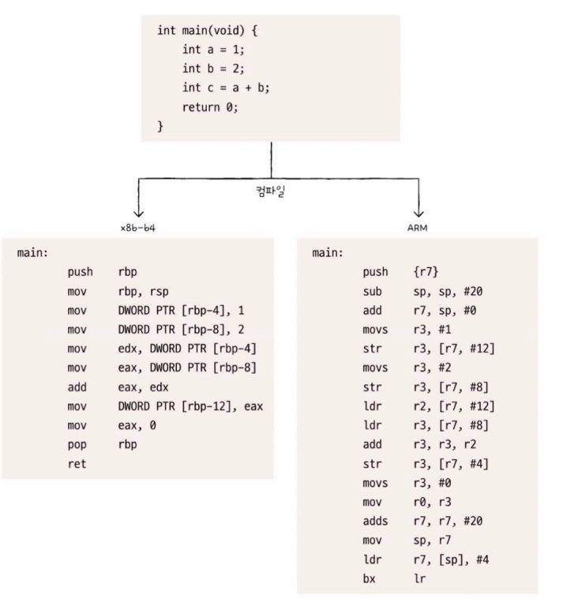
    
- ISA는 일종의 CPU 언어이다.

### CSIC

- 복잡하고 다양한 명령어들을 활용하는 CPU 설계 방식이다.
- 가변 길이 명령어를 활용한다.
- 적은 수의 명령어로도 프로그램을 실행할 수 있다.
- 명령어의 크기와 실행되기까지의 시간이 일정하지 않다는 단점이 있다.
- 복잡한 명령어 때문에 명령어 하나를 실행하는 데 여러 클럭 주기를 필요로 한다.
- 아래 그림과 같이 CSIC는 파이프라인이 효율적으로 명령어를 처리할 수 없다.
    
    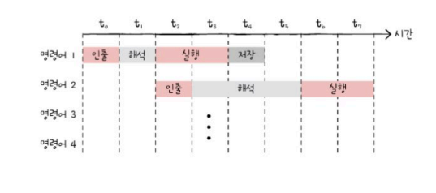
    
- CSIC 기반 CPU는 성장에 한계가 있다.

### RISC

- CISC에 비해 명령어의 종류가 적다
- CISC와 달리 짧고 규격화된 명령어, 되도록 1클럭 내외로 실행되는 명령어를 지향한다.
- 즉, 고정 길이 명령어를 사용한다.
- 아래 그림과 같이 명령어 파이프라이닝에 최적화되어 있다.
    
    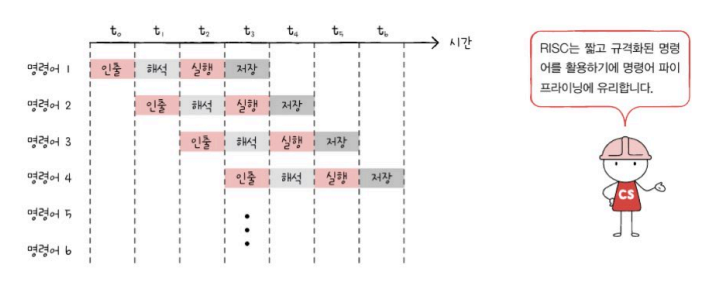
        
    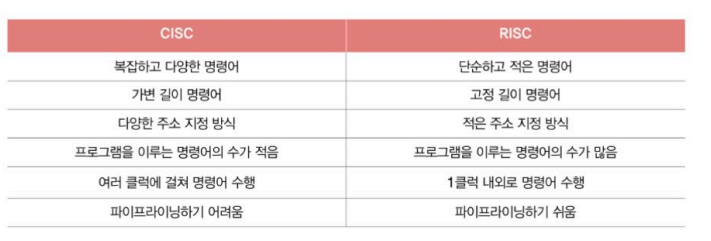