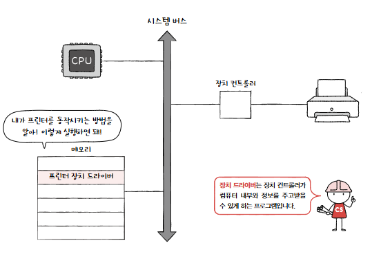
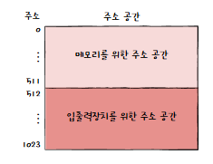
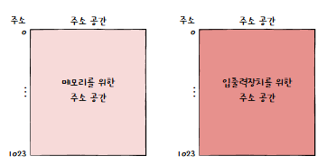
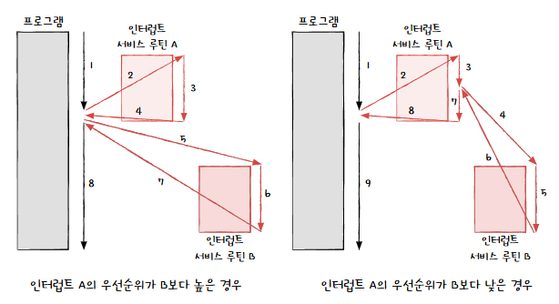
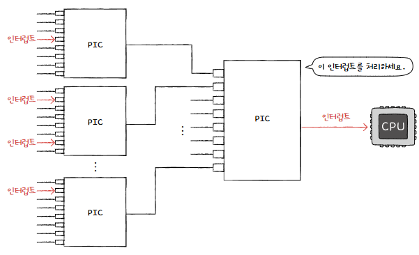
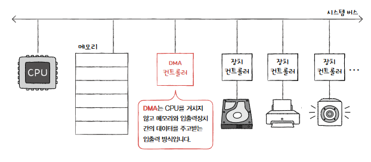
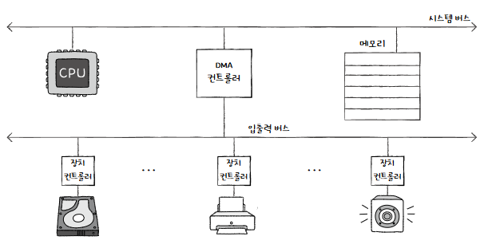

# 8-1. 장치 컨트롤러와 장치 드라이버

> 다양한 외부 장치가 컴퓨터 내부와 어떻게 연결되고 소통할까?

## 1. 장치 컨트롤러(Device Controller)

- CPU와 다양한 입출력 장치 간의 통신을 중계하는 하드웨어
- = 입출력 제어기, 입출력 모듈 등으로 불림

### 1-1. 입출력 장치! CPU/메모리보다 다루기 어려운 이유

1. 다양한 입출력 장치의 종류 및 동작 방식의 차이
2. CPU/메모리와 입출력 장치 간의 데이터 전송률 차이
   - 일반적으로 CPU와 메모리의 데이터 전송률은 높지만 입출력 장치의 데이터 전송률은 낮음
   - 전송률 : 데이터를 얼마나 빨리 교환할 수 있는지를 나타내는 지표

→ 따라서, 입출력 장치는 장치 컨트롤러라는 하드웨어를 통해 연결됨

### 1-2. 주요 기능

- **CPU와 입출력 장치 간의 통신 중계:** CPU와 입출력 장치 간의 통신 규격 차이 해소 (번역가 역할)
- **오류 검출:** 입출력 장치 동작 중 발생하는 오류 감지
- **데이터 버퍼링:** 전송률이 다른 장치 간의 데이터 전송 시 중간 매개체 역할을 하여 데이터 오버플로 방지 (미리 데이터 받아놓기)
  - **버퍼링(Buffering)** : 전송률이 높은 장치와 낮은 장치 사이에 주고 받는 데이터를 버퍼라는 임시 저장 공간에 저장해 전송률을 비슷하게 맞추는 방법

### 1-3. 내부 구조

- **데이터 레지스터 (Data Register):** CPU와 입출력 장치 간 주고받을 데이터 저장 (버퍼 역할)
  - 최근에는 레지스터 대신 RAM을 사용하기도 함
- **상태 레지스터 (Status Register):** 입출력 장치의 작업 상태 및 오류 정보 기록
- **제어 레지스터 (Control Register):** 입출력 장치가 수행할 내용에 대한 제어 정보 저장
- **레지스터 (Register):** CPU 내부에 있는 고속의 저장 공간

### 1-4. 참고

- 각 입출력 장치마다 전용 장치 컨트롤러 존재 (키보드 컨트롤러, 하드 디스크 컨트롤러 등)

## 2. 장치 드라이버(Device Driver)

- 장치 컨트롤러의 동작을 제어하고, 컴퓨터 내부와 정보를 주고받을 수 있게 하는 소프트웨어 프로그램

### 2-1. 역할

- 장치 컨트롤러를 통해 입출력 장치를 컴퓨터 시스템과 연결
- 프로그래머가 장치 컨트롤러를 쉽게 사용할 수 있도록 인터페이스 제공
- 운영체제가 장치 컨트롤러를 인식하고 실행할 수 있도록 함 (일종의 번역 역할)

### 2-2. 작동 방식

- 새로운 장치 연결 시 해당 드라이버를 설치해야 컴퓨터가 인식 가능
- 운영체제가 기본 제공하거나 장치 제조사가 제공 (필요시 직접 설치)

### 2-3. 참고

- 운영체제(윈도우, macOS 등)가 드라이버를 인식하고 실행할 수 있어야 장치 사용 가능
- **버스 (Bus):** CPU와 다른 장치들 간에 데이터를 주고받는 통로

# 8-2. 다양한 입출력 방법

> 장치 컨트롤러는 CPU와 어떻게 정보를 주고 받을까?
> → 프로그램 입출력, 인터럽트 기반 입출력, DMA 입출력

## 1. 프로그램 입출력(Programmed I/O)

- 프로그램 속 명령어로 입출력 장치를 제어하는 방법
- CPU가 직접 입출력 장치 컨트롤러의 레지스터를 읽고 쓰면서 입출력 작업을 수행하는 방식

### 1-1. 동작 방식

1. CPU가 입출력 명령어를 만나면 장치 컨트롤러의 제어 레지스터에 명령을 보냄
2. 하드 디스크 컨트롤러가 하드 디스크 준비 상태 확인 및 상태 레지스터에 표시
3. CPU는 데이터 레지스터에 데이터를 쓰고/읽으며 입출력 작업 수행

### 1-2. 특징

- CPU가 모든 입출력 과정에 관여, 효율성 낮음
- 단순한 작업에 적합

### 1-3. 주소 공간 처리 방식

1. **메모리 맵 입출력 (Memory-Mapped I/O)**

   - CPU가 메모리 주소 공간과 입출력 장치 컨트롤러의 레지스터 주소 공간을 하나의 주소 공간으로 통합하여 사용하는 방식

     

   - **동작 방식**
     - 메모리 주소 공간 일부를 입출력 장치 레지스터 주소 공간으로 할당
     - CPU는 메모리 주소와 동일한 방식으로 입출력 장치 레지스터에 접근
   - **특징**
     - CPU가 메모리 명령어를 사용하여 입출력 장치 제어
     - 단순한 구조, 다양한 장치에 적용 용이

2. **고립형 입출력 (Isolated I/O)**

   - 메모리 주소 공간과 입출력 장치 컨트롤러의 레지스터 주소 공간을 완전히 분리하여 사용하는 방식

     

   - **동작 방식**
     - 메모리 주소 공간과 입출력 장치 주소 공간 분리
     - CPU는 메모리 접근 명령어와 입출력 접근 명령어 분리하여 사용
   - **특징**
     - 메모리와 입출력 주소 공간 분리
     - 복잡한 구조, 특정 장치에 적용

3. **메모리 맵 입출력 vs 고립형 입출력 비교**

| **구분**             | **메모리 맵 입출력 (Memory-Mapped I/O)**      | **고립형 입출력 (Isolated I/O)**              |
| -------------------- | --------------------------------------------- | --------------------------------------------- |
| **주소 공간 사용**   | 메모리와 입출력장치는 *같은* 주소 공간 사용   | 메모리와 입출력장치는 *분리된* 주소 공간 사용 |
| **메모리 주소 공간** | 메모리 주소 공간이 *축소됨*                   | 메모리 주소 공간이 *축소되지 않음*            |
| **명령어 사용**      | 메모리와 입출력장치에 *같은* 명령어 사용 가능 | *입출력 전용* 명령어 사용                     |

## 2. 인**터럽트 기반 입출력 (Interrupt-Driven I/O)**

- 입출력 장치가 CPU에 인터럽트 신호를 보내면 CPU가 하던 작업을 멈추고 해당 인터럽트를 처리하는 방식
  - **인터럽트** : CPU가 프로그램을 실행하는 도중, 입출력 하드웨어 등의 장치에 예외 상황이 발생하여 처리가 필요할 때, 마이크로프로세서에게 알려 처리할 수 있도록 하는 것
  - **풀링(polling)** : 인터럽트와 비교되는 개념, 입출력 장치의 상태와 처리할 데이터를 주기적으로 확인하는 방식

### 2-1. 동작 방식

1. CPU는 입출력 작업 요청 후 다른 작업 수행
2. 입출력 장치 완료 후 장치 컨트롤러가 CPU에 인터럽트 요청
3. CPU는 하던 작업 중단하고 인터럽트 서비스 루틴(ISR) 실행
4. ISR 실행 후 원래 작업 재개

### 2-2. 특징

- CPU 효율성 향상 (입출력 작업 중 다른 작업 가능)
- 인터럽트 우선순위 존재 (높은 우선순위 인터럽트 먼저 처리)

  

- **PIC (Programmable Interrupt Controller):** 여러 인터럽트 요청의 우선순위를 결정하여 CPU에 전달

  - 처리 과정

    1. PIC가 장치 컨트롤러에서 인터럽트 요청 신호(들)을 받아들임
    2. PIC는 인터럽트 우선순위에 따라 CPU에 처리해야 할 인터럽트 신호를 보냄
    3. CPU는 인터럽트 발생 인지
    4. CPU는 데이터를 읽고 쓰기 위해 CPU에 백업
    5. CPU는 백업된 인터럽트 주소를 참조하여 해당 장치의 서비스 루틴 실행

    

- **NMI (Non-Maskable Interrupt):** 최우선 순위 인터럽트, PIC 제어 불가
- **Maskable 인터럽트:** PIC를 통해 우선순위 처리

## 3. **DMA 입출력 (Direct Memory Access I/O)**

- CPU 개입 없이 입출력 장치와 메모리 간 직접 데이터 전송
- 기존의 모든 데이터가 CPU를 거쳐야 하는 비효율적인 문제 해결
- 필요 요소 : **DMA 컨트롤러**

### 3-1. 동작 방식

1. CPU는 DMA 컨트롤러에 입출력 작업 (장치 주소, 메모리 주소, 연산 등) 명령
2. DMA 컨트롤러는 CPU 대신 장치 컨트롤러와 상호작용하며 데이터 전송. 필요한 경우 DMA 컨트롤러는 메모리에 직접 접근하여 데이터 읽기/쓰기
3. 입출력 작업 완료 후 DMA 컨트롤러는 CPU에 인터럽트를 걸어 작업이 끝났음을 알림

### 3-2. 특징

- CPU 부하 감소 (데이터 전송에 관여 X)
- 대량 데이터 전송에 효율적
- 시스템 버스는 동시 사용이 불가능해 사이클 훔침이 일어날 수 있음
  - **사이클 훔침 (Cycle Stealing):** DMA 컨트롤러가 시스템 버스 사용 시 CPU가 일시적으로 버스 사용 불가
  - DMA 컨트롤러는 CPU가 시스템 버스를 이용하지 않을 때마다 조금씩 시스템 버스를 이용하거나, CPU가 일시적으로 시스템 버스를 이용하지 않도록 허락을 구하고 시스템 버스를 집중적으로 이용

### 3-3. 입출력 버스(I/O Bus)

- 입출력 장치 (장치 컨트롤러)들을 시스템 버스와 분리하여 연결하는 별도의 버스

- **목적:** DMA 시 시스템 버스 사용률 감소, CPU 부담 감소
- **예시:** PCI, PCI Express (PCIe) 버스
- **특징**
  - 대부분 입출력 장치는 시스템 버스 아닌 입출력 버스에 연결됨
  - PCIe 버스가 가장 일반적

 

# 7-3. 질문

#### 1. 프로그램 입출력(Programmed I/O) 방식과 인터럽트 기반 입출력(Interrupt-Driven I/O) 방식의 주요 차이점은 무엇이며, 각각 어떤 상황에 적합한가?

정답

프로그램 입출력(Programmed I/O) 방식은 CPU가 입출력 작업의 모든 단계를 직접 관리하며, 입출력 작업이 완료될 때까지 CPU가 다른 작업을 수행하지 못하고 기다립니다. 이 방식은 구현이 단순하지만 CPU 효율성이 낮아, 단순하고 작은 규모의 입출력 작업에 적합합니다.
 
반면, 인터럽트 기반 입출력(Interrupt-Driven I/O) 방식은 CPU가 입출력 작업을 요청한 후 다른 작업을 수행하다가, 입출력 장치가 완료되면 인터럽트 신호를 받아 해당 작업을 처리합니다. 이 방식은 CPU 효율성이 높지만, 인터럽트 처리에 대한 오버헤드가 발생할 수 있으며, 다양한 입출력 작업이나 복잡한 처리에 적합합니다.

 

#### 2. DMA(Direct Memory Access) 입출력 방식의 핵심적인 장점은 무엇이며, DMA 과정에서 '사이클 훔침(Cycle Stealing)'이란 무엇을 의미하는가?

정답

DMA (Direct Memory Access) 입출력 방식의 핵심적인 장점은 CPU의 개입 없이 입출력 장치와 메모리 간에 직접 데이터 전송이 가능하여 CPU의 부담을 줄이고, 특히 대량의 데이터를 효율적으로 전송할 수 있다는 점입니다.
 
DMA 과정에서 '사이클 훔침(Cycle Stealing)'은 DMA 컨트롤러가 데이터 전송을 위해 시스템 버스를 사용할 때, CPU가 일시적으로 버스 사용 권한을 잃고 대기하는 현상을 의미합니다. 이는 DMA 컨트롤러가 메모리에 접근하여 데이터를 전송하는 동안, CPU가 시스템 버스를 사용할 수 없어 일시적으로 작업이 중단될 수 있음을 나타냅니다.

