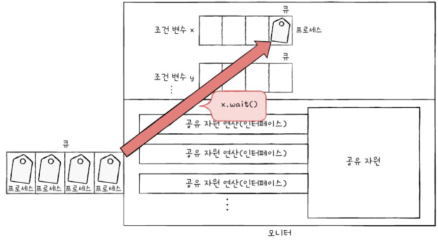
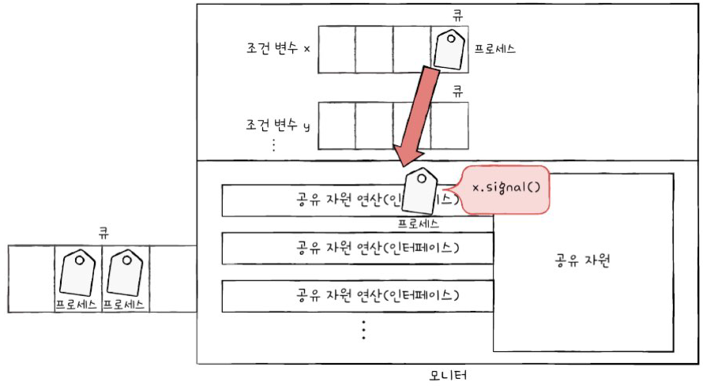

> ## 프로세스 동기화 관련 QA
>### 질문 1: 프로세스 동기화란 무엇이며, 왜 필요한가요?
>프로세스 동기화는 동시에 실행되는 프로세스들이 실행 순서를 맞추거나, 공유 자원에 안전하게 접근할 수 있도록 제어하는 기술입니다. 동기화가 필요한 이유는 여러 프로세스가 동일한 자원을 동시에 사용하려고 할 때 데이터의 일관성이 깨질 수 있기 때문입니다. 예를 들어, 두 개의 프로세스가 하나의 공유 변수(잔액)를 동시에 수정하려고 하면 계산이 꼬이거나 잘못된 결과가 나올 수 있습니다. 이를 방지하려면, 하나의 프로세스가 공유 자원에 접근하는 동안 다른 프로세스는 대기하도록 제어해야 합니다.
>
>동기화를 구현하기 위해서는 **상호 배제(Mutual Exclusion)**가 중요합니다. 상호 배제란 한 프로세스가 임계 구역(Critical Section)에서 작업 중일 때, 다른 프로세스가 그 구역에 진입하지 못하도록 막는 것을 의미합니다. 동기화 기술을 통해 프로세스 간 충돌을 방지하고 데이터의 일관성과 시스템의 안정성을 보장할 수 있습니다.
>
>### 질문 2: 프로세스 동기화를 구현하기 위한 방법에는 어떤 것이 있나요?
>프로세스 동기화를 구현하기 위한 대표적인 방법으로 **뮤텍스(Mutex), 세마포(Semaphore), 모니터(Monitor)**가 있습니다.
>
>뮤텍스(Mutex): 뮤텍스는 하나의 공유 자원에 한 번에 하나의 프로세스만 접근할 수 있도록 자물쇠(Lock) 개념을 도입한 동기화 기법입니다. 임계 구역에 진입하기 전에 acquire 함수를 호출해 잠금을 설정하고, 작업이 끝난 후 release 함수를 호출해 잠금을 해제합니다. 하지만 뮤텍스는 임계 구역이 잠겨 있을 때 프로세스가 반복적으로 대기하며 CPU 자원을 낭비하는 바쁜 대기(Busy Wait) 문제가 발생할 수 있습니다.
>
>세마포(Semaphore): 세마포는 뮤텍스와 달리 공유 자원의 개수를 지정할 수 있는 동기화 기법입니다. 이를 통해 다수의 프로세스가 여러 개의 공유 자원을 동시에 사용할 수 있습니다. 세마포는 wait와 signal 함수를 통해 자원의 접근을 제어하며, 바쁜 대기 문제를 해결하기 위해 대기 상태 프로세스를 큐에 저장하고 관리합니다.
>
>모니터(Monitor): 모니터는 공유 자원과 해당 자원에 접근하는 메서드들을 묶어 관리하는 동기화 기법입니다. 모니터 내부에는 항상 하나의 프로세스만 들어갈 수 있으므로 상호 배제가 자동으로 보장됩니다. 또한, 조건 변수(Conditional Variable)를 사용해 실행 순서를 제어할 수 있습니다. 조건 변수의 wait 연산은 특정 조건이 만족될 때까지 프로세스를 대기 상태로 전환하고, signal 연산은 대기 상태 프로세스를 실행 가능 상태로 바꿔줍니다. 모니터는 뮤텍스나 세마포에 비해 사용이 편리하고 오류 발생 가능성이 낮습니다.
>
>이러한 기법들은 각각의 특성과 장단점이 있으므로, 상황에 맞는 방법을 선택해 동기화를 구현해야 합니다.

 
 

# 1. 동기화 synchronization

> - **동기화**는 특정 자원에 접근할 때 한 개의 프로세스만 접근하게 하거나 > 프로세스를 올바른 순서대로 실행하게 하는 것을 의미합.
> - **공유 자원**은 공동으로 사용하는 자원으로, 전역 변수가 될 수도 있고, 파일이 > 될 수도 있고, 입출력장치, 보조기억장치가 될 수도 있음.
> - **임계 구역**은 공유 자원에 접근하는 코드 중 동시에 실행하면 문제가 발생하는 > 코드 영역. 임계 구역에 진입한 프로세스가 있다면 다른 프로세스는 임계 구역 > 밖에서 기다려야 함.
> - **상호 배제**는 한 프로세스가 임계 구역에서 작업 중이면 다른 프로세스가 임계 > 구역에 들어갈 수 없도록 제어.

## 1. 동기화

- 프로세스 동기화란 프로세스들 사이의 수행 시기를 맞추는 것을 의미함.
    1. 실행 순서 제어 : 프로세스를 올바른 순서대로 실행하기
    2. 상호 배제 : 동시에 접근해서는 안되는 자원에 하나의 프로세스만 접근하게 하기
- 동시다발적으로 협력해 실행되는 프로세스들은 실행 순서와 일관성을 보장하기 위해 동기화되어야 함.
- 프로세스 뿐 아니라, 스레드 등 실행의 흐름을 갖는 모든 것은 동기화의 대상임.

### 실행순서 제어를 위한 동기화

- 동시에 실행되는 프로세스를 올바른 순서대로 실행하는 것
- e.g. writer 프로세스가 book.txt에 값을 저장한 후에 reader 프로세스가 실행되도록 함.

### 상호 배제를 위한 동기화

- 상호 배제(mutual exclusion) : 공유가 불가능한 자원의 동시 사용을 피하기 위해 사용하는 알고리즘
- 프로세스A와 프로세스B가 ‘잔액’ 데이터를 동시에 사용하는데, 프로세스A가 끝나기 전에 B가 잔액을 읽어버린다면 결과가 올바르게 나오지 않음.

## 2. 상호 배제를 위한 동기화 - 생산자와 소비자 문제

---

- 생산자 : 물건을 계속해서 생산하는 프로세스
- 소비자 : 물건을 계속해서 소비하는 프로세스
- 생산자 소비자 코드 예제
    
    https://github.com/kangtegong/self-learning-cs/tree/main/producer_consumer
    
- 생산자 소비자를 동시에 실행하면, 동시에 접근해서 안되는 자원에 동시에 접근했기 때문에 결과가 아래와 같이 나오게 됨.
    
    
    
    
    

## 3. 공유 자원과 임계 구역

---

- 공유 자원(shared resource) : 동시에 실행되는 프로세스들이 작업할 때 가지는 공동의 자원. 전역 변수, 파일, 입출력장치, 보조기억 장치 등의 자원이 공유 자원이 될 수 있음.
- 임계 구역(critical section) : 공유 자원에 접근하는 코드 중 동시에 실행하면 문제가 발생하는 자원에 접근하는 코드 영역
- 두 개 이상의 프로세스가 임계 구역에 진입하고자 하면, 먼저 진입한 프로세스의 작업이 마무리될 때까지 다른 프로세스는 대기해야 함.
    
    
    
- 레이스 컨디션(race condition) : 잘못된 실행으로 여러 프로세스가 동시 다발적으로 임계 구역의 코드를 실행해 문제가 발생하는 경우. 이로 인해 데이터 일관성이 깨지는 문제가 발생.
- 고급 언어는 실행 과정에서 저급 언어로 변환되어 실행됨. 컴퓨터는 저급 언어를 실행하기 때문에 여러 줄의 저급 언어로 변환된 고급 언어 한 줄을 실행하는 과정에서 문맥 교환이 일어날 수 있음.
    
    
    
    - 이에 따라 전체 프로세스는 아래처럼 실행되는 문제가 발생
    
    
    

⇒ 이런 문제가 발생하지 않도록 두 개 이상의 프로세스가 임계 구역에 동시에 접근하지 못하도록 관리하는 것이 상호 배제를 위한 동기화.

- 상호 배제를 위한 동기화를 위한 세 가지 원칙
    1. 상호 배제(mutual exclusion) : 한 프로세스가 임계 구역에 진입했다면 다른 프로세스는 임계 구역에 들어올 수 없다.
    2. 진행(progress) :  임계 구역에 어떤 프로세스도 진입하지 않았다면 임계 구역에 진입하고자 하는 프로세스는 들어갈 수 있어야 한다.
    3. 유한 대기(bounded waiting) : 한 프로세스가 임계 구역에 진입하고 싶다면 그 프로세스는 언젠가는 임계 구역에 들어올 수 있어야 한다(무한정 대기X).

# 2. 동기화 기법

<aside>

- **뮤텍스 락**은 임계 구역을 잠금으로써 프로세스 간의 상호 배제를 이룸.
- **세마포**는 공유 자원이 여러 개 있는 임계 구역 문제도 해결할 수 있는 동기화 도구
- **모니터**는 세마포에 비해 사용자가 사용하기 편리한 동기화 도구로 **조건 변수**를 사용
</aside>

## 1. 뮤텍스 락 MUTual EXclusion lock

---

- 상호 배제를 위한 동기화 도구
- 하나의 공유 자원에 접근하는 프로세스를 상정한 방식
    1. 임계 구역에 진입하는 프로세스는 뮤텍스 락을 이용해 임계 구역에 자물쇠를 걺
    2. 다른 프로세스는 임계 구역이 잠겨 있다면 기다리고, 잠겨 있지 않다면 진입
- 뮤텍스 락 구현 : 임계구역 전후로 acquire, release 함수를 호출
    
    
    
    - 자물쇠 역할 : 프로세스들이 공유하는 전역 변수 lock
    - 임계 구역을 잠그는 역할 : acquire 함수
    - 임계 구역의 잠금을 해제하는 역할 : release 함수
    
    
    
    - acquire 함수
        - 프로세스가 임계 구역에 진입하기 전에 호출하는 함수.
        - 임계 구역이 잠겨있다면 lock이 false가 될 때까지 임계 구역을 반복적으로 확인하며, 열려있다면 lock을 true로 바꾸는 함수
        - **바쁜 대기(busy wait)** : 임계 구역이 잠겨 있을 경우, 프로세스가 반복적으로 lock을 확인하는 대기 방식
    - release 함수
        - 임계 구역에서 작업이 끝나고 호출하는 함수.  lock을 false로 바꾸는 함수,
    

## 2. 세마포 semaphore

---

- 공유 자원이 여러 개 있는 상황에서도 적용이 가능한 동기화 도구로, 이진 세마포(binary semaphore)와 카운팅 세마포(counting semaphore)가 있음.

### 상호 배제를 위한 동기화

- 세마포 구현(변수, 함수명은 전공서마다 상이) : 임계구역 전후로 wait함수와 signal함수 호출
    - 임계 구역에 진입할 수 있는 프로세스의 개수(사용 가능한 공유 자원의 개수) : 전역 변수 S
    - 임계 구역에 들어갈지, 기다려야 할지를 알려주는 wait 함수
    - 임계 구역 앞에서 기다리는 프로세스에 가도 좋다고 신호를 주는 signal 함수
    
    
    
    - wait() 함수
        
        
        
        1. 임계 구역에 진입할 수 있는 프로세스 개수가 0 이하라면
        2. 사용할 수 있는 자원이 있는지 반복적으로 확인
        3. 임계 구역에 진입할 수 있는 프로세스 개수가 하나 이상이면 S를 1 감소시키고 임계 구역 진입
    - signal() 함수 :
        
        
        
        1. 임계 구역에서의 작업을 마친 뒤 S를 1 증가시킴

- 세 개의 프로세스, 두 개의 공유자원이 있을 때 예시
    
    
    

- 사용할 수 있는 공유 자원이 없는 경우, S를 무한히 반복하며 확인해야 하는 문제 발생(CPU 주기 낭비)
    
    ⇒ wait 함수는 프로세스를 대기 상태로 만들고, 그 프로세스의 PCB를 세마포를 위한 대기 큐에 삽입.
    
    - 다른 프로세스가 임계 구역에서의 작업이 끝나고 signal 함수를 호출하면 signal 함수는 대기 중인 프로세스를 대기 큐에서 제거하고, 프로세스 상태를 준비 상태로 변경한 뒤 준비 큐로 옮겨줌.
    - 이러한 과정 덕분에 뮤텍스 락에서 발생하는 바쁜 대기를 하지 않아도 됨.
    
    
    
    1. 해당 프로세스 PCB를 대기 큐에 삽입
    2. 대기상태로 접어듦
    
    
    
    1. 대기 큐에 있는 프로세스 p를 제거
    2. 프로세스 p를 대기 상태에서 준비 상태로 만듦

- 예시
    
    
    

### 실행 순서 제어를 위한 동기화

- 세마포의 변수 S를 0으로 두고 먼저 실행할 프로세스 뒤에 signal 함수, 다음에 실행할 프로세스 앞에 wait 함수를 붙여서 실행 순서 제어를 위한 동기화 구현.
    
    
    
    - P1→P2 순서대로 실행됨
        - P2가 먼저 실행되더라도 P2는 wait 함수를 만나 P1이 임계 구역에 진입하게 되며, P1이 임계 구역의 실행을 끝내고 signal을 호출하면 그제서야 P2가 임계 구역에 진입

## 3. 모니터 monitor

---

- 세마포는 임계 구역 앞뒤로 wait과 signal 함수를 명시해야 하는 번거로움이 있으며, 아래와 같이 잘못된 사용이 발생할 수 있음 → 모니터 등장
    
    
    

### 상호 배제를 위한 동기화

- 공유 자원과 공유 자원에 접근하기 위한 인터페이스를 묶어 관리하며, 프로세스는 반드시 인터페이스를 통해서만 공유 자원에 접근함.
- 모니터는 공유 자원을 다루는 인터페이스에 접근하기 위한 큐(모니터에 진입하기 위한 큐)를 만들고, 모니터 안에 항상 하나의 프로세스만 들어오도록 해 **상호 배제를 위한 동기화**를 제공
    
   
    

### 실행 순서 제어를 위한 동기화

- **조건 변수**를 활용해 **실행 순서 제어를 위한 동기화**도 제공
    - 조건 변수(conditional variable) : 특정 조건을 바탕으로 프로세스를 실행하고 일시 중단하기 위해 사용되는 변수로, 프로세스나 스레드의 실행 순서를 제어하기 위해 사용. wait연산과 signal 연산 가능.
    
    
    
    1. wait 연산 : 모니터에 진입한 프로세스의 상태를 실행 조건이 만족될 때까지 대기 상태로 전환하고 일시적으로 조건 변수에 대한 대기 큐에 삽입하는 연산.
        
       

    2. signal연산 : wait를 호출해 큐에 삽입된 프로세스의 실행을 재개하는 연산.
        
       
        

- (정리)
wait를 호출했던 프로세스는 signal을 호출한 프로세스가 모니터를 떠난 뒤에 실행되거나, signal을 호출한 프로세스의 실행을 일시 중단하고 자신이 실행된 뒤 다시 signal을 호출한 프로세스의 수행을 재개.
1. 특정 프로세스가 아직 실행될 조건이 되지 않았을 때 wait를 통해 실행을 중단
2. 특정 프로세스가 실행될 조건이 충족되었을 때에는 signal을 통해 실행을 재개