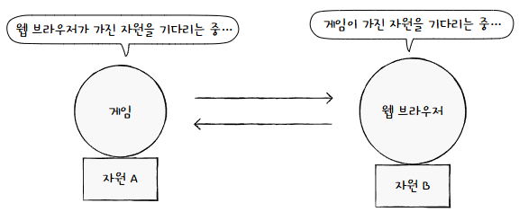
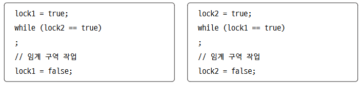
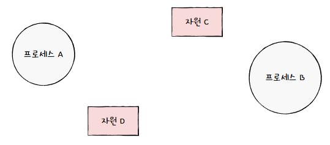
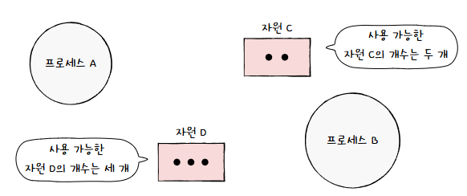
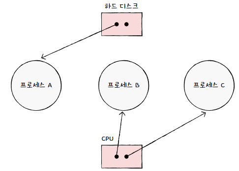
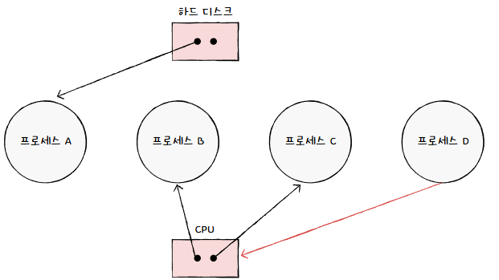
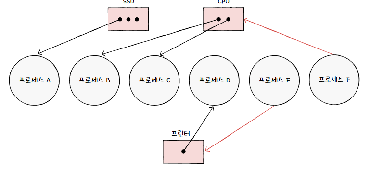
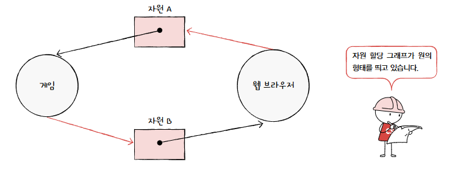
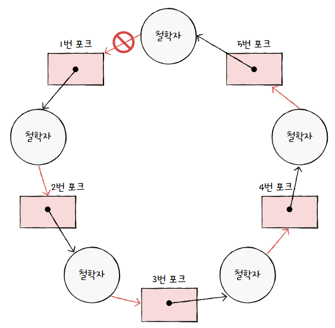

# 13-1 교착상태

<aside>

### **`교착상태(Deadlock)`**

여러 프로세스가 서로의 자원을 점유하고 있으면서 다른 프로세스의 자원을 기다리는 상황에서, **프로세스들이 모두 멈춰서 더 이상 실행을 진행할 수 없는 상태**



- 아래와 같은 상황이라고 볼 수 있음.
    - 게임 프로세스 자원 A를 점유한 채 사용 중인 자원 B를 기다림
    - 웹 브라우저 프로세스 자원 B를 가지고 자원 A 사용이 끝나길 기다림.
    
    ⇒ 이 경우 두 프로세스는 상대방이 가진 자원을 기다리기만 하다가 결국 실행하지 못하는 상황이 벌어짐.
    

앞서 배운 `뮤텍스 락`에서도 교착 상태가 발생할 수 있음.




**상황 설명**:

- 프로세스 A는 `lock1`을 잡고(`lock1 = true`), 프로세스 B는 `lock2`를 잡습니다(`lock2 = true`).
- 이 상태에서:
    - 프로세스 A는 `lock2`가 **false**가 되기를 기다립니다.
    - 프로세스 B는 `lock1`이 **false**가 되기를 기다립니다.
- 결과적으로 두 프로세스는 서로의 자원을 기다리며 교착 상태에 빠집니다.

---

### 자원 할당 그래프

교착 상태는 `자원 할당 그래프`를 통해 단순하게 표현할 수 있음.

- 교착 상태를 시각적으로 표현하기 위해 사용
- 그래프는 어떤 프로세스가 어떤 자원을 점유하고 있으며, 어떤 자원을 기다리고 있는지를 표현
    
    ---
    
    ### 자원 할당 그래프 구성 규칙
    
    1.  프로세스는 원으로, 자원의 종류는 사각형으로 표현
        
        

        
    
    1.  사용할 수 있는 자원의 개수는 자원 사각형 내 점으로 표현
        
        

        
        각 자원의 **사용 가능한 개수**는 자원 사각형 내부에 점(dot)으로 표현
        
        - 같은 자원일지라도 사용 가능한 자원의 개수를 여러 개 있을 수 있음.
        - 예를들어
            - 하드디스크 자원이 3개라면, 자원의 종류는 하드 디스크 하나이지만, 사각형 안에 점 3개로 표시됩니다.
            - CPU가 2개라면, 자원의 종류는 CPU 하나이지만, 사각형 안에 점 2개로 표시됩니다.
    
    1. 프로세스가 어떤 자원을 할당 받아 사용 중이라면 ,
    ⇒ 자원에서 프로세스를 향해 화살표를 표시
        
        

        
        그림에서:
        
        - **하드 디스크 자원**은 **프로세스 A**에 할당.
        - **CPU 자원**은 **프로세스 B**와 **프로세스 C**에 각각 할당.
        
        프로세스가 자원 사용을 끝내면, 자원은 다시 운영체제에 반환되며 화살표는 삭제
        
    2. 프로세스가 어떤 자원을 기다리고 있다면,
    ⇒ 프로세서에서 자원으로 화살표 표시
        
        

        
        그림에서:
        
        - **프로세스 D**는 **CPU 자원**을 기다리고 있음.
    
            ### `예시 1`
            
            

            
            ### **상황 설명**
            
            | **프로세스** | **사용 중인 자원** | **기다리는 자원** |
            | --- | --- | --- |
            | 프로세스 A | SSD | 없음 |
            | 프로세스 B | CPU | 없음 |
            | 프로세스 C | CPU | 없음 |
            | 프로세스 D | 프린터 | 없음 |
            | 프로세스 E | 없음 | 프린터 |
            | 프로세스 F | 없음 | CPU |
            
            ---
            
            ### **그래프 의미**
            
            | **화살표 방향** | **의미** |
            | --- | --- |
            | 자원 → 프로세스 | 해당 자원을 프로세스가 사용 중임. |
            | 프로세스 → 자원 | 해당 자원을 프로세스가 기다리는 중임. |
            
            ### 추가 상태 설명
            
            - 프로세스 E는 프린터 자원이 사용 중이라 대기
            - 프로세스 F는 CPU 자원이 사용 중이라 대기
            
            ---
            ---
            ### `예시2`
            
            

            
            ### **상황 설명**
            
            | **프로세스** | **사용 중인 자원** | **기다리는 자원** |
            | --- | --- | --- |
            | 게임 프로세스 | 자원 A | 자원 B |
            | 웹 브라우저 프로세스 | 자원 B | 자원 A |
            - 게임 프로세스는 자원 A를 할당 받은 채 자원 B의 사용이 끝나길 기다림
            - 웹 브라우저 프로세스는 자원 B를 할당 받은 채 자원 A의 사용이 끝나길 기다림
            
            ---
            
            ### **그래프 의미**
            
            | **특징** | **의미** |
            | --- | --- |
            | 자원 A → 게임 프로세스 → 자원 B | 게임 프로세스가 자원 A를 사용 중이며, 자원 B를 기다리는 중. |
            | 자원 B → 웹 브라우저 프로세스 → 자원 A | 웹 브라우저 프로세스가 자원 B를 사용 중이며, 자원 A를 기다리는 중. |
            
            ---
            
            ### **교착 상태의 특징**
            
            - **순환 대기(Circular Wait)**:
                - 게임 프로세스와 웹 브라우저 프로세스가 서로 자원을 점유한 채 상대방의 자원을 기다리는 상태.
                - 자원 할당 그래프가 원형 구조를 형성.

        ---

    ### 교착 상태 발생 조건

    - 교착상태는 아래 네 가지 조건이 모두 만족될 때 발생
        
        ---
        
        | **조건** | **설명** | **예시** |
        | --- | --- | --- |
        | **상호 배제** | 자원을 한 번에 하나의 프로세스만 사용할 수 있는 상태. | 프린터와 같은 자원이 한 번에 하나의 프로세스만 사용 가능. |
        | **점유와 대기** | 프로세스가 이미 점유한 자원을 유지하면서 다른 자원을 추가로 요청하며 대기하는 상태. | 철학자 문제에서 철학자가 한쪽 포크를 점유한 채 다른 포크를 기다리는 상황. |
        | **비선점** | 프로세스가 점유한 자원을 강제로 뺏을 수 없는 상태. | 철학자가 점유한 포크를 다른 철학자가 강제로 가져갈 수 없는 경우. |
        | **원형 대기** | 프로세스들이 순환적으로 자원을 요청하며 서로 대기하는 상태. | 프로세스 A가 B의 자원을 기다리고, B는 A의 자원을 기다리는 원형 대기 상황. |
        
        ---
        
        ### 1. 상호 배제
        
        - 교착 상태가 발생하는 주된 이유는 **해당 자원을 한 번에 하나의 프로세스만 사용할 수 있도록 제한**했기 때문
            - 프로세스도 마찬가지로 한 프로세스가 사용하는 자원을 다른 프로세스가 사용할 수 없을 때 발생.
        - 즉, 자원이 독점적으로 사용될 수밖에 없는 상황에서 교착 상태가 발생
        
        ### 2. 점유와 대기
        
        - 프로세스가 하나 이상의 자원을 점유한 상태에서, 다른 자원을 추가로 요청하며 기다리는 상황.
        
        ### 3. 비선점
        
        - 프로세스가 사용 중인 자원을 작업이 끝날 때까지 다른 프로세스가 강제로 뺏을 수 없음.
        
        ### 4. 원형 대기
        
        - 자원 요청이 원형 구조를 형성하여 순환 대기 상태가 발생.
    </aside>

# 13-2 교착 상태 해결 방법

<aside>

### 교착 상태 해결방법

1. 예방
2. 회피
3. 검출 후 회복

## 교착 상태 예방

- 교착 상태를 예방하는 방법은 13-1 절에서 설명한 교착 상태 발생 필요 조건 네 가지 중 하나를 충족하지 못하게 하는 방법과 같음.
    - `상호 배제, 점유와 대기, 비선점, 원형 대기`
    
    ### 1. 상호 배제
    
    - 모든 자원을 공유 가능하게 만든다.
    - 이 조건은 문제의 기본 요구 사항이기 때문에 제거할 수 없습니다.
    
    ### 2. 점유와 대기
    
    - 운영체제가 특정 프로세스에 필요한 모든 자원을 한 번에 할당하거나, 전혀 할당하지 않는 방식으로 배분
        
        **장점**
        
        - 교착 상태를 이론적으로 해결할 수 있습니다.
        
        **단점**
        
        - 자원의 활용률이 낮아질 우려가 있습니다.
            - 한 프로세스가 필요한 모든 자원을 확보하지 못하면 다른 프로세스에 자원을 양보해야 하므로 자원 활용도가 떨어질 수 있습니다.
        - 많은 자원을 사용하는 프로세스가 불리해짐.
            - 자원을 적게 사용하는 프로세스에 비해 자원을 사용할 타이밍 확보가 어려움
            - 이는 많은 자원을 사용하는 프로세스가 무한으로 기다리는 현상을 야기
            
    
    ### 3. 비선점 조건
    
    - 특정 자원을 사용 중인 프로세스로부터 해당 자원을 빼앗는 방식 활
        
        **효율적인 경우**
        
        - 일부 자원(CPU 등)은 선점이 가능하므로 교착 상태를 예방할 수 있습니다.
            - CPU처럼 프로세스 간 공유 가능한 자원은 특정 프로세스가 일정 시간 사용한 후 다른 프로세스에 할당할 수 있습니다.
        
        **한계**
        
        - 모든 자원에 적용하기는 어려움.
            - 예를 들어, 하나의 프린터를 한 프로세스가 사용 중이라면 다른 프로세스가 강제로 프린터를 사용할 수는 없습니다.
            - 특정 자원을 빼앗기 어려운 경우 교착 상태 예방이 어려울 수 있습니다.
            
    
    ### 4. 원형 대기 조건
    
    - 모든 자원에 번호를 부여하고, 번호가 오름차순으로 자원을 할당하면 원형 대기가 발생하지 않습니다.
    
    **예시**:
    
    - 철학자 문제에서 포크에 1번부터 5번까지 번호를 부여합니다.
    - 철학자는 항상 번호가 낮은 포크부터 높은 포크 순서로 잡습니다.
    - 예를 들어, 철학자가 5번 포크를 잡고 1번 포크를 잡으려 할 수 없으므로 원형 대기가 방지됩니다.
        
        

        
    
        원형 대기를 없앰으로써 교착 상태를 예방하는 방식은 앞선 세 방식에 비하면 비교적 현실적이고 실용적이지만,    
        
        **단점**이 존재
    
        - 자원에 번호를 부여하는 작업이 복잡할 수 있음.
        - 자원의 활용률이 낮아질 가능성.
        - 어떤 기준으로 번호를 부여할지에 따라 특정 자원의 효율적인 사용이 어려워짐
    
    ---
    
    ## 교착 상태 회피

    - 교착 상태가 발생하지 않을 정도로만 자원을 할당하는 방식
    - 자원의 제한된 상황에서도 교착 상태를 예방하기 위해 자원의 분배를 신중히 관리
    
    ### **원리**:
    
    1. **충분한 자원**:
        - 프로세스가 한 번에 적은 자원만 요청하는 상황에서는 교착 상태가 발생하지 않음.
        - 예
            - 포크가 100개 이상 있는 상황에서 철학자가 한 개의 포크만 요청한다면 교착 상태가 발생하지 않음.
    2. **제한된 자원**:
        - 모든 프로세스가 동시에 최대 자원을 요청하는 경우 교착 상태 발생 가능.
        - 예
            - 철학자가 두 개의 포크를 요구하면 제한된 자원으로 인해 교착 상태 발생.
    
    그래서 프로세스들이 배분할 수 있는 자원의 양을 고려하여 `교착 상태가 발생하지 않을 정도의 양만큼만` 자원을 배분
    
        교착 상태 학습 이전에 `안전 상태, 불안전 상태, 안전 순서열` 용어를 알아보자
    
    
    ### **안전 순서열(Safe Sequence)**:
    
    - 프로세스에 자원을 안전하게 할당할 수 있는 순서를 정의해주는 것
    - 예:
        - 웹 브라우저, 메모장, 게임의 자원 요청이 있을 때, "웹 브라우저 → 메모장 → 게임" 순으로 자원을 할당하면 교착 상태가 발생하지 않음.
        - 안전 순서열을 따라 자원을 분배하면 시스템이 안전 상태를 유지 가능.
        
    
    ### **안전 상태와 불안전 상태**
    
    - **안전 상태(Safe State)**:
        - 교착 상태 없이 자원을 할당할 수 있는 상태.
        - 안전한 순서(안전 순서열, Safe Sequence)로 자원을 배분하여 시스템이 계속 작동 가능.
        - 예: 웹 브라우저 → 메모장 → 게임 순서로 자원을 할당하면 교착 상태 방지 가능.
    - **불안전 상태(Unsafe State)**:
        - 교착 상태가 발생할 가능성이 있는 상태.
        - 시스템이 불안정한 상태에 놓이면 교착 상태로 이어질 수 있음.
    
        ## 예제로 알아보자.
        
        ```python
        프로세스와 스레드는 자원을 사용하기 위해
            1. 우선 자원을 운영체제에게 요청하고,
            2. 운영체제로부터 자원을 할당받아 사용하고,
            3. 자원의 사용이 끝났다면 자원을 반환함.
        ```
    
        ### **초기 상황이 아래와 같이 주어짐**
        
        - **프로세스(P1, P2, P3)**: 세 개의 프로세스가 각기 자원을 요청
        - **총 자원** : 12 개
        - **현재 상태**:
            - P1: 최대 요구량 10, 현재 사용량 5
            - P2: 최대 요구량 4, 현재 사용량 2
            - P3: 최대 요구량 9, 현재 사용량 2
        
        | **프로세스** | **최대 요구량** | **현재 사용량** |
        | --- | --- | --- |
        | P1 | 10 | 5 |
        | P2 | 4 | 2 |
        | P3 | 9 | 2 |
        - **할당 가능 자원**: 12
        - **할당된 자원**: 9 (P1: 5, P2: 2, P3: 2의 합)
        - **남은 자원**: 3 (12 - 9)
        - **현재 상태는 안전 상태**
            - 왜냐하면, `P2 → P1 → P3 순서로 안전 순서열이 있기 때문`
        
        ---
        
        ## 프로세스 P1, P2, P3이 모두 최대로 자원을 요구한 최악의 상황을 가정해보자
        
        - 각각 5개, 2개, 7개 추가 요구.
        
        ### **1단계: P2 작업 완료 후 상태**
        
        - 남은 자원(3개)을 P2에 추가로 2개 할당합니다(P2의 최대 요구량 충족).
        
        | **프로세스** | **최대 요구량** | **현재 사용량** |
        | --- | --- | --- |
        | P1 | 10 | 5 |
        | P2 | 4 | 2+2=4 |
        | P3 | 9 | 2 |
        - **할당 가능 자원**: 12
        - **할당된 자원**: 11
        - **남은 자원**: 1 (12 - 11)
        
        P2는 작업을 정상적으로 완료하고 자원(4개)을 반환합니다.
        
        | **프로세스** | **최대 요구량** | **현재 사용량** |
        | --- | --- | --- |
        | P1 | 10 | 5 |
        | ~~P2~~ | ~~4~~ | ~~2+2=4~~ |
        | P3 | 9 | 2 |
        - **할당 가능 자원**: 12
        - **할당된 자원**: 11 - 4 = 7
        - **남은 자원**: 1 + 4 =5
        
        P2 작업 완료 후 반환된 자원을 포함하면 남은 자원이 5개(1 + P2 반환 4)로 증가
        
        ---
        
        ### **2단계: P1 작업 완료 후 상태**
        
        - 남은 자원을 P1에 추가로 할당하여 최대 요구량을 충족시킵니다.
        
        | **프로세스** | **최대 요구량** | **현재 사용량** |
        | --- | --- | --- |
        | P1 | 10 | 5 + 5 |
        | ~~P2~~ | ~~4~~ | ~~2+2=4~~ |
        | P3 | 9 | 2 |
        - **할당 가능 자원**: 12
        - **할당된 자원**: 7+5-12
        - **남은 자원**: 5-5=0
        
        P1은 작업을 정상적으로 완료하고 자원(10개)을 반환합니다.
        
        | **프로세스** | **최대 요구량** | **현재 사용량** |
        | --- | --- | --- |
        | ~~P1~~ | ~~10~~ | ~~5+5=10~~ |
        | ~~P2~~ | ~~4~~ | ~~4 (완료 후 반환)~~ |
        | P3 | 9 | 2 |
        - **할당 가능 자원**: 12
        - **할당된 자원**: 12-10=2
        - **남은 자원**: 0+10=10
        
        즉, P2 → P1 → P3 이라는 안전 순서열대로 자원을 배분하면 모두 자원을 할당 ㅏㅂㄷ고 교착 상태 없이 올바르게 작업을 마칠 수 있음.
        
        ---
        
        ## 이번에는 운영체제가 P3에 먼저 자원을 하나 내준 상황
        
        - P1 ~ P3 세 개의 프로세스는 각각 5, 2, 3개의 자원을 보유하게 되고, 
        남은 자원은 2개
        
        | **프로세스** | **최대 요구량** | **현재 사용량** |
        | --- | --- | --- |
        | P1 | 10 | 5 |
        | P2 | 4 | 2 |
        | P3 | 9 | 3 |
        - **할당 가능 자원**: 12
        - **할당된 자원**: 10
        - **남은 자원**: 2
        
        → 이 상황은 불안전 상태이다. 즉 교착 상태가 발생할 위험이 있다.
        
        Why??
        
        - P1~P3 모두 최대로 자원을 요구한 최악의 상황일 때
            - 5개, 2개, 6개
        
        안전 순서열에 따라 자원을 배분한다고 하더라도, 
        P2가 작업을 끝낸 뒤 남은 4개의 자원으로는 P1, P3 둘 다 요구를 충족할 수 없다.
        
        → 교착상태
        
        | **프로세스** | **최대 요구량** | **현재 사용량** |
        | --- | --- | --- |
        | P1 | 10 | 5 |
        | ~~P2~~ | ~~4~~ | ~~2 + 2~~ |
        | P3 | 9 | 3 |
        - **할당 가능 자원**: 12
        - **할당된 자원**: 12 - 4 = 8
        - **남은 자원**: 0 + 4 = 4
        
        따라서 운영체제가 교착 상태를 회피하기 위해서는 시스템의 상태가 `안전 상태에서 안전 상태로 움직이는 경우에만 자원을 할당`하면 됨.
    

---

## 교착 상태 후 회복

- 교착 상태 예방과 회피는 **교착 상태가 발생하지 않도록 미리 조치**하는 방식입니다.
- 반면, **교착 상태 검출 후 회복**은 **교착 상태가 발생했음을 인정하고, 이를 해결하기 위해 `사후 조치를 취하는 방식`**입니다.

### **운영 방식**

1. **자원 할당 및 검출**:
    - 운영체제는 프로세스들이 자원을 요청할 때마다 요청된 자원을 모두 할당합니다.
    - 교착 상태 발생 여부를 **주기적으로 검사**하여 확인합니다.
2. **교착 상태 발생 시 조치**:
    - 교착 상태가 발생하면, 다음과 같은 방식으로 회복을 시도합니다:
        - 선점을 통한 회복
        - 프로세스 강제 종료를 통한 회복
    
    ---
    
    ### 선점을 통한 회복
    
    - 선점은 **교착 상태 해결을 위해 특정 프로세스로부터 자원을 빼앗는 방식**입니다.
    - 교착 상태가 해결될 때까지:
        1. 한 프로세스씩 필요한 자원을 몰수하여 다른 프로세스에 할당.
        2. 강제로 자원을 회수하여 시스템의 교착 상태를 해결.
    
    ### 프로세스 강제 종료를 통한 회복
    
    - **교착 상태 회복의 가장 단순하고 확실한 방법**으로, 교착 상태에 놓인 프로세스 중 하나 이상을 강제로 종료하여 교착 상태를 해결합니다.
    - **두 가지 방식**:
        1. 교착 상태에 놓인 모든 프로세스를 종료.
        2. 교착 상태가 해결될 때까지 하나씩 프로세스를 선택해 강제로 종료.

---

## 타조 알고리즘 (참고)

- **교착 상태를 무시하는 방식**으로, 문제를 해결하려 하지 않고 단순히 발생 빈도가 낮은 교착 상태를 **의도적으로 간과**하는 방식입니다.
- 이름의 유래는 **타조가 위협을 받으면 머리를 모래에 묻는 모습에서 착안**

</aside>