# 7-1. 다양한 보조기억장치

> 대표적인 보조기억장치 : **하드 디스크**, **플래시 메모리**

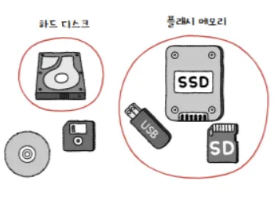

## 1. 하드 디스크 **(HDD: Hard Disk Drive)**

- 자기적인 방식으로 데이터를 저장하는 보조기억장치(자기 디스크)

### 1-1. 하드디스크의 구성 요소

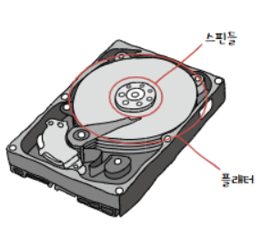

- **플래터(Platter)**
  - 하드 디스크에서 실질적으로 데이터가 저장되는 곳
  - 자기 물질로 덮인 원판, N극/S극으로 0과 1 저장
    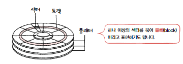
    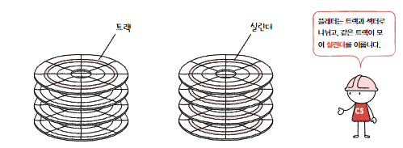
  - **트랙(Track):** 플래터의 동심원 형태의 데이터 저장 공간
  - **섹터(Sector):** 트랙을 나눈 조각, 가장 작은 전송 단위 (보통 512B~4KB)
  - **실린더(Cylinder):** 여러 플래터의 같은 트랙 위치를 모아 연결한 논리적 단위
    → 연속된 정보는 보통 한 실린더에 기록됨
- **스핀들(Spindle)**

  - 플래터를 회전시키는 축
  - **RPM** : 분당 회전수(스핀들이 플래터를 돌리는 속도를 표현)
    - ex) RPM 15,000인 하드 디스크 → 1분에 15,000바퀴를 회전하는 하드 디스크

- **헤드(Head)**
  - 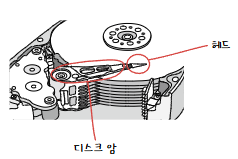
  - 플래터 위에서 데이터를 읽고 쓰는 부품
  - 디스크암에 부착되어 있음
    - **디스크암** : 원하는 위치로 헤드를 이동시킴

### 1-2. 데이터 접근 시간

- **탐색 시간(Seek Time):** 헤드가 목표 트랙으로 이동하는 시간

  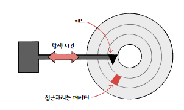

- **회전 지연(Rotational Latency):** 플래터가 회전하여 헤드 밑에 목표 섹터가 오는 시간

  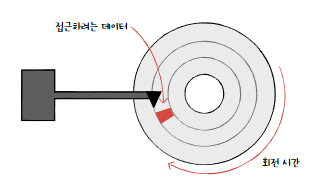

- **전송 시간(Transfer Time):** 데이터가 컴퓨터로 전송되는 시간

  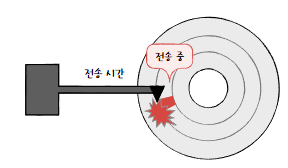

- 탐색 시간과 회전 지연을 단축시키기 위해서는?
  → 플래터를 빨리 돌려 RPM을 높이는 것도 중요하지만, 접근하려는 데이터가 플래터 혹은 헤드를 조금만 옮겨도 접근할 수 있는 곳에 위치해 있는 것도 중요함(참조 지역성 고려)

### 1-3. 종류

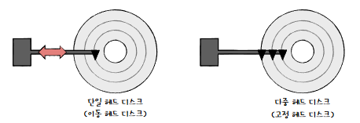

- **헤드 개수**에 따른 구분
  - **단일 헤드 디스크(Single-Head Disk)** : 플래터의 한 면당 헤드가 하나씩 달려 있는 하드 디스크
  - **복합 헤드 디스크(Multiple-Head Disk**) : 헤드가 트랙별로 여러 개 달려 있는 하드 디스크
- **헤드 이동 여부**에 따른 구분
  - **고정 헤드 디스크(Fixed-Head Disk)** : 헤드를 움직일 필요가 없는 다중 헤드 디스크
  - **이동 헤드 디스크(Movable-Head Disk)** : 헤드를 데이터가 있는 곳까지 움직여야하는 단일 헤드 디스크

## 2. 플래시 메모리(Flash Memory)

- 전기적 방식으로 데이터를 읽고 쓸 수 있는 반도체 기반의 저장 장치
- USB 메모리, SD카드, SSD 등
- 특징 : 하드 디스크보다 속도 빠름, 다양한 전자 기기에 사용

### 2-1. 종류

| **구분**               | **구조**  | **저장 밀도** | **속도**       | **특징**                          |
| ---------------------- | --------- | ------------- | -------------- | --------------------------------- |
| **NAND 플래시 메모리** | 직렬 구조 | 높음          | 읽기/쓰기 중간 | 일반적으로 사용되는 플래시 메모리 |
| **NOR 플래시 메모리**  | 병렬 구조 | 낮음          | 읽기/쓰기 빠름 | 빠른 읽기/쓰기 필요한 곳에 사용   |

### 2-2. 구조

- **셀(Cell):** 데이터 저장 기본 단위 (1bit 저장)
  | **구분** | **저장 용량** | **속도** | **수명** | **특징** |
  | ----------------------------- | ------------- | -------- | -------- | ------------------------------ |
  | **SLC (Single-Level Cell)** | 셀 당 1bit | 빠름 | 김 | 고성능, 높은 내구성, 높은 가격 |
  | **MLC (Multiple-Level Cell)** | 셀 당 2bit | 중간 | 중간 | SLC보다 용량 유리, 중간 가격 |
  | **TLC (Triple-Level Cell)** | 셀 당 3bit | 느림 | 짧음 | 대용량, 낮은 가격 |
- **페이지(Page):** 셀들의 모임
  - 페이지 상태
    - **Free:** 데이터 없음
    - **Valid:** 유효 데이터 저장
    - **Invalid:** 유효하지 않은 데이터 저장
- **블록(Block):** 페이지들의 모임
- **플레인(Plane):** 블록들의 모임
- **다이(Die):** 플레인들의 모임

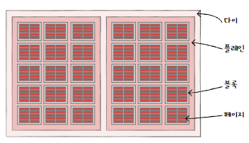

- **쓰기/삭제 특징:**
  - 쓰기/읽기는 페이지 단위, 삭제는 블록 단위로 수행
  - 덮어쓰기 불가능, 데이터 수정 시 기존 데이터 Invalid 처리 후 새 데이터 기록
  - **가비지 컬렉션(Garbage Collection):** 유효한 페이지만 새로운 블록으로 옮기고 기존 블록 삭제하는 과정 (쓰레기 값 정리)

# 7-2. RAID의 정의와 종류

## 1. RAID의 정의

- 여러 개의 물리적 보조 기억 장치(HDD, SSD)를 마치 **하나의 논리적 장치처럼 사용**하는 기술
- 목적 : 데이터의 안전성(내고장성) 및 성능 향상
- 주요 사용 : 서버, 대용량 데이터 관리 시스템

## 2. RAID의 종류

- **RAID 레벨**
  - RAID 구성 방법
  - RAID 0, RAID 1, RAID 2, RAID 3, RAID 4, RAID 5, RAID 6
    - RAID 2와 RAID 3은 현재 잘 활용되지 않음
  - 위에서 파생된 RAID 10, RAID 50 등

### 2-1. **RAID 0(스트라이핑)**

- 여러 개의 보조기억장치에 데이터를 단순히 나누어 저장하는 구성 방식
  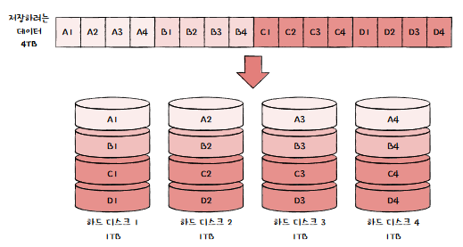
- **방식:** 데이터를 여러 디스크에 분산 저장 (스트라이핑)
- **장점:** 읽기/쓰기 속도 향상
  - 데이터 동시에 읽고 쓰기 가능해져서
- **단점:** 데이터 안전성 낮음 (하나의 디스크 고장 시 전체 데이터 손실)
  → RAID 1이 나오게 된 이유
- **용도:** 데이터 손실 위험을 감수하고 고성능이 필요한 환경 (비디오 편집, 게임)

### 2-2. RAID 1(미러링)

- 복사본을 만드는 방식
- 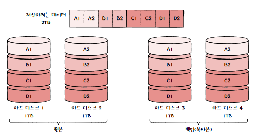
- **방식:** 데이터를 여러 디스크에 복사 저장 (미러링)
- **장점:** 데이터 안전성 높음 (디스크 고장 시 데이터 복구 용이)
- **단점:** 저장 용량 효율성 낮음 (복사본 저장으로 실제 저장 용량의 절반, 비용 증가)
- **용도:** 데이터 안전성이 중요한 환경 (은행, 의료 데이터)
- **속도** : 어떤 데이터를 쓸 때 원본과 복사본 두 군데 쓰기 때문에 RAID 0보다 느림

### 2-3. RAID 4

- 완전한 복사복을 만드는 대신 오류를 검출하고 복구하기 위한 정보를 저장한 장치를 두는 구성 방식
  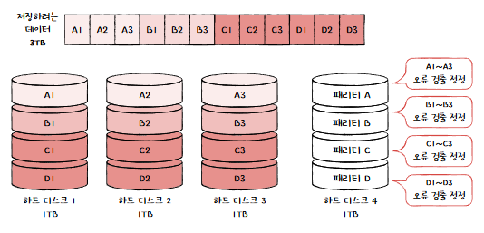
  - **RAID에서의 패리티 비트 (Parity Bit)** : 오류 검출 및 복구를 위해 사용하는 데이터
- **방식:** 데이터는 여러 디스크에 분산 저장, 패리티 정보는 특정 디스크에 저장
- **장점:** 데이터 복구 가능, RAID 1보다 용량 효율성 좋음
- **단점:** 패리티 디스크 병목 현상 발생 (쓰기 성능 저하)
- **용도:** 거의 사용하지 않음

### 2-4. RAID 5

- 패리티 정보를 분산해 저장하는 방식, RAID 4의 문제인 병목 현상 해소
  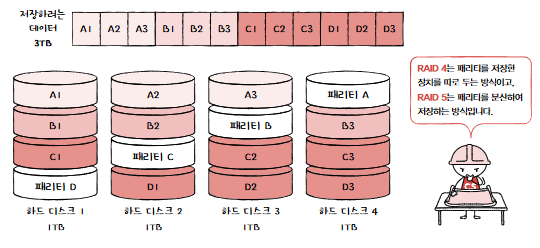
- **방식:** 데이터와 패리티 정보를 모든 디스크에 분산 저장
- **장점:** 데이터 복구 가능, RAID 4보다 쓰기 성능 향상
- **단점:** 패리티 연산으로 쓰기 속도 다소 느림
- **용도:** 일반적인 서버 환경, 데이터 복구 능력과 성능이 모두 필요한 경우

### 2-5. RAID 6

- RAID 5와 구성이 같은, 서로 **다른 두 개의 패리티**를 두는 방식
  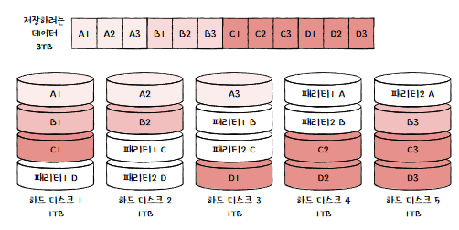
- **방식:** 데이터와 두 개의 패리티 정보를 모든 디스크에 분산 저장
- **장점:** 데이터 안전성 매우 높음 (두 개의 디스크 고장에도 데이터 복구 가능)
- **단점:** 쓰기 속도 RAID 5보다 느림, 패리티 연산 복잡
- **용도:** 데이터 안전성이 매우 중요한 환경, 대용량 데이터 보관

### 2-6. 기타

- **RAID 10 (RAID 1+0):** RAID 1 미러링 후 RAID 0 스트라이핑 조합, 높은 성능과 안정성
- **RAID 50 (RAID 5+0):** RAID 5를 스트라이핑으로 묶은 형태, 대용량 환경에 적합
- **Nested RAID:** 여러 RAID 레벨을 혼합한 방식

# 7-3. 질문

#### 1. 하드 디스크(HDD)의 데이터 접근 시간을 구성하는 요소 세 가지는 무엇이며, 이 중 탐색 시간(Seek Time)을 줄이기 위한 방법은 무엇인가?

  

  
정답

  하드 디스크의 데이터 접근 시간은 탐색 시간(Seek Time), 회전 지연(Rotational Latency), 전송 시간(Transfer Time) 세 가지 요소로 구성됩니다. 탐색 시간을 줄이기 위해서는 플래터의 RPM을 높이거나, 참조 지역성을 고려하여 데이터가 헤드를 조금만 이동해도 접근할 수 있는 위치에 저장하는 것이 중요합니다.
  

#### 2. RAID (Redundant Array of Independent Disks) 기술의 주요 목적은 무엇이며, RAID 0, RAID 1, RAID 5의 주요 특징과 장단점을 비교 설명하시오.

  

  
정답

  RAID 기술의 주요 목적은 데이터의 안전성(내고장성) 및 성능 향상입니다.
  RAID 0 (스트라이핑): 여러 디스크에 데이터를 분산 저장하여 읽기/쓰기 속도를 향상시키지만, 데이터 안전성이 낮아 하나의 디스크 고장 시 전체 데이터를 잃게 되는 단점이 있습니다.

RAID 1 (미러링): 데이터를 여러 디스크에 복사 저장하여 데이터 안전성을 높이지만, 저장 용량 효율성이 낮고, 쓰기 속도가 RAID 0보다 느린 단점이 있습니다.

RAID 5: 데이터와 패리티 정보를 모든 디스크에 분산 저장하여 데이터 복구 능력을 가지며, RAID 4의 병목 현상을 해소하지만, 패리티 연산으로 인해 쓰기 속도가 다소 느린 단점이 있습니다.

  

